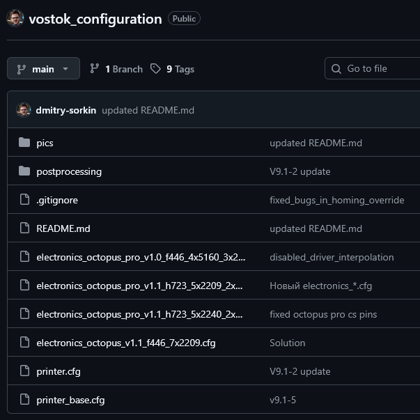

---
authors:
  - sorkin
icon: material/printer-3d
title: VOSTOK
description: Общее описание конструкции
show_created: false
show_updated: false
show_author: false
---

#

{ .notrounded width="900" }
{ .notrounded width="900" }

{ width="900" }

---

{ width="300" }

!!! time "Полное время смены инструмента - 0.5 секунды!"

Для сравнения, принтеры с AMS-подобными системами меняют материал за ~90 с, двойные экструдеры и тулченджеры за ~10 с, а RatRig V4 IDEX ~7 с[¹](./faq.md/#ratrig){ target="_blank" }.

Этого удалось добиться за счёт использования кастомной ветки Klipper, поддерживающей независимое управление печатающими головами и экструдерами. Благодаря этому становится возможно прочистить неактивную печатающую голову пока активная еще печатает. Следовательно, после смены инструмента нет необходимости тратить время на печать черновой башенки и можно сразу приступать к печати детали.

---

{ width="300" align="right" }

!!! fire "Производительность хотэнда до 50 мм³/с"

Если хотэнд не тянет, то не важно насколько быстра будет механика - принтер будет медленным. Поэтому на VOSTOK используются одни из наиболее производительных хотэндов на рынке — Goliath и CHC XL. Они одинаково уверенно работают как при печати мелких деталей на низких скоростях, так и при изготовлении крупногабаритных изделий на очень высокой скорости.

Обдув не отстаёт. Очень производительный компрессор ws7040 вкупе с оптимизированными под него соплами системы охлаждения работают настолько хорошо, что в реальных задачах не бывает нужно включать обдув выше 70-80% даже при высокоскоростной печати легкоплавкими материалами.

---

{ width="300" }

!!! speed "Быстрый несмотря на большую область печати"

| Принтер | Область печати | Макс. ускорения |
| :------ | :------------: | :-------------: |
| VOSTOK M | 400x250x250 мм | ~11000 мм/с² |
| VOSTOK L | 400x400x400 мм | ~10000 мм/с² |
| VOSTOK XL | 500x500x500 мм | ~8000 мм/с² |
| RatRig V4 IDEX | 400x400x400 мм | ~5000 мм/с² |
| Bambu Lab H2D | 350×320x325 мм | ~5000 мм/с² |

---

{ width="330" }

!!! clone "Удвоенная производительность при печати партий"

IDEX хорош не только в печати одно/двухматериальных деталей. Когда речь заходит о печати партий деталей, две головы могут работать параллельно друг с другом, буквально удваивая скорость печати.

Отдельно стоит отметить, что т. к. VOSTOK изначально разрабатывался как IDEX, то в нём нет детских болячек конверсий одноэкструдерных принтеров в IDEX - первый слой идеально выкладывается во всех режимах, смещения голов не уезжают при нагреве термокамеры и т.д.

---

{ width="300" }

!!! fire "Готовность под термокамеру до 80°C"

- Все моторы, кроме моторов экструдеров, вынесены из отсека печати;
- Тепловое расширение деталей механики не влияет на смещения голов;
- Панели зашивки сделаны так, чтобы минимизировать щели;
- Есть штатные места под термистор термокамеры и отверстия для прохождения кабелей;
- Забор воздуха в систему охлаждения осуществляется из горячей точки зоны печати;
- В области печати используются только теплостойкие компоненты.

---

{ width="300" }
{ width="300" }

!!! info "Полная и подробная документация"

В комплект документации VOSTOK входят:

- Спецификация, в которой есть исчерпывающая информация о том, что, в каком количестве и где покупать, чего и сколько печатать и т.д.;
- Чертежи профилей, деталей стола и панелей зашивки;
- Полный комплект STL моделей, оптимизированных под печать;
- Полные сборки в форматах STEP и Parasolid;
- Конфигурация принтера, включая множество вариантов конфигураций под разные платы;
- Набор инструкций, покрывающий все этапы сборки принтера от покупки деталей до конфигурации слайсера(1).
{.annotate}

    1. Инструкции по сборке еще не готовы. Будут готовы до конца лета

---

{ width="300" }

!!! note "Минимум лицензионных ограничений"

VOSTOK выпускается под лицензией [Creative Commons Attribution 4.0](https://creativecommons.org/licenses/by/4.0/){ target="_blank" }. Если коротко, то эта лицензия позволяет вам не только использовать и модифицировать принтер для своих нужд, но и использовать его в коммерческих целях. К примеру, начать продавать модификации, киты, собранные принтеры, или даже создать свой закрытый проект принтера на основе VOSTOK'а.

Единственное ограничение - вы не можете присваивать разработку себе, и должны указывать моё авторство, а также ссылку на эту страницу где-нибудь на видном месте. Всё остальное никак не ограничивается.

---

-   :material-download-box:{ .lg .middle } __Начать сборку__

    ---

    Скачайте необходимые для сборки файлы - спецификацию, CAD сборки, STL файлы, чертежи.

    [:octicons-arrow-right-24: Скачать](./releases/index.md)

-   :lucide-book-open:{ .lg .middle } __Сначала почитать__

    ---

    Узнать о структуре документации и первых шагах сборки еще до сборки.

    [:octicons-arrow-right-24: С чего начать?](./manual/start.md)

-   :material-frequently-asked-questions:{ .lg .middle } __Остались вопросики__

    ---

    Многие из особенностей проекта лучше описаны в ЧаВо - Частые вопросы и ответы на них.

    [:octicons-arrow-right-24: Почитать ЧаВо](./faq.md)

-   :simple-telegram:{ .lg .middle } __Пообщаться__

    ---

    Сообщество проекта наиболее активно в Telegram. Присоединяйтесь

    [:octicons-arrow-right-24: Обсуждение K3D VOSTOK](https://t.me/k3d_vostok){ target="_blank" }

