# Инструкция по сборке Lite Print Head

## Подготовка

### Необходимые детали

- Подающий механизм (LGX Lite или [K3D Minifeeder](../minifeeder/minifeeder_assembly.md))
- Хотэнд (Подготовленный E3D V6/Volcano, Dragon, Rapido, Dragonfly или CR-10)
- 1-2шт. Вентилятор 5015 центробежный
- Вентилятор 4010 осевой
- Каретка MGN9H
- 6шт. Винт М3х6 с полукруглой головкой
- 2шт. Винт М3х12 с полукруглой головкой
- 4шт. Винт М3х6 с потайной головкой
- 2шт. Винт М3х35 с потайной головкой
- 2шт. Винт М3х8 с цилиндрической головкой
- 2шт. Гайка М3
- 4шт. Резьбовая вставка М3х3
- 6шт. Резьбовая вставка М3х5
- 4шт. Подшипник F623
- 2шт. Подшипник 623
- 2шт. Шайба М3

Для крепления хотэнда E3D V6 / Volcano, Dragon, Rapido, Dragonfly:

- 4шт. Винт М2.5х8 с цилиндрической головкой
- PTFE трубка. Длина отмеряется в шаге 5

Для крепления хотэнда CR-10:

- 2шт. Винт М3х20 c полукруглой или потайной головкой
- 2шт. Резьбовая вставка М3х5
- PTFE трубка. Длина отмеряется в шаге 5

### Необходимые инструменты

- Паяльник или любое другое устройство для установки резьбовых вставок
- Отвертки или ключи для винтов
- Нож
- Клеевой пистолет
- Стяжки

## Печать деталей

### Выбор материала

| Деталь             | Предпочтительно                                              | Возможно                         | Нежелательно                                      |
| ------------------ |:------------------------------------------------------------:|:--------------------------------:|:-------------------------------------------------:|
| LPH mount          | `PA GF`, `PP GF`                                             | `PETG`, `PA`, `PC`               | `ABS`, `ASA`, `HIPS`, `PLA` и другие на их основе |
| LPH case           | `PA GF`, `PP GF`                                             | `PETG`, `ABS`, `ASA`, `PA`, `PC` | `PLA`                                             |
| LPH front fan duct | Любой с термостойкостью более 100°C. Можно напечатать на SLA |                                  | `PLA`, `PETG`                                     |
| LPH back fan duct  | Любой с термостойкостью более 100°C. Можно напечатать на SLA |                                  | `PLA`, `PETG`                                     |
| Roller spacer      | Любой жесткий                                                |                                  | Любой гибкий                                      |

### Ориентация моделей

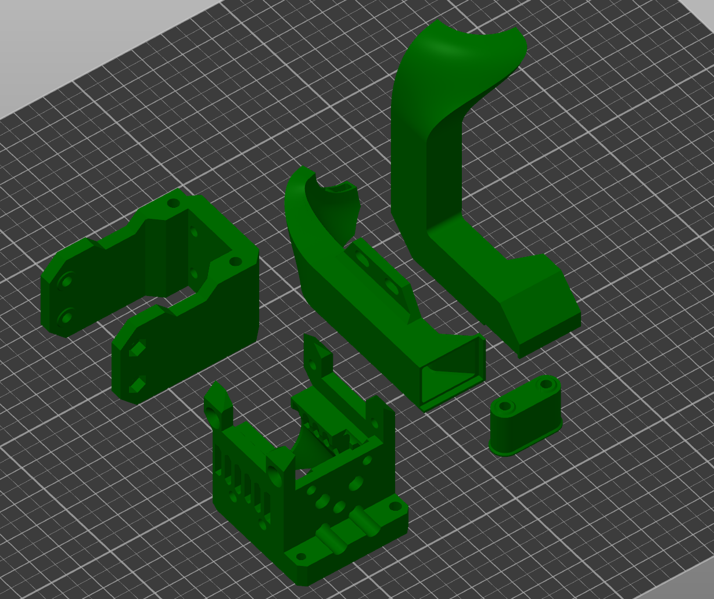

### Рекомендуемые параметры печати

Для деталей case, mount и spacer:

| Параметр                         | Значение                                                                           |
| -------------------------------- |:----------------------------------------------------------------------------------:|
| Ширина линий                     | 0.3-0.6 мм                                                                         |
| Толщина слоя                     | 0.1-0.3 мм                                                                         |
| Толщина периметров, крышки и дна | 2 мм                                                                               |
| Заполнение                       | 100%                                                                               |
| Скорость печати                  | Любая, на которой будет достаточно точная геометрия и достаточно высокая прочность |
| Поддержки                        | Не нужны                                                                           |

Для сопел системы охлаждения:

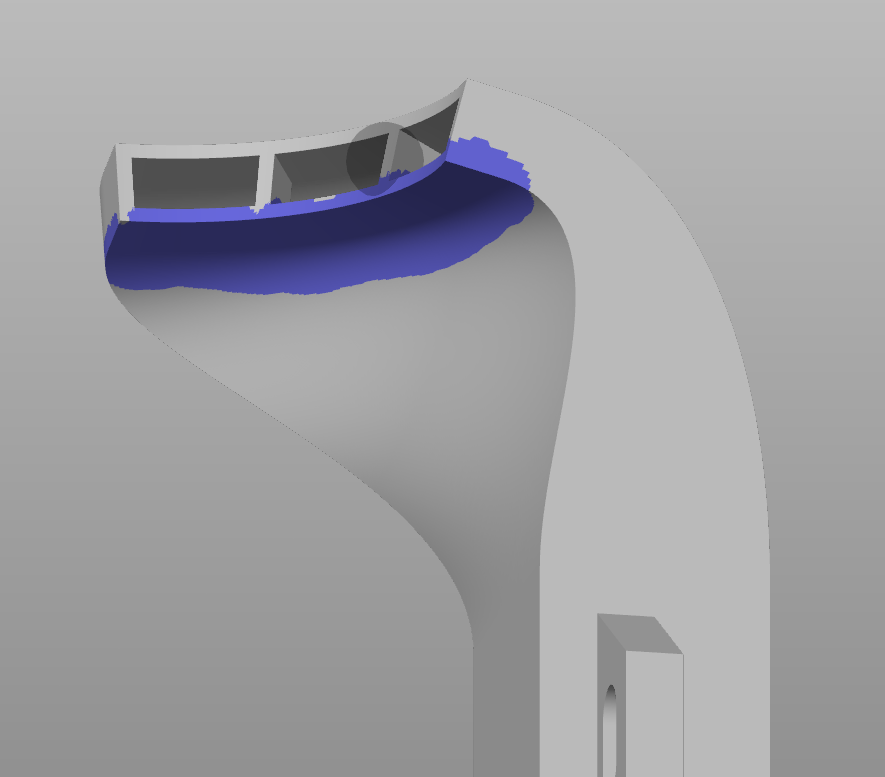

| Параметр        | Значение                                                                            |
| --------------- |:-----------------------------------------------------------------------------------:|
| Ширина линий    | Подобрать так, чтобы стенки печатались без заполнения зазора. Толщина стенки 0.8 мм |
| Толщина слоя    | ~ 0.2 мм                                                                            |
| Заполнение      | 100%                                                                                |
| Скорость печати | Любая, на которой будет достаточно точная геометрия и достаточно высокая прочность  |
| Поддержки       | Для переднего сопла не нужны. Для заднего нужны под носик (как на изображении выше) |

## Сборка

### Шаг 1. Подготовка детали mount

1.1 Вплавьте резьбовые вставки М3х5 в указанные углубления. Обратите внимание, что пластик не должен попасть внутрь резьбы

1.2 Повторите с обратной стороны

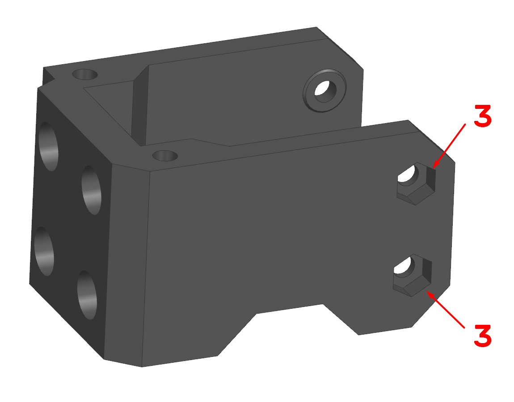

1.3 Вставьте гайки М3 в указанные углубления

### Шаг 2. Установка детали mount на балку оси Х

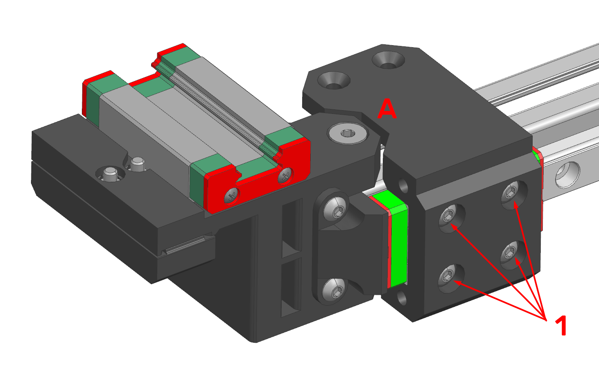

2.1 Установите деталь на каретку MGN9H и прикрутите 4 винтами М3х6 с полукруглой головкой. Обратите внимание, что ключ (А) должен совпадать с ухом каретки оси Y. 

### Шаг 3. Сборка роликов

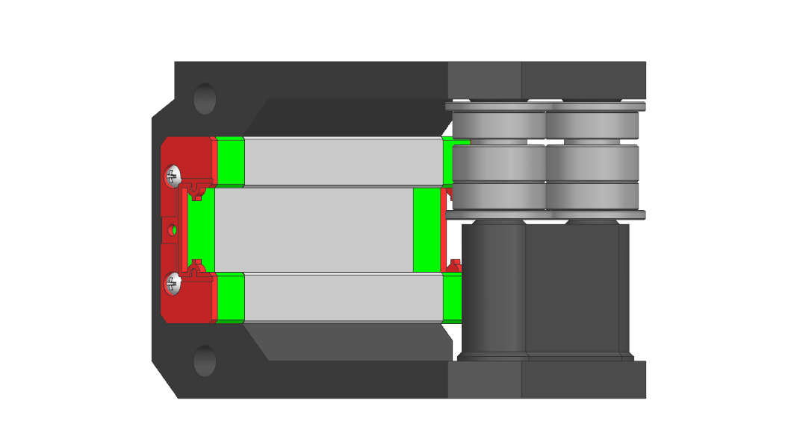

3.1 Соберите ролики в задней части на винты М3х35. Последовательность деталей в ролике: `Подшипник F623` - `шайба` - `подшипник 623` - `подшипник F623`. Вниз ставится деталь `roller spacer`. 

### Шаг 4. Подготовка детали Case

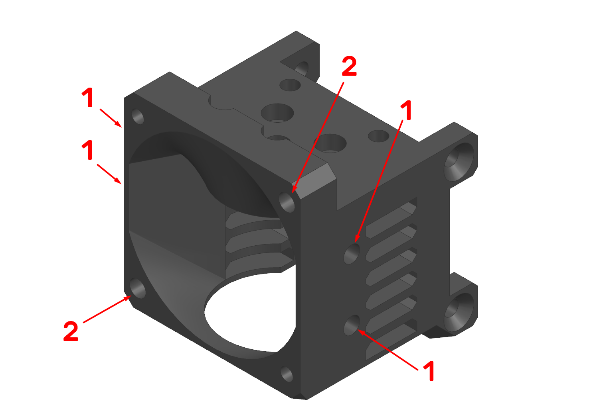

4.1 Вплавьте резьбовые вставки М3х3 в указанные углубления (с невидимой стороны зеркально). Обратите внимание, что пластик не должен попасть внутрь резьбы, а также вытесненный пластик не должен создавать бугра на поверхности детали;

4.2 (Опционально) Вплавьте резьбовые вставки М3х5 в указанные углубления. Если не собираетесь часто снимать/ставить вентилятор, то можно крепиться в 2 других отверстия, они сделаны под вкручивание винтов М3 непосредственно в тело детали.

### Шаг 5. Установка хотэнда

#### Вариант 1. Установка хотэнда E3D V6 / Dragon / Dragonfly / Rapido

Если у вас CR-10 хотэнд, то переходите сразу к варианту 2.

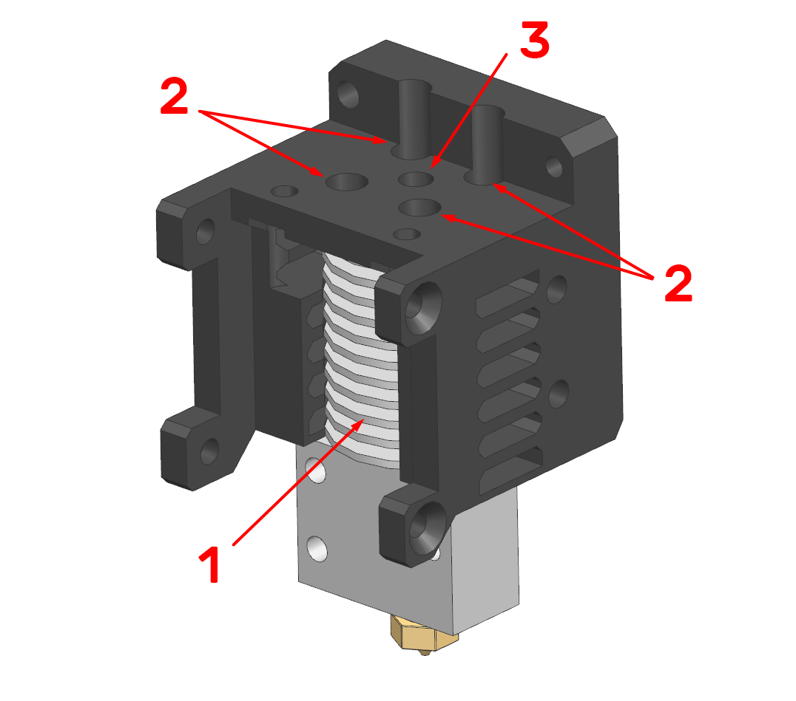

5.1 Установите хотэнд на место через нижнее отверстие. Обратите внимание, что если используется не осесимметричный хитблок (V6 / Volcano и т.д.), то длинная часть должна смотреть в другую сторону от предполагаемого положения сопел системы охлаждения модели. Если используется медно-керамический хитблок, то провода лучше поставить в сторону предполагаемого крепления системы охлаждения;

5.2 Закрепите хотэнд на 4 винта М2.5х8 с циллиндрической головкой;

5.3 Засуньте трубку в отверстие до упора в горло. Для LGX Lite трубка должна выступать на ~ 3 мм, для Minifeeder на ~ 5 мм. Обрежьте исходя из этих размеров и окончательно установите в канал;

#### Вариант 2. Установка хотэнда CR-10

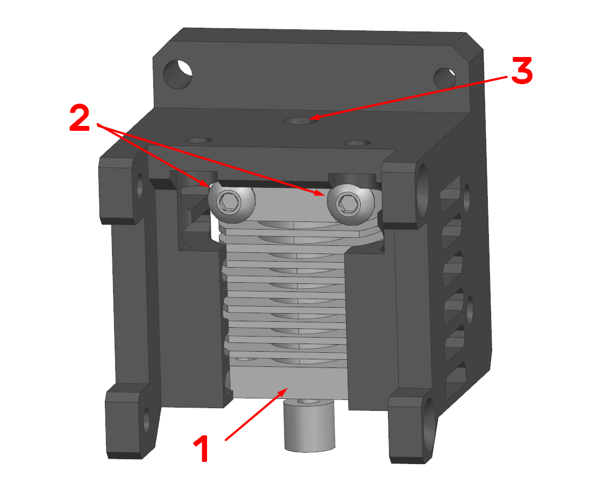

5.1 Установите хотэнд на место через нижнее отверстие. Обратите внимание, что если используется не осесимметричный хитблок (V6 / Volcano и т.д.), то длинная часть должна смотреть в другую сторону от предполагаемого положения сопел системы охлаждения модели (на изображении не показано). Если используется медно-керамический хитблок, то провода лучше поставить в сторону предполагаемого крепления системы охлаждения;

5.2 Закрепите хотэнд на 2 винта М3х20 с циллиндрической головкой;

5.3 Засуньте трубку в отверстие до упора в горло. Для LGX Lite трубка должна выступать на ~ 3 мм, для Minifeeder на ~ 5 мм. Обрежьте исходя из этих размеров и окончательно установите в канал.

### Шаг 6. Установка подающего механизма

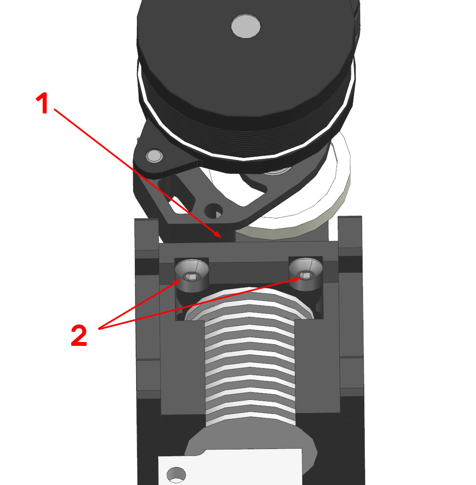

6.1 Установите подающий механизм на место. Убедитесь, что он соприкасается с корпусом детали `case`, а также что трубка попала в канал;

6.2 Зафиксируйте подающий механизм винтами М3х6.

### Шаг 7. Установка вентилятора обдува радиатора

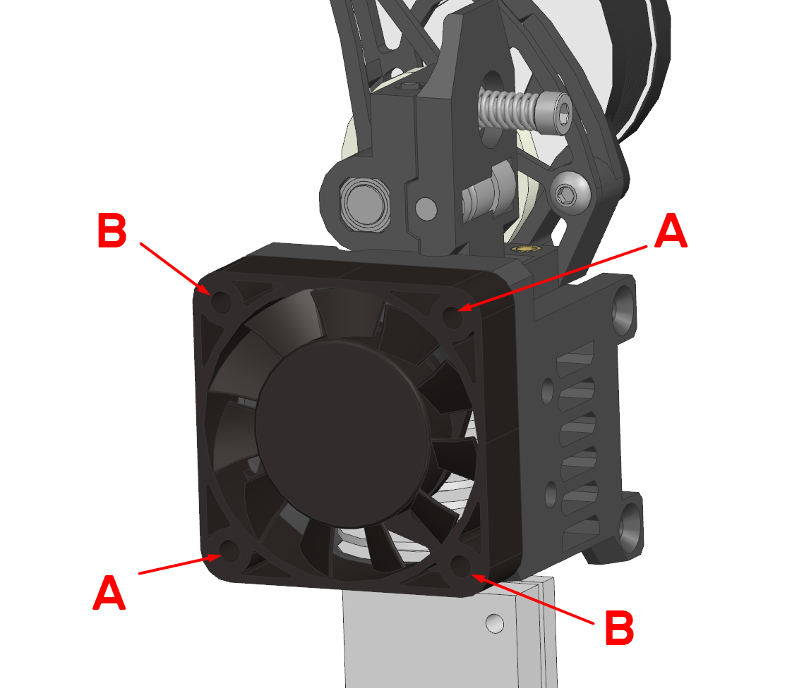

7.1 Установите вентилятор на место и закрепите двумя винтами. Если вы вплавляли вставки в деталь `case`, то используйте винты М3х12 или М3х14 и отверстия (А), если нет - винты М3х16 и отверстия (B).

### Шаг 8. Подготовка системы охлаждения модели

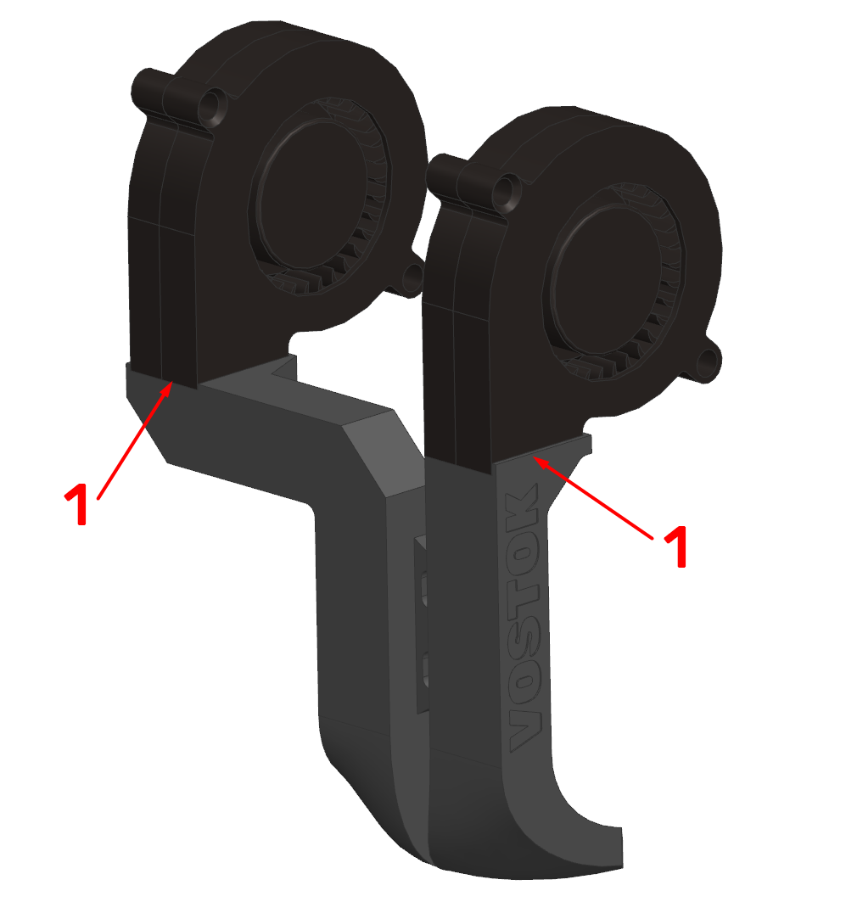

8.1 Приклейте вентиляторы 5015 к соплам системы охлаждения. Лучше всего использовать термоклей (клей-пистолет) так как он и держит нормально, и позволяет в случае чего снять вентилятор без повреждений. Но можно использовать и другой нравящийся вам клей.

### Шаг 9. Установка системы охлаждения модели

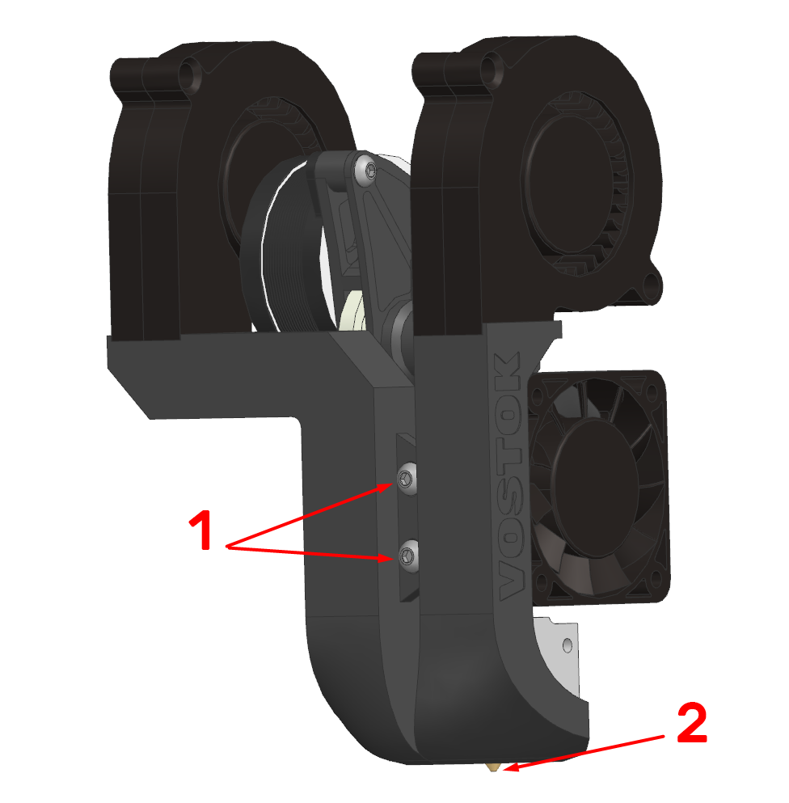

9.1 Установите систему охлаждения на печатающую голову и прикрутите винтами М3х8 с полукруглой головкой. Винты на этом этапе затягивать не надо;

9.2 Отрегулируйте положение сопел системы охлаждения так, чтобы их нижние точки были примерно на 1мм выше кончика сопла. Затяните винты (1).

#### Шаг 10. Установка печатающей головы

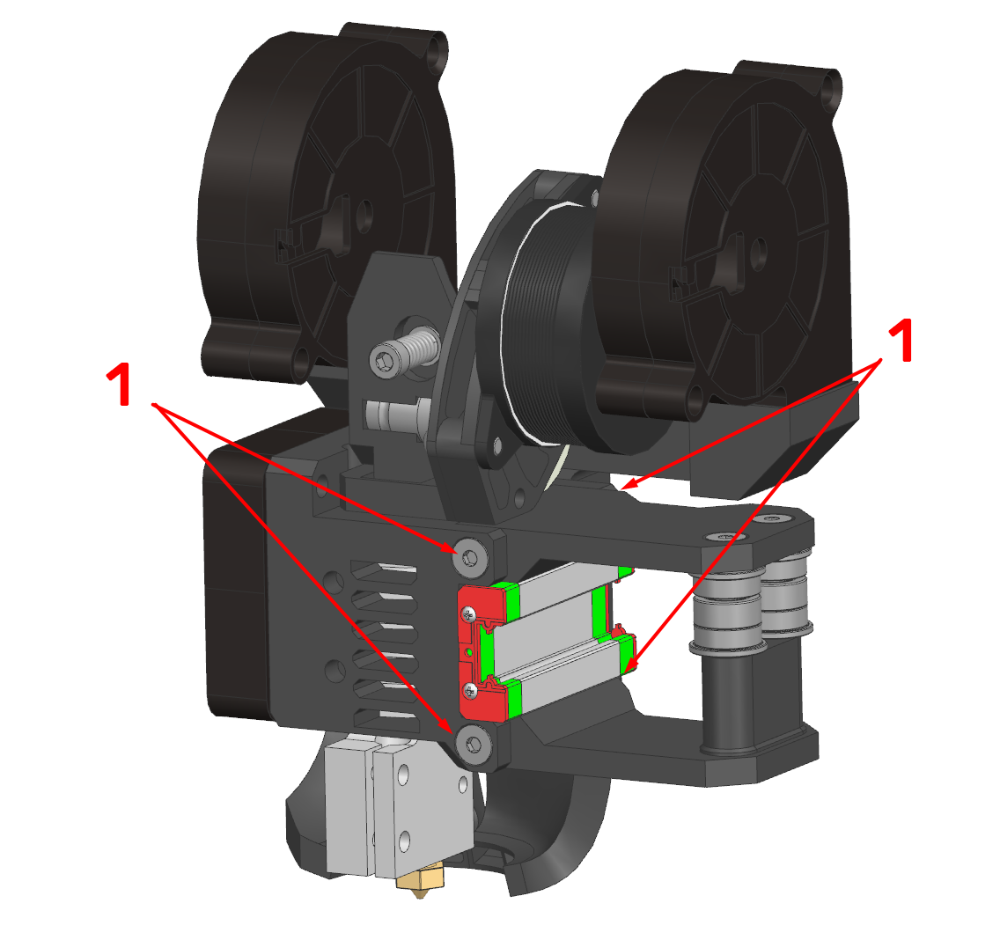

10.1 Установите печатающую голову на каретку и закрепите винтами М3х6 с потайной головкой. 
