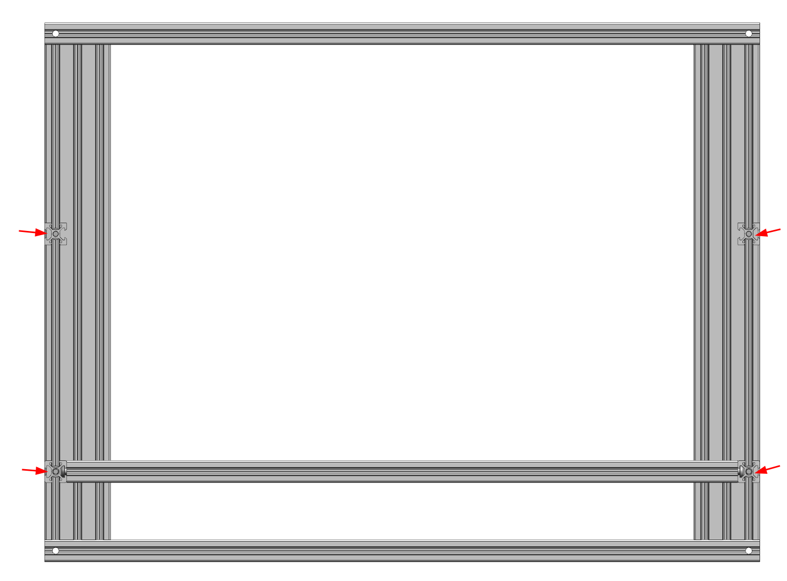
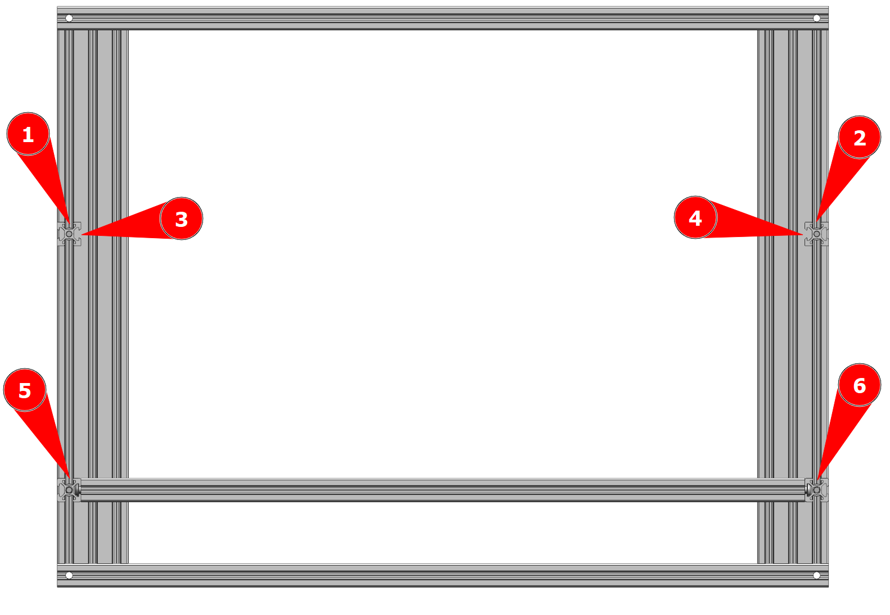
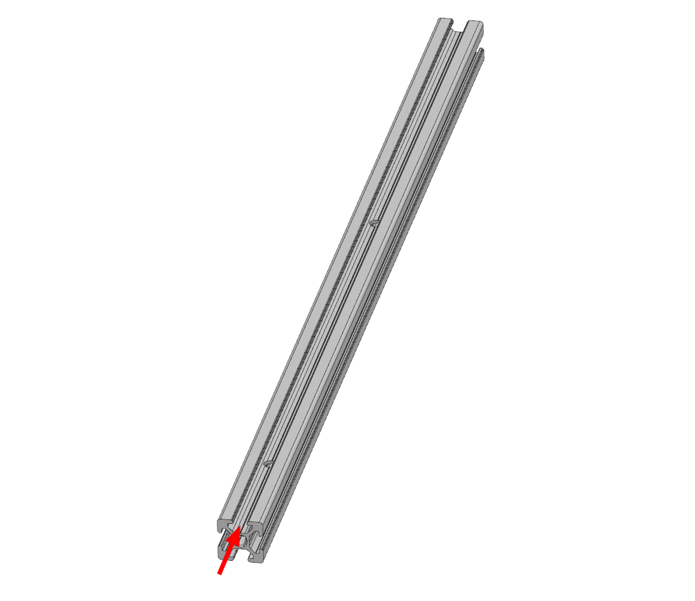
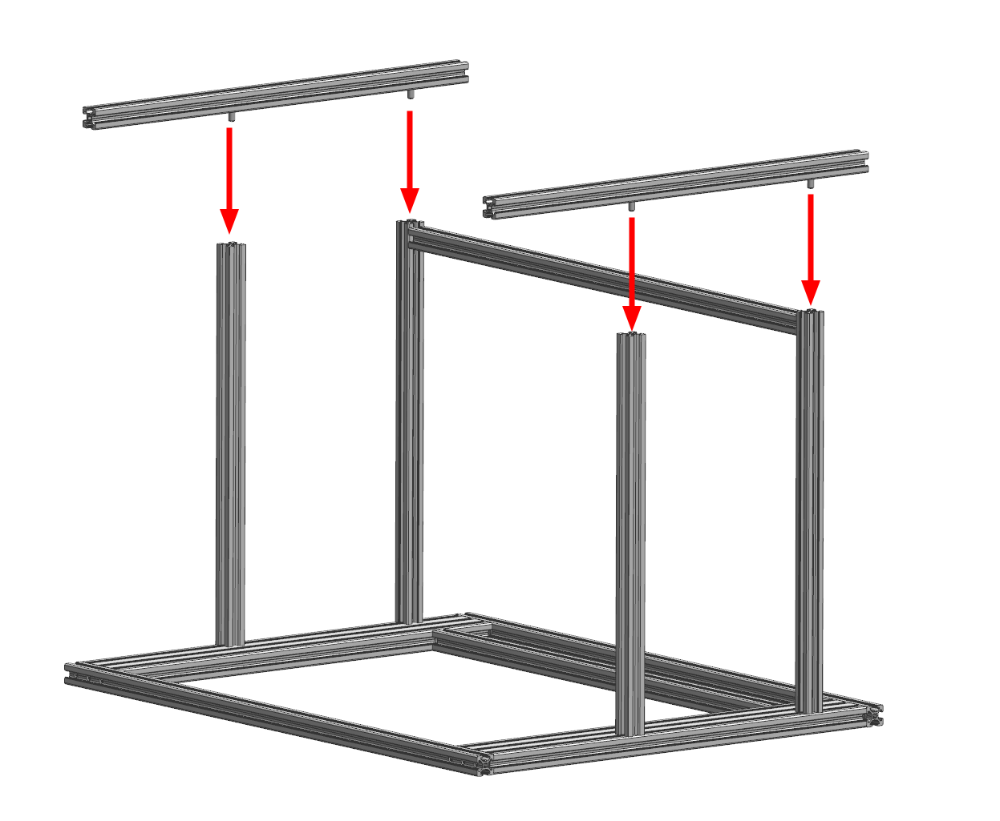
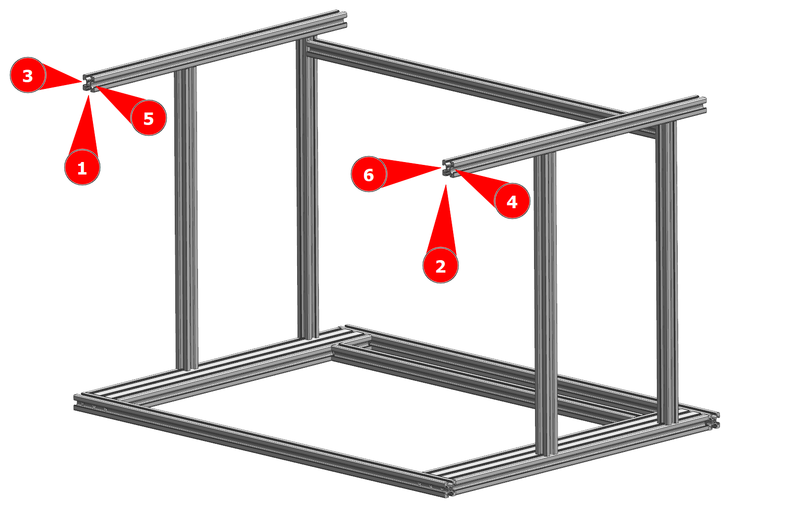
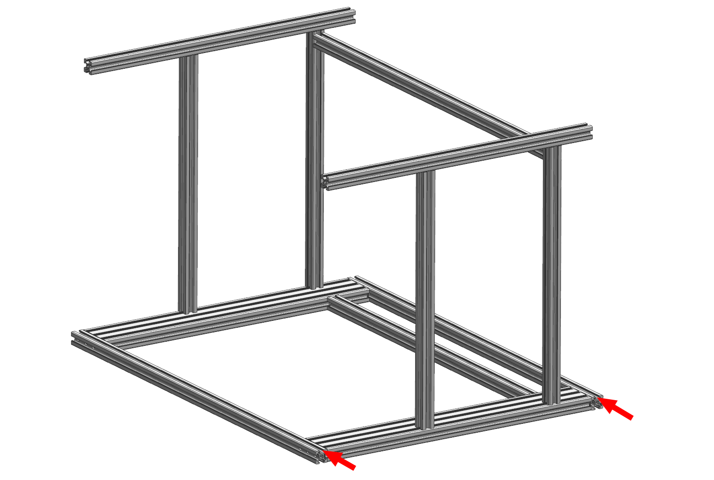
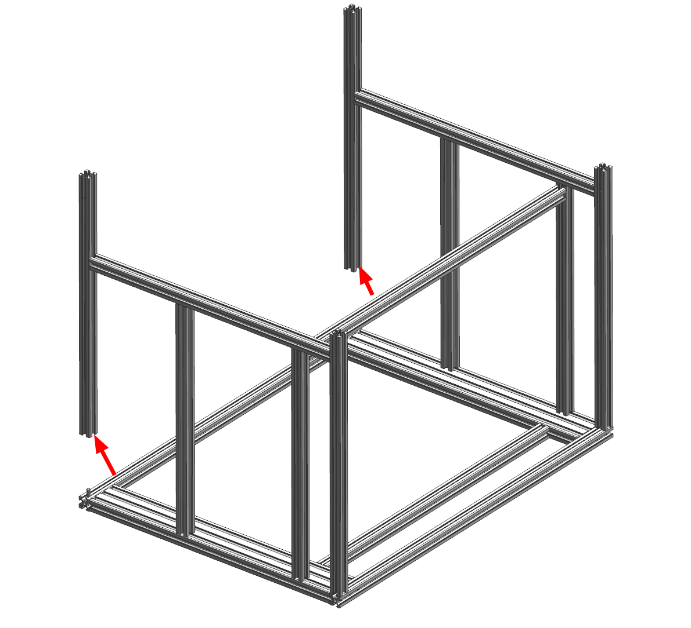
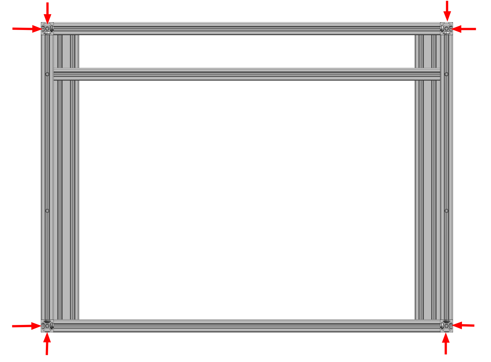

# Сборка нижней части рамы

<iframe width="900" height="400" src="https://www.youtube.com/embed/7GxtSSZW7pc" title="K3D VOSTOK v0.4 - Сборка рамы" frameborder="0" allow="accelerometer; autoplay; clipboard-write; encrypted-media; gyroscope; picture-in-picture" allowfullscreen></iframe>

Процесс сборки рамы достаточно подробно описан в видео выше. Но там отсутсвует информация о закладке гаек в пазы и не указывается порядок сборки. Так что лучше будет и посмотреть видео для понимания процесса в общем, и прочитать эту часть инструкции.

## Используемые детали и инструменты

### Покупные детали

| Наименование | Кол-во | Примечание |
|:------------ |:------:|:---------- |
| Собранный портал | 1 | Собирается в шаге 2 |
| Угловая стойка 2020 T-slot | 4 |  |
| Вспомогательная стойка 2020 T-slot | 2 |  |
| Вспомогательная поперечина 2020 T-slot | 1 |  |
| Поперечная балка основания 2020 T-slot | 2 |  |
| Продольная балка основания 2020 T-slot | 2 |  |
| Стойка оси Z 2020 V-slot | 2-4 | Количество зависит от того, сколько стоек вы выбрали в спецификации (BOM) |
| Пазовая гайка М4 | ?? | Учтены только те гайки, которые нельзя будет установить после сборки |
| Винт М6х12 ISO 7380-1 | ?? | Зависит от количества вертикальных стоек оси Z. Для 4 стоек надо ?? винтов, для 2 стоек хватит ?? |
| Шестигранный ключ 4 мм | 1 |  |
| Угольник | 1 | Желательно поверочный, если есть. Если нет, то нормального строительного хватит |
| Штангенциркуль | 1 | В крайнем случае можно использовать линейку, но это не так удобно |

### Печатаемые детали

| Обозначение | Наименование | Кол-во | Примечание |
|:----------- |:------------ |:------:|:---------- |
| Vx-02-01 | Foot | 4 | Печатаются из любого эластомера с заполнением 100% |

## Сборка рамы

### Установка стоек оси Z и вспомогательных стоек

Во процессе сборки портала в пазы продольных балок портала закладываются винты М6х12. На этом этапе надо с их помощью прикрутить 2-4 стойки оси Z (профиль 2020 V-slot) и 2 вспомогательные стойки (профиль 2020 T-slot). Стойки оси Z прикручиваются в передней части, вспомогательные стойки в задней (там, где вспомогательная балка портала). 

!!! note "Выравнивать профили и сильно затягивать крепления на данном этапе не надо, просто прихватите чтобы ничего не падало"

### Закладка метизов во вспомогательную поперечину

В любые два соседних пара заложите:

- В первый паз 5шт. пазовых гаек М4;
- Во второй паз 7шт. пазовых гаек М4.

### Установка вспомогательной поперечины

В торцы вспомогательной поперечины вкрутите винты М6х12. Не докручивайте их до конца, оставьте зазор от головки до профиля чуть более 2 мм.

Ориентируйте вспомогательную поперечину так, чтобы паз с 5 заложенными пазовыми гайками смотрел в сторону передней части принтера (там, где нет вспомогательной поперечины в портале), а паз с 7 пазовыми гайками смотрел в сторону нижней части принтера (от портала). После этого задвиньте вспомогательную поперечину как показано на картинке выше. 

!!! note "Выравнивать профили и сильно затягивать крепления на данном этапе не надо, просто прихватите чтобы ничего не падало"

### Закладка метизов в стойки

Во внешние пазы всех стоек заложите по 5 шт. пазовых гаек М4;

Заложите в пазы:

- В пазы 1 и 2 по 2 шт. пазовых гаек М4;
- В пазы 3 и 4 по 1 шт. пазовых гаек М4;
- В пазы 5 и 6 по 4 шт. пазовых гаек М4;

В случае, если у вас 4 стойки оси Z, то закладывать гайки в пазы 1, 2, 3 и 4 надо на двух любых стойках оси Z по диагонали. Эти гайки используются для крепления кронштейнов концевиков оси Z.

### Закладка метизов в продольные балки основания часть 1

Расположите продольные балки основания так, чтобы отверстия располагались вертикально. Далее заложите в верхний паз каждого профиля со стороны отверстия под вспомогательную поперечину (отверстие в 52мм от торца профиля):

- Если 2 стойки оси Z:
    - Винт М6х12 головкой в паз;
    - 3 пазовые гайки М4;
    - Винт М6х12 головкой в паз;
- Если 4 стойки оси Z и 2 привода:
    - Винт М6х12 головкой в паз;
    - 2 пазовые гайки М4;
    - Винт М6х12 головкой в паз;
    - 4 пазовые гайки М4;
    - Винт М6х12 головкой в паз;
- Если 4 стойки оси Z и 4 привода:
    - Винт М6х12 головкой в паз;
    - 3 пазовые гайки М4;
    - Винт М6х12 головкой в паз;
    - 4 пазовые гайки М4;
    - Винт М6х12 головкой в паз.

### Установка продольных балок основания

Аккуратно переверните продольные балки и поставьте их так, как показано на изображении выше. При этом винты М6х12 должны выровняться одновременно с отверстиями в балках и с торцами стоек. Закрутите винты, но не затягивайте сильно.

### Закладка метизов в продольные балки основания часть 2

Заложите в пазы с передней стороны принтера:

- В пазы 1 и 2:
    - Если 4 стойки оси Z и 2 привода, то 2 шт. пазовых гаек М4;
    - В других случаях 3 шт. пазовых гаек М4;
- В пазы 3 и 4 по 4 шт. пазовых гаек М4;
- В пазы 5 и 6:
    - Если 2 привода оси Z, то по 2 шт. пазовых гаек М4;
    - Если 4 привода оси Z, то по 4 шт. пазовых гаек М4.

### Закладка метизов в поперечные балки портала

В нижние пазы (в ориентации как на картинке находятся сверху, ближе к стойкам) поперечных балок портала заложите по 2 шт. пазовых гаек М4.

### Установка угловых стоек

1. Закрутите винты М6х12 в торцы продольных балок основания. Не докручивайте до конца, оставьте зазор от головки до профиля около 3 мм;
2. Заложите винты М6х12 в нижние пазы поперечных балок портала (в ориентации как на картинке находятся сверху, ближн к стойкам).

Задние угловые стойки ориентируйте так, чтобы отверстия в них смотрели от портала (в ориентации как на изображении - вверх). После этого опустите их, заводы головки винтов в пазы, как показано на изображении. Первыми затягиваются винты в торцах угловых стоек, далее винты в основании рамы.

Передние угловые стойки устанавливаются аналогично, но с одним отличием. Перед тем, как затягивать винты, надо будет заложить по 2 шт. пазовых гаек М4 в пазы, которые смотрят в сторону стоек оси Z (отмечены стрелками на картинке).

### Закладка метизов в поперечные балки основания

Закрутите винты в торцы поперечных балок основания. Не докручивайте до конца, оставьте зазор от головки до профиля чуть более 2 мм.

На одной балке заложите в любые два соседних паза по 7 шт. пазовых гаек М4. На другой в один паз 7 шт. пазовых гаек М4, а в соседний 5 шт. пазовых гаек М4.

### Установка поперечных балок основания

Поперечная балка основания с 14 заложенными пазовыми гайками устанавливается в передней части принтера (дальше от вспомогательных стоек и балок). Её надо ориентировать так, чтобы пазы с заложенными гайками были направлены вперед принтера (в сторону от стоек) и в сторону портала.

Поперечная балка основания с 12 заложенными гайками устанавливается в задней части принтера (ближе к вспомогательным стойкам и балкам). Её нужно ориентировать так, чтобы паз с 7 заложенными гайками был направлен назад (в сторону от стоек), паз с 5 заложенными гайками был направлен в сторону портала.

Опустите поперечные балки основания до уровня продольных балок основания и затяните винты.

!!! note "Выравнивать профили и сильно затягивать крепления на данном этапе не надо, просто прихватите чтобы ничего не падало"

### Закладка метизов в угловые стойки

Во внешние пазы всех угловых стоек надо заложить по 6 шт. пазовых гаек М4. 

### Установка ножек

Ножки прикручиваются к открытым торцам угловых стоек на винты М6х12.

### Регулировка всех соединений

Регулировка большинства соединений происходит при помощи панелей зашивки. Так что этот процесс будет описан в следующем шаге сборки принтера.