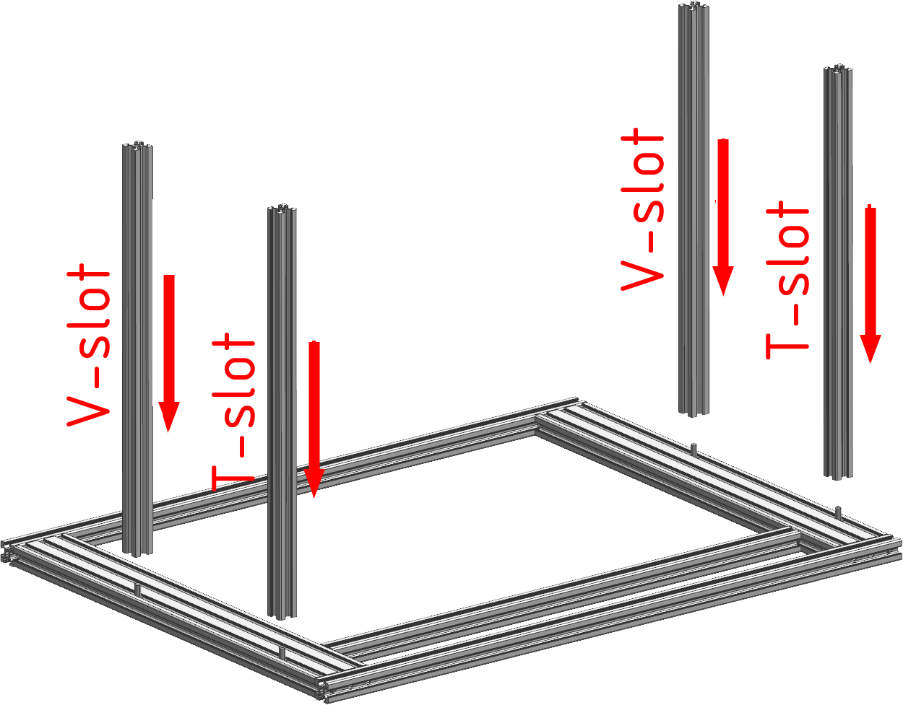
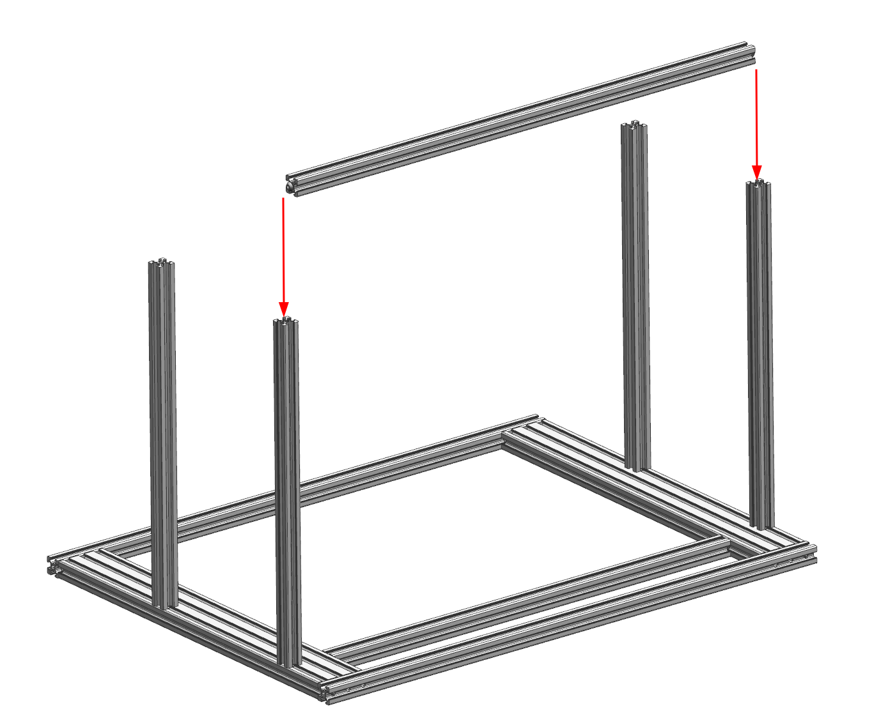
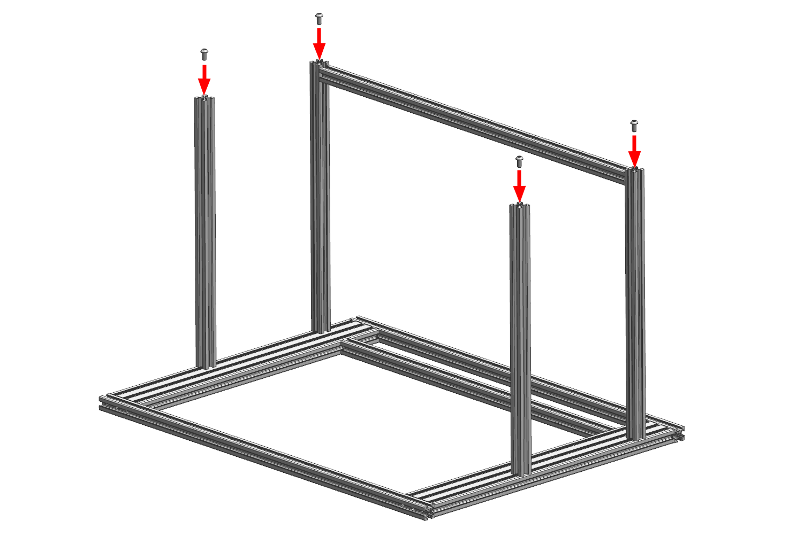
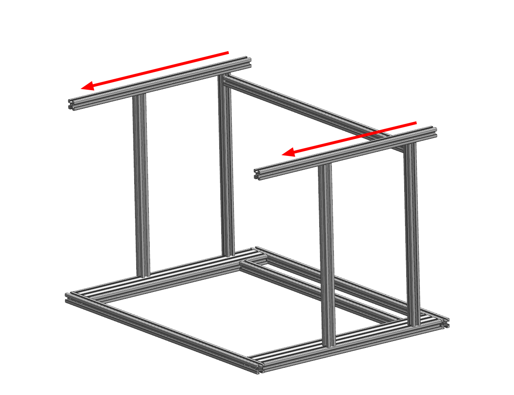
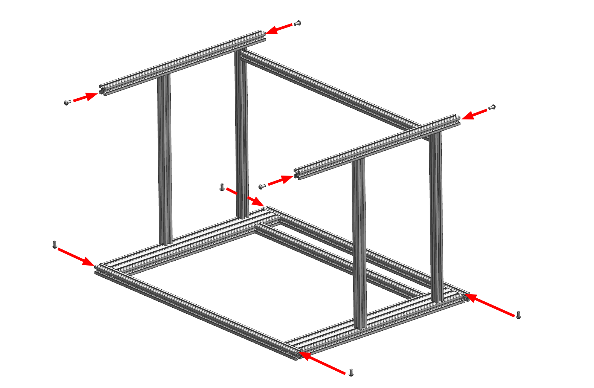
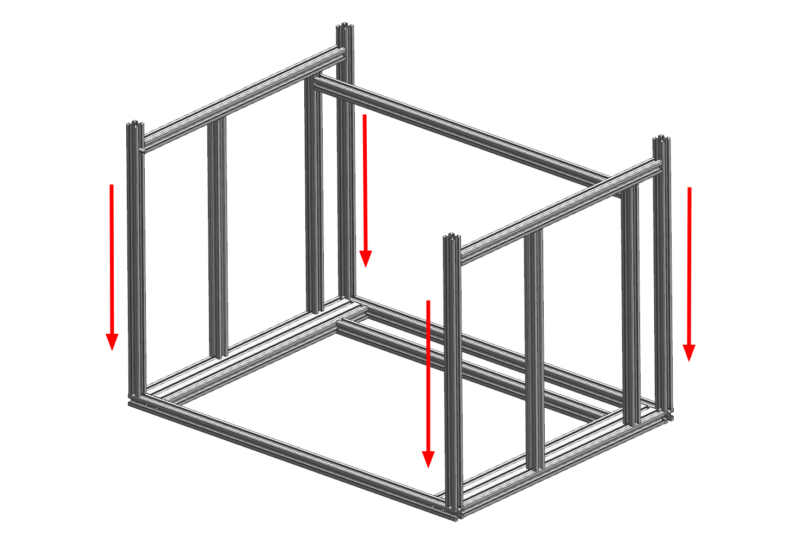
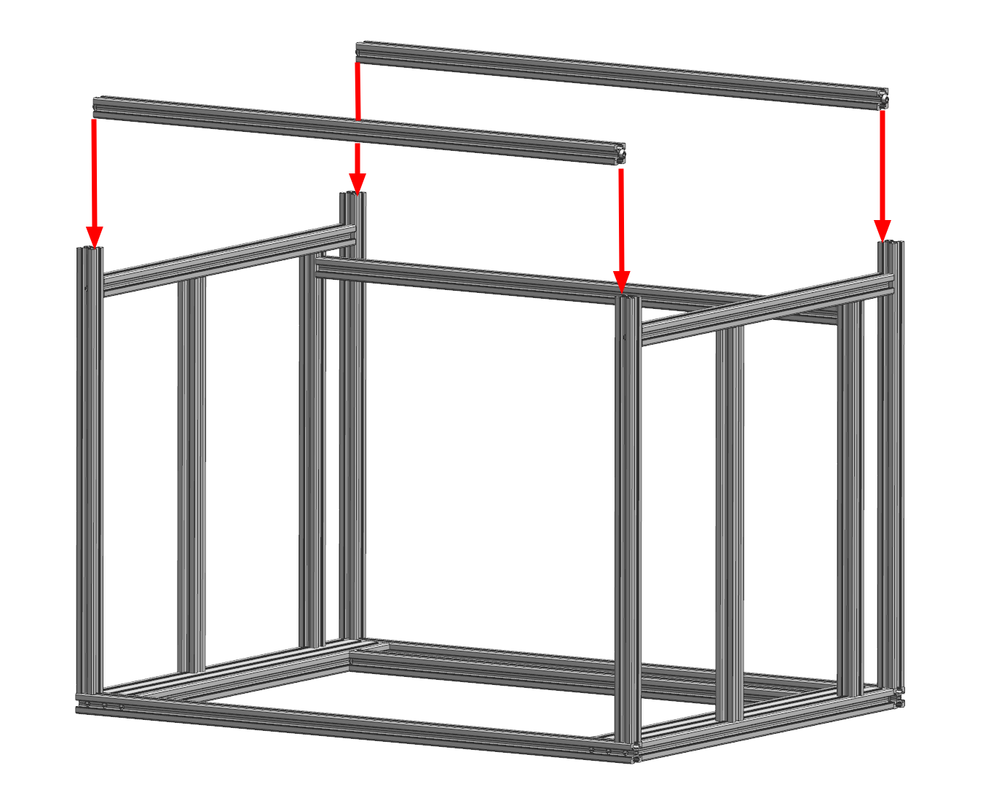
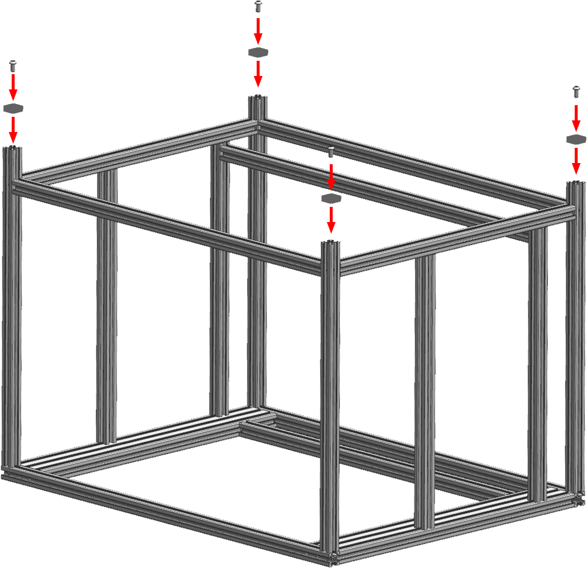

# Шаг 3 - Сборка нижней части рамы

<iframe width="900" height="400" src="https://www.youtube.com/embed/7GxtSSZW7pc" title="K3D VOSTOK v0.4 - Сборка рамы" frameborder="0" allow="accelerometer; autoplay; clipboard-write; encrypted-media; gyroscope; picture-in-picture" allowfullscreen></iframe>

Процесс сборки рамы достаточно подробно описан в видео выше. Но там отсутсвует информация о закладке гаек в пазы и не указывается порядок сборки. Так что лучше будет и посмотреть видео для понимания процесса в общем, и прочитать эту часть инструкции.

## Печатаемые детали

| Обозначение | Наименование | Кол-во | Примечание |
|:----------- |:------------ |:------:|:---------- |
| Vx-02-01 | Foot | 4 | Печатаются из любого эластомера с заполнением 100% |

## Сборка рамы

### Установка стоек оси Z и вспомогательных стоек

В процессе сборки портала в пазы продольных балок портала закладываются винты М6х12. На этом этапе надо с их помощью прикрутить стойки оси Z (профиль 2020 V-slot) и вспомогательные стойки (профиль 2020 T-slot). Стойки оси Z прикручиваются в передней части, вспомогательные стойки в задней (там, где вспомогательная балка портала). 

!!! note "Выравнивать профили и сильно затягивать крепления на данном этапе не надо, просто прихватите, чтобы ничего не падало"

### Установка вспомогательной поперечины

В торцы вспомогательной поперечины вкрутите винты М6х12. Не докручивайте их до конца, оставьте зазор от головки до профиля чуть более 2 мм.

Ориентируйте вспомогательную поперечину так, чтобы паз с 5 заложенными пазовыми гайками смотрел в сторону передней части принтера (там, где нет вспомогательной поперечины в портале), а паз с 7 пазовыми гайками смотрел в сторону нижней части принтера (от портала). После этого задвиньте вспомогательную поперечину как показано на картинке выше. 

!!! note "Выравнивать профили и сильно затягивать крепления на данном этапе не надо, просто прихватите, чтобы ничего не падало"

### Установка продольных балок основания

В торцы стоек вкрутите винты М6х12. Не докручивайте их до конца, оставьте зазор от головки до профиля около 3 мм.

Ориентируйте продольные балки основания так, чтобы оси отверстий в них были расположены вертикально, плюс прикиньте совпадут ли отверстия с положением балки после задвигания их на место. Если совпадут, то задвигайте. Потом закрутите винты, но не затягивайте сильно.

### Установка угловых стоек

1. Закрутите винты М6х12 в торцы продольных балок основания. Не докручивайте до конца, оставьте зазор от головки до профиля около 3 мм;
2. Заложите винты М6х12 в нижние пазы поперечных балок портала (в ориентации как на картинке находятся сверху, ближн к стойкам).

Задние угловые стойки ориентируйте так, чтобы отверстия в них смотрели от портала (в ориентации как на изображении - вверх). После этого опустите их, заводя головки винтов в пазы, как показано на изображении. Первыми затягиваются винты в торцах угловых стоек, далее винты в основании рамы.

### Установка поперечных балок основания

Закрутите винты М6х12 в торцы поперечных балок основания. Оставьте зазор между головкой и профилем чуть более 2 мм.

Опустите поперечные балки основания до уровня продольных балок основания и затяните винты.

!!! note "Выравнивать профили и сильно затягивать крепления на данном этапе не надо, просто прихватите, чтобы ничего не падало"

### Установка ножек

Ножки прикручиваются к открытым торцам угловых стоек на винты М6х12.

### Регулировка всех соединений

Регулировка большинства соединений происходит при помощи панелей зашивки. Так что этот процесс будет описан в следующем шаге сборки принтера.