---
authors:
    - sorkin
icon: material/lightning-bolt
title: VOSTOK - Установка
description: Установа управляющей электроники
---

# Установка

## Экран

!!! note "Экран - опциональное оборудование. Если не хотите его ставить, то вместо него ставится заглушка `V9-442`"

### Корпус и плечо

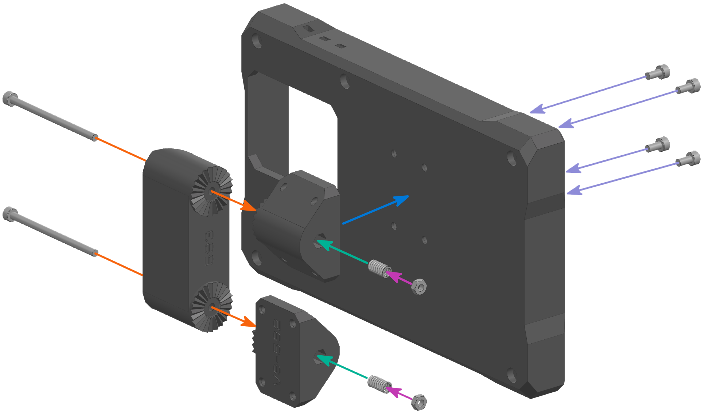

1. Заложите пружины OD5 ID3 L10 в детали `V9-592`;
2. Установите `V9-592` на плечо экрана `V9-593` с помощью винтов M3x50 с цилиндрической головкой;
3. Закрепите гайками M3;
4. Установите собранное плечо на корпус экрана `V9-591`;
5. Закрепите его винтами M3x6 с цилиндрической головкой.

### Экран и крепление

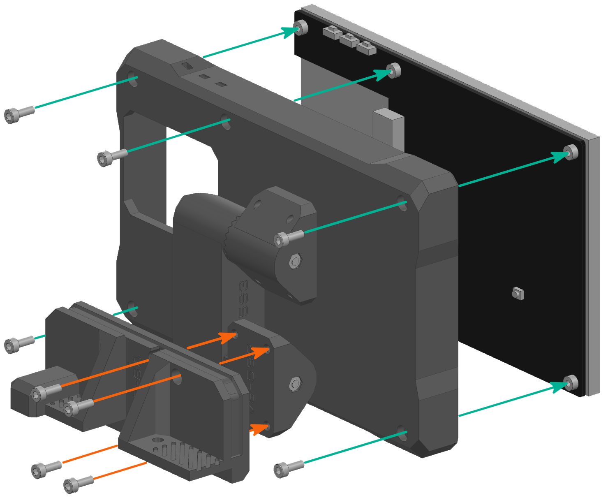

1. Установите экран в корпус экрана `V9-591` и закрепите его винтами M3x8 с цилиндрической головкой;
2. Установите крепление к порталу `V9-594` и закрепите его винтами M3x8 с цилиндрической головкой.

### Установка

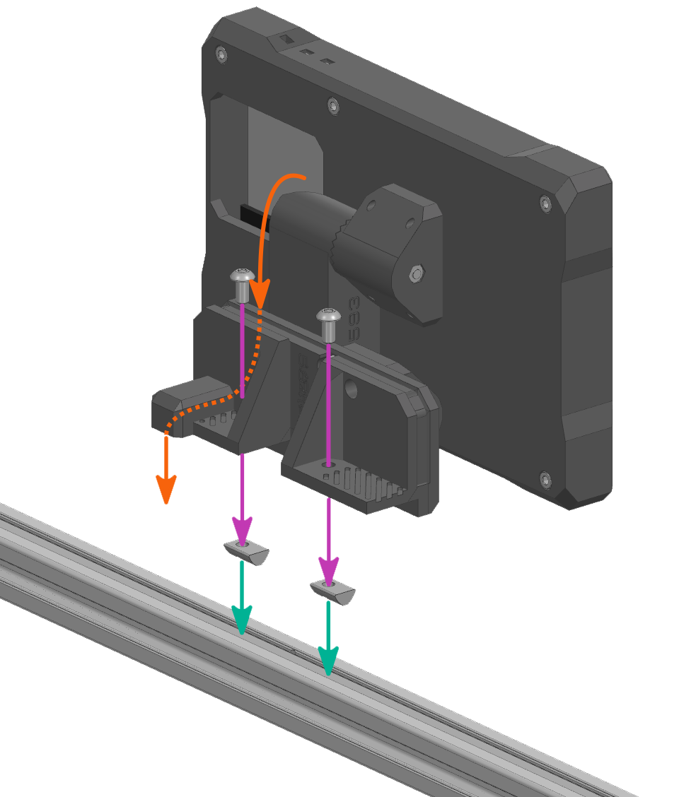

1. Заложите пазовые гайки M4 в переднюю поперечную балку портала;
2. Подключите HDMI и USB провода к экрану, после чего заложите их в кабель-канал;
3. Установите экран вместе с креплением на центр передней поперечной балки портала `V9-19` и закрепите винтами M4x8 с полукруглой головкой.

## Ввод питания

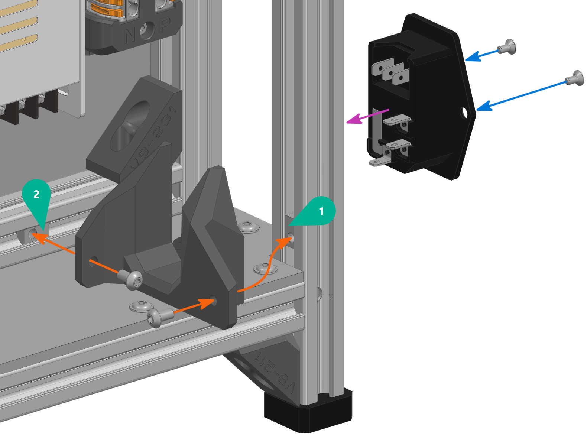

1. Заложите пазовые гайки M4;
2. Установите крепление вводного разъёма `V9-511` и закрепите его винтами M4x8 с полукруглой головкой;
3. Установите вводной разъём на крепление;
4. Закрепите его винтами M3x6 с потайной головкой.

## Сборка DIN реек

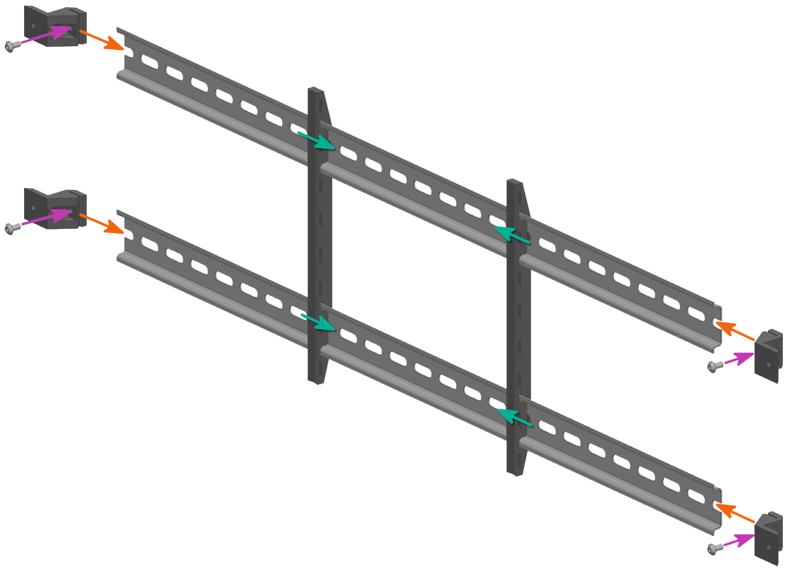

1. Установите крепления для проводов `V9-5A` на DIN рейки;
2. Установите крепления DIN реек `V9-5111`;
3. Закрепите их винтами M4x8 с полукруглой головкой.

## Установка DIN реек

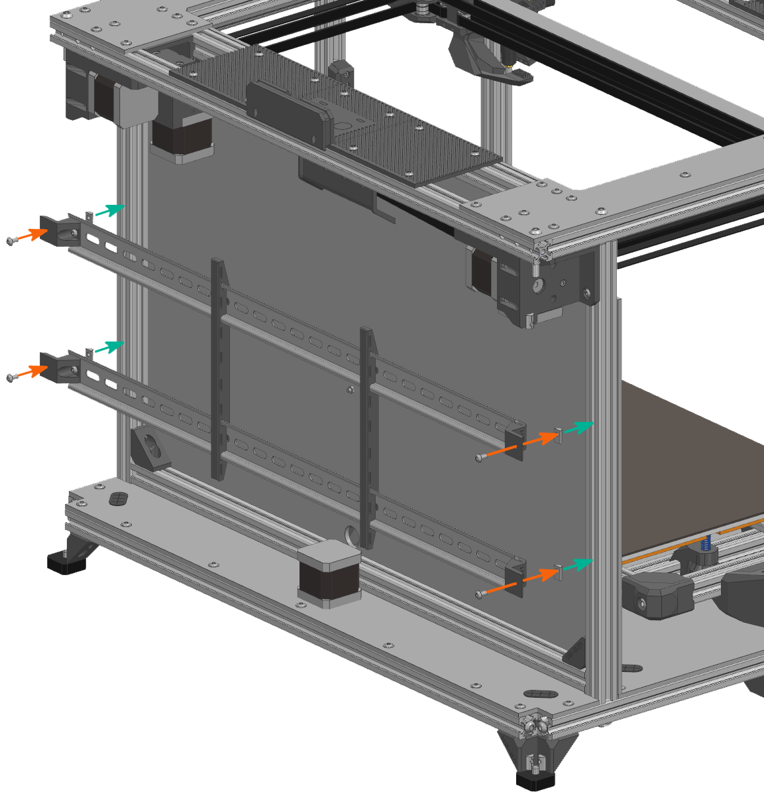

1. Заложите пазовые гайки M4 во вспомогательные стойки рамы `V9-26`;
2. Установите DIN рейки примерно посередине области электроники и закрепите винтами M4x8 с полукруглой головкой.

## Материнская плата

!!! warning "Материнская плата обязательно должна быть установлена в зоне обдува вентилятора (по центру). Иначе будут перегреваться драйверы"

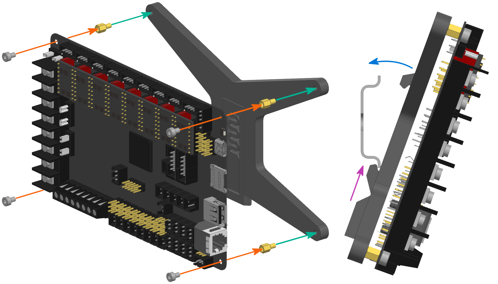

1. Закрутите стойки M3x5 в крепление материнской платы `V9-5411`;
2. Установите материнскую плату и закрепите её винтами M3x4 с цилиндрической головкой;
3. Зацепите подпружиненной частью крепления за DIN рейку снизу;
4. Наденьте верхнюю часть на DIN рейку.

## Управляющая плата

!!! tip "Рекомендуемое место установки - на нижней рейке в зоне обдува вентилятора"

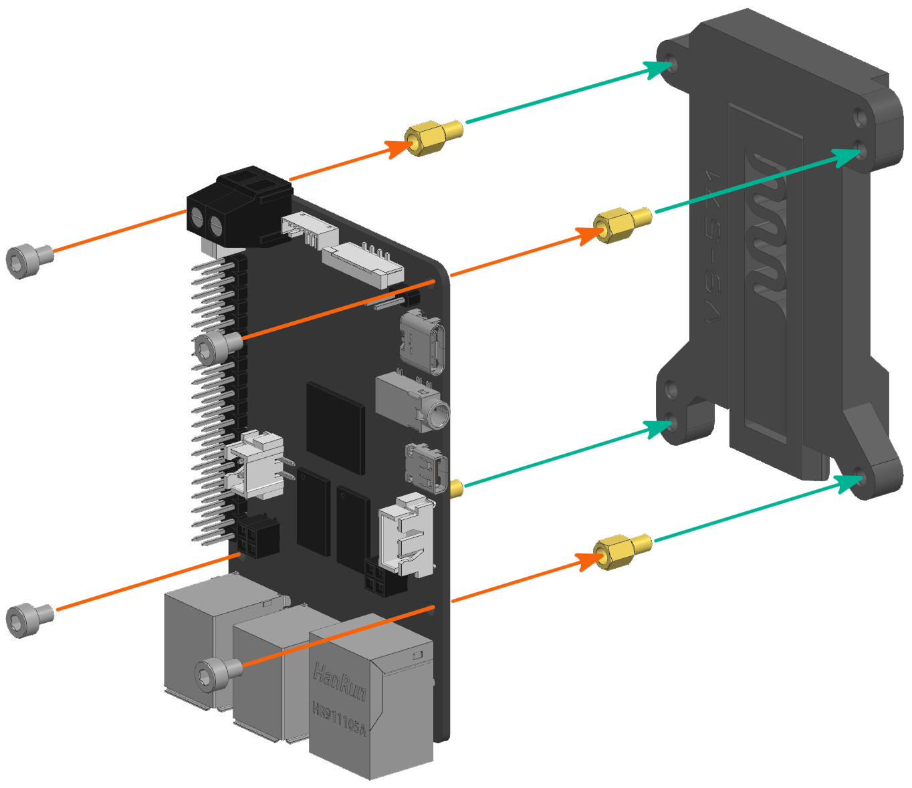

1. Закрутите стойки M3x5 в креплние управляющей платы `V9-571`;
2. Установите управляющую плату и закрепите её винтами M3x4 с цилиндрической головкой;
3. Установите управляющую плату на DIN рейку.

## Блок питания

<figure markdown="span">
    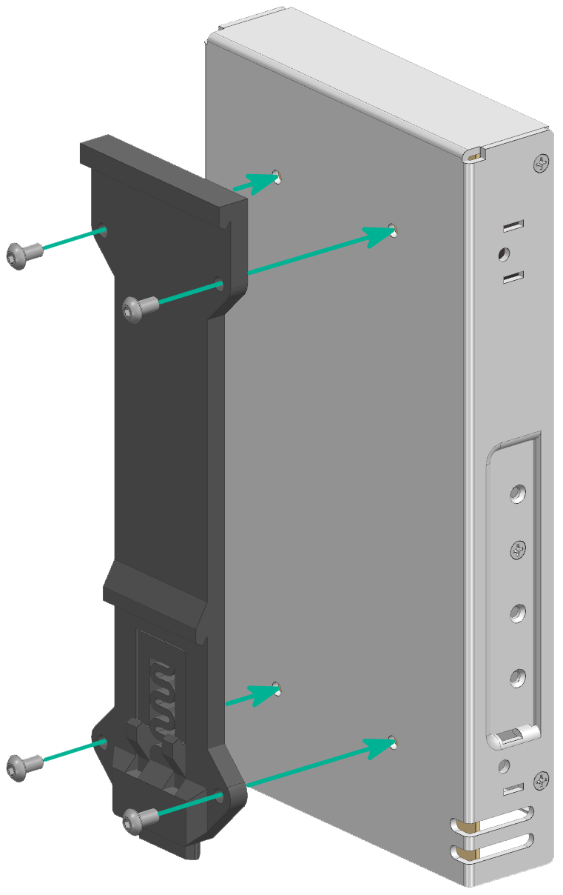{ width="500" }
</figure>

1. Установите крепление блока питания `V9-531` на блок питания и закрепите винтами M4x8 с полукруглой головкой;
2. Установите блок питания на DIN рейки. Рекомендуемое место - вблизи вводного разъёма.

## Блок WAGO 222-415

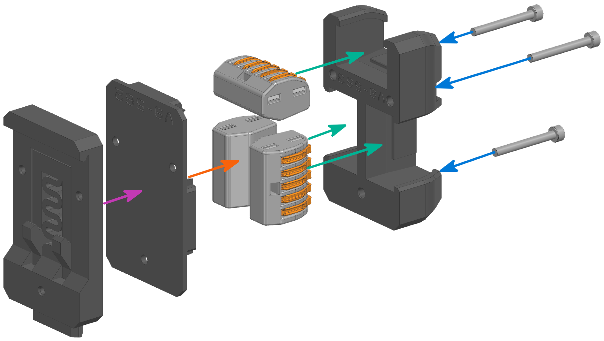

1. Заложите WAGO 222-415 в крышку `V9-563`;
2. Установите базу `V9-562`;
3. Установите крепление `V9-561`;
4. Закрепите винтами M3x25 с цилиндрической головкой;
5. Установите блок WAGO на DIN рейку. Рекомендуемое место - вблизи вводного разъёма.

## Твердотельные реле

<figure markdown="span">
    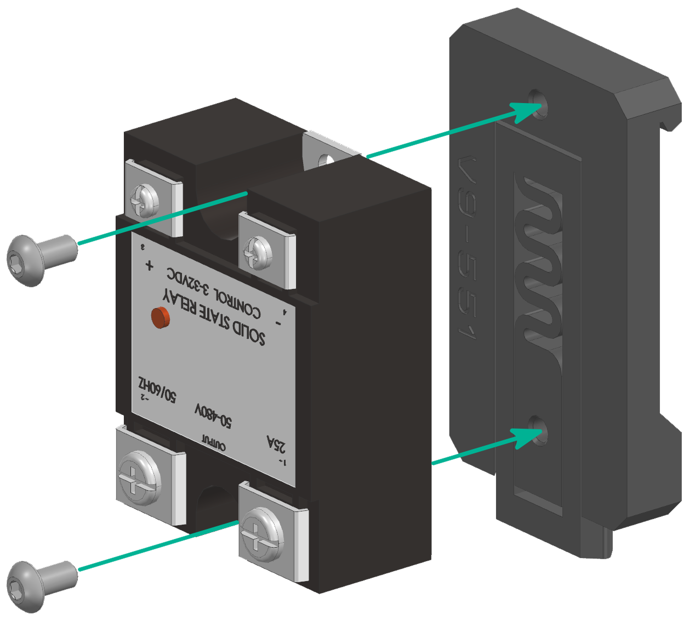{ width="500"}
</figure>

1. Закрепите твердотельное реле к креплению `V9-551` с помощью винтов M4x8 с полукруглой головкой;
2. Установите реле на DIN рейку. Рекомендуемое место - вблизи вывода на стол или реле.

## Драйвер ws7040

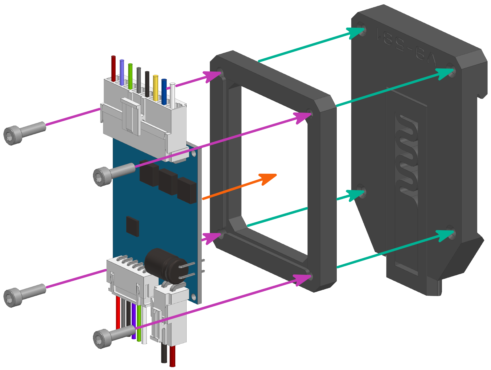

1. Установите проставку `V9-582` на крепление `V9-581`;
2. Установите драйвер в проставку;
3. Закрепите его винтами M3x10 с цилиндрической головки;
4. Установите на DIN рейку в любое удобное место.

