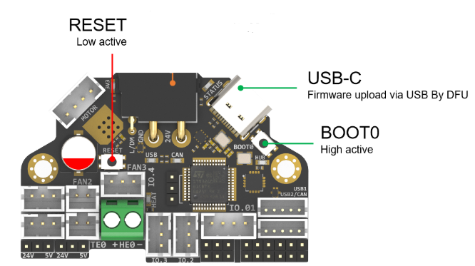
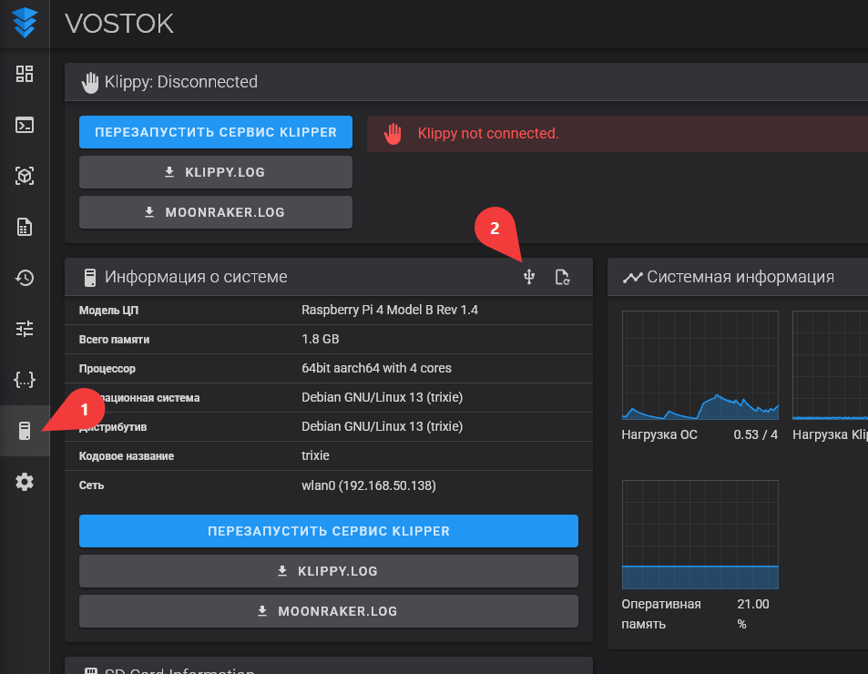
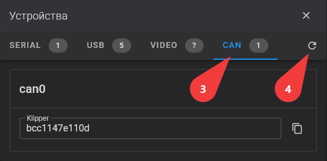
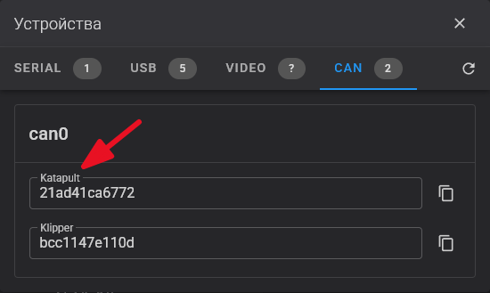
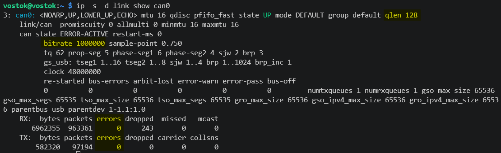

---
authors:
  - sorkin
  - alexander
icon: lucide/code-2
title: VOSTOK - Прошивка
description: Octopus Pro v1.1 + Fysetc H36
---

# Прошивка

!!! danger "Подключение/отключение любых кабелей допустимо только при выключенном питании принтера. В противном случае возможны повреждения электроники. Далее по тексту я не буду повторять это предупреждение, но прошу вас всегда помнить о нём"

!!! info "Текущая инструкция составлена для BTT Octopus Pro v1.1 H723 и Fysetc H36. Если у вас другая электроника, то следует ознакомиться с инструкциями по прошивке от производителей или на сайте [Esoterical](https://canbus.esoterical.online/){ target="_blank" }."

## BigTreeTech Pi 1.2

### Установка операционной системы

1. Скачайте последнюю версию образа системы из [официального репозитория BTT](https://github.com/bigtreetech/CB1/releases){ target="_blank" };
2. Скачайте и установите [Balena Etcher](https://etcher.balena.io){ target="_blank" };
3. Запишите образ на MicroSD (не менее 8 ГБ, класс 10) с помощью Balena Etcher;
4. После записи в корне MicroSD появится файл `system.cfg`. Откройте его любым текстовым редатором, например, [Notepad++](https://notepad-plus-plus.org/downloads/){ target="_blank" };
5. В нём укажите:
      1. `check_interval=5`;
      2. `eth=end0`;
      3. `wlan=wlan0`;
      4. `hostname="vostok"`;
      5. `WIDI_SSID="Имя_Вашей_Сети"`;
      6. `WIFI_PASSWD="Пароль_Сети"`;
6. Сохраните изменения и извлеките MicroSD из компьютера;
7. Вставьте MicroSD в слот на нижней стороне Pi 1.2;
8. Подключите питание и подождите ≈ 60–90 секунд первого расширения раздела и запуска сервисов.

После этого система должна быть готова к эксплуатации. В общем случае:

- Адрес платы: `http://vostok.local`;
- Подключение по SSH из-под пользователя: `ssh biqu@vostok.local`, пароль `biqu`;
- Подключение по SSH из-под root: `ssh root@vostok.local`, пароль `root`.

!!! note "Далее все инструкции будут даваться для подключения из-под пользователи (biqu). При выполнении команд через sudo надо будет вводить пароль `root`"

### Установка зависимостей

- Обновление системы:

    ``` bash
    sudo apt update
    sudo apt upgrade
    ```

- Python 3 и pyserial

    ``` bash
    sudo apt install python3 python3-serial
    ```

- Katapult

    ``` bash
    test -e ~/katapult && (cd ~/katapult && git pull) || (cd ~ && git clone https://github.com/Arksine/katapult) ; cd ~
    ```

### Настройка CAN

1. Подключитесь к плате по SSH;
2. Откройте файл:

    ```bash
    sudo nano /etc/network/interfaces.d/can0
    ```

3. В открывшемся редакторе укажите:

    ``` bash
    allow-hotplug can0
    iface can0 can static
        bitrate 1000000
        up ip link set can0 txqueuelen 128
    ```

4. Сохраните изменения и закройте редактор ++ctrl+o++ → ++enter++ → ++ctrl+x++;
5. Перезагрузите плату:

    ```bash
    sudo reboot
    ```

6. Дождитесь загрузки, подключитесь по SSH и проверьте статус интерфейса:

    ```bash
    ip -s link show can0
    ```

    В самом низу ответа обратите внимание на колонку `errors`. Если там указано `0`, значит интерфейс работает корректно.

### Смена репозитория Klipper

Главная ветка Klipper не поддерживает независимое управление двумя печатающими головами. Без этого нельзя будет использовать скрипт быстрой смены инструмента, а также не будут подходить текущие конфиги VOSTOK'а. Поэтому настоятельно рекомендуется на [форк от Дмитрия Бутюгина](https://github.com/dmbutyugin/klipper/tree/generic-cartesian){ target="_blank" }, в котором нужная функциональность уже реализована. Для перехода на него:

1. Подключитесь к хосту по SSH;
2. Запустите KIAUH:

    ```bash
    ~/kiauh/kiauh.sh
    ```

3. Перейдите в раздел `Settings` <kbd>S</kbd>;
4. Выберите `Switch Klipper source repository` <kbd>1</kbd>;
5. Выберите `Add repository` <kbd>A</kbd>;
6. Введите адрес:

    ``` bash
    https://github.com/dmbutyugin/klipper
    ```

7. Укажите ветку:

    ``` bash
    generic-cartesian
    ```

8. Сохраните репозиторий <kbd>S</kbd>;
9. Переключитесь на добавленный репозиторий, выбрав его в списке <kbd>2</kbd>.

!!! info "В веб-интерфейсах версия Klipper будет отображаться 0.7.0, и будут сыпаться ошибки о несовместимости этой версии с текущей версией Moonraker и т.д. На самом деле, просто версия в репозитории указана неверно. Игнорируйте эти ошибки, на работоспособность они не влияют"

### Установка G-code Shell Command

G-code Shell Command необходим для работы макросов автоматической калибровки Input Shaping.

1. В KIAUH выберите пункт `Extensions` <kbd>E</kbd>;
2. Выберите `G-Code Shell Command` из списка;
3. Install <kbd>1</kbd>;
4. На вопрос `Create an example shell command` ответьте <kbd>N</kbd>.

### Установка конфигурации

1. Скачайте последнюю версию конфигурации VOSTOK с [GitHub](https://github.com/dmitry-sorkin/vostok_configuration/tree/main){ target="_blank" };
2. Скопируйте файлы `printer_base.cfg`, `printer.cfg` и подходящий под вашу электронику `electronics_*.cfg` на принтер в папку `~/printer_data/config/` любым способом. Проще всего через веб-интерфейс;
3. Если не было соответствующего вашей электронике `electronics_*.cfg`, то скопируйте любой, переименуйте и внесите в него изменения таким образом, чтобы конфигурация подходила под электронику вашего принтера;
4. Откройте `printer.cfg`.

!!! warning "Дальнейшие инструкции по настройке принтера, а также по структуре конфигурации и её модификации под свои нужды указаны прямо в файле `printer.cfg` в виде комментариев. Пожалуйста, внимательно ознакомьтесь с ними перед началом эксплуатации принтера."

## Прошивка Octopus Pro v1.1 H723

В VOSTOK в качестве коммутационных плат печатающих голов используются Fysetc H36. Они могут подключаться как по USB, так и по CAN. Но, в случае подключения по USB, теплостойкость этих плат снижается. Поэтому используется подключение по CAN. Для этого необходимо прошить Octopus Pro v1.1 в режим USB-to-CAN Bridge. Для этого:

1. Подключите к хосту только Octopus Pro. Fysetc H36 оставьте не подключенными к CAN разъёму Octopus'а;
2. Подключитесь к хосту по SSH;
3. Откройте меню сборки:

    ```bash
    cd ~/klipper
    make menuconfig
    ```

4. Установите значение настроек следующим образом:

    - Micro-controller Architecture: `STMicroelectronics STM32`;
    - Processor model: `STM32H723`;
    - Bootloader offset: `128KiB bootloader`;
    - Clock Reference: `25 MHz crystal`;
    - Communication interface: `USB to CAN bus bridge (USB on PA11/PA12)`;
    - CAN bus interface: `CAN bus (on PD0/PD1)`;
    - CAN bus speed: `1000000`;

5. Сохраните изменения и выйдите из меню <kbd>Q</kbd> → <kbd>Y</kbd>;
6. Скомпилируйте прошивку:

    ```bash
    make clean && make
    ```

7. Скачайте полученный файл прошивки `out/klipper.bin` на компьютер. Например, при помощи [WinSCP](https://winscp.net/eng/download.php){ target="_blank" };
8. Скопируйте его на MicroSD и переименуйте в `firmware.bin`;
9. Вставьте MicroSD в слот Octopus Pro v1.1 и подключите питание. После этого плата автоматически прошьётся. Подождите ≈ 60 секунд перед выполнением следующих действий;
10. Выполните команду

    ```bash
    lsusb
    ```

    Если прошивка прошла успешно, то в списке подключенных устройств вы увидите строку с упоминанием `openMoko, Inc. Klipper device`.

## Прошивка Fysetc H36

### Установка Katapult

Сначала в каждую H36 надо прошить [Katapult](https://github.com/Arksine/katapult){ target="_blank" }. Это загрузчик, который даёт достаточно много возможностей, но из интересного для нас - простую установку прошивок по CAN.

1. Установите Katapult:

    ``` bash
    cd ~/
    git clone https://github.com/Arksine/katapult
    ```

2. Откройте меню сборки:

    ```bash
    cd ~/katapult
    make menuconfig
    ```

3. Установите значение настроек следующим образом:

    - Micro-controller Architecture: `STMicroelectronics STM32`;
    - Processor model: `STM32G431`;
    - Bootloader offset: `No bootloader`;
    - Clock Reference: `12 MHz crystal`;
    - Communication interface: `CAN bus (on PA11/PA12)`;
    - Application start offset: `8KiB offset`;
    - CAN bus speed: `1000000`;
    - GPIO pint to set at micro-controller staratup: `!PA2`;
    - Support bootloader entry on rapid double click of reset button: `Вкл.`;
    - Enable bootloader entry on button (or gpio) state: `Выкл.`;
    - Enable Status LED: `Вкл.`;

4. Сохраните изменения и выйдите из меню <kbd>Q</kbd> → <kbd>Y</kbd>;
5. Соберите прошивку:

    ``` bash
    make
    ```

6. Подключите H36 к хосту с помощью USB кабеля;
7. Нажмите и удерживайте кнопку `BOOT0`. Не отпуская её нажмите `RST` и отпустите `BOOT0`(1);
    { .annotate }

    1. 

8. Проверьте, что плата отображается в выводе `dfu-util`:

    ``` bash
    dfu-util -l
    ```

    Должна появиться строка `Found DFU [****:****]`. Если нет, то повторите шаг 7;

9. Прошейте H36 скомпилированной ранее прошивкой, заменив адрес на выясненный через `dfu-util` ранее:

    ``` bash
    sudo dfu-util -R -a 0 -s 0x08000000:mass-erase:force:leave -D ~/katapult/out/katapult.bin -d ****:****
    ```

10. Дождитесь окончания загрузки прошивки. Если выскочит ошибка `Error during download get_status`, но `Download` прошёл на 100%, то ошибку можно игнорировать;
11. Повторите шаги 6-10 для второй Fysetc H36. Ту, которая уже прошита, лучше отключить, чтобы не перепутать.

### Установка Klipper

1. Подключите одну Fysetc H36 по CAN (штатным проводом, не через USB);
2. Подключитесь к принтеру по SSH;
3. Выключите сервис Klipper:

    ``` bash
    sudo service klipper stop
    ```

4. Сконфигурируйте прошивку для платы:

    ``` bash
    cd ~/klipper && make menuconfig
    ```

    === "Fysetc H36 v1.3"

        - Micro-controller Architecture: `STMicroelectronics STM32`
        - Processor model: `STM32G0B1`
        - Bootloader offset: `8KiB bootloader`
        - Clock Reference: `12 MHz crystal`
        - Communication interface: `CAN bus (on PD0/PD1)`
        - CAN bus speed: `1000000`
        - GPIO pins to set at micro-controller setup: `!PA2`

    === "Fysetc H36 v2"

        - Micro-controller Architecture: `STMicroelectronics STM32`
        - Processor model: `STM32G431`
        - Bootloader offset: `8KiB bootloader`
        - Clock Reference: `12 MHz crystal`
        - Communication interface: `CAN bus (on PA11/PA12)`
        - CAN bus speed: `1000000`
        - GPIO pins to set at micro-controller setup: `!PA2`

5. Сохраните изменения и выйдите из меню <kbd>Q</kbd> → <kbd>Y</kbd>;
6. Соберите прошивку:

    ``` bash
    make clean && make
    ```

7. Посмотрите, есть ли H36 в списке Katapult устройств:

    ``` bash
    python3 ~/katapult/scripts/flashtool.py -i can0 -q
    ```

    Вы должны увидеть строку вида:

    ``` bash
    Detected UUID: ************, Application: Katapult
    ```

    Это значит, что устройство прошилось и загрузилось в Katapult. Сохраните этот UUID на будущее.

    !!! warning "Если список пустой, то не продолжайте. Обратитесь к разделу `Нет UUID`"

8. Прошейте плату:

    ``` bash
    python3 ~/katapult/scripts/flash_can.py -i can0 -f ~/klipper/out/klipper.bin -u ************
    ```

    Где ************ - UUID вашей платы

9. Убедитесь, что плата прошилась нормально:

    ``` bash
    ~/klippy-env/bin/python ~/klipper/scripts/canbus_query.py can0
    ```

    В выводе должна появиться запись с `Application: Klipper`. Это значит, что плата успешно прошилась и загрузилась в Klipper.

10. Отключите прошитую плату. Подключите еще не прошитую и повторите шаги 7-9 для неё;
11. Включите сервис Klipper:

    ``` bash
    sudo service klipper start
    ```

## Настройка `printer.cfg`

### MCU в printer.cfg

1. Зайдите в веб-интерфейс принтера (Fluidd или Mainsail);
2. Перейдите на вкладку `Система` и откройте окно `Устройства` (1);
    { .annotate }

    1. 

3. В появившемся окне перейдите на вкладку `CAN` и нажмите `Обновить` (1);
    { .annotate }

    1. 

4. Появятся список из 3 UUID. Чтобы узнать какой из них какой:
    1. На H36 левой печатающей головы 2 раза быстро нажмите кнопку reset. Должен начать мигать красный светодиод между USB и XT30 разъёмами;
    2. Обновите список в окне `Устройства`. Одно из них начнёт отображаться как `Katapult`. Это и есть коммутационная плата левой печатающей головы. Запишите её UUID (1);
        { .annotate }

        1. 

    3. Повторите действия для H36 правой печатающей головы. То устройство, тип которого изменился с `Klipper` на `Katapult` - коммутационная плата правой печатающей головы;
    4. Последнее оставшееся устройство - Octopus Pro;

5. Откройте `printer.cfg` и впишите UUID в соответствующие поля:

    ``` toml
    [mcu]
    canbus_uuid: ************

    [mcu T0CB]
    canbus_uuid: ************

    [mcu T1CB]
    canbus_uuid: ************
    ```

6. Сохраните `printer.cfg` с перезагрузкой прошивки. Если сервис Klipper был выключен, то можете запустить его командой через SSH или нажать `Перезапустить сервис Klipper` в веб-интерфейсе. После этого прошивка должна запуститься, все 3 платы должны отображаться на вкладке `Система`;
7. Перед началом настройки принтера рекомендую проверить, что коммутационные платы не перепутаны в конфиге. Для этого возьмитесь пальцами за термистор одной из печатающих голов. Если начала расти температура хотэнда именно той головы, за термистор которой вы взялись, тогда всё нормально. Переходите к калибровке настроек принтера.

### Другие настройки

Также в `printer.cfg` есть ряд других параметров, которые необходимо правильно настроить перед началом калибровок. Инструкции по выставлению всех этих параметров приведены прямо в `printer.cfg` рядом с самими параметрами.

## Частые проблемы

### Проблемы в проводке

На CAN шине должно быть ровно 2 резистора по 120 Ом, расположенных на физических концах шины. В сумме (параллельно) они дают 60 Ом — именно это сопротивление должен видеть трансивер между CAN_H и CAN_L.

В VOSTOK у каждой платы есть свой 120 Ом резистор, но с особенностями включения:

- Octopus Pro v1.1 H723 — резистор включается/выключается джампером на плате;
- Fysetc H36 до v1.3 включительно — резистор включается/выключается джампером на плате;
- Fysetc H36 v2 — резистора в стандартной поставке нет. Чтобы его добавить, нужно физически перерезать или запаять специальную дорожку на плате.

Из этих трёх позиций в итоге должны быть активны ровно 2. Подходящие комбинации:

- Резистор на одной H36 + резистор на Octopus Pro. На второй H36 джампер снят (или дорожка не запаяна для v2);
- Резистор на каждой H36 + резистор на Octopus Pro. На Octopus Pro джампер в этом случае обязательно снят.

!!! warning "Если все три резистора окажутся включены — трансивер начнёт видеть шину как короткое замыкание, и работа CAN станет нестабильной или невозможной. Это частая ошибка при сборке, проверяйте положение джамперов внимательно."

Чтобы проверить, что у вас всё в порядке:

1. :warning: Полностью отключите питание принтера. Все измерения проводятся только на обесточенной электронике;
2. Подключите все платы ровно так, как они будут стоять в финальной сборке, с нужным положением джамперов;
3. Мультиметром в режиме измерения сопротивления замерьте сопротивление между CAN_H и CAN_L в любой удобной точке. Должно быть ~60 Ом. Это значит, что в сети ровно 2 резистора по 120 Ом, включённых параллельно:
      - ~120 Ом — забыли включить один из резисторов, либо обрыв в проводе;
      - ~40 Ом или меньше — резисторов слишком много (3 или больше), что-то включено лишнее;
4. Если есть подозрение на обрыв или перепутанные CAN_H/CAN_L — снимите все джамперы резисторов и в режиме прозвонки проверьте, что CAN_H с одной платы приходит на CAN_H на всех других, а CAN_L — на CAN_L. Если где-то звонок идёт «наоборот» — L и H перепутаны;
5. Если сопротивление между CAN_H и CAN_H (или между CAN_L и CAN_L) на разных платах показывает ~120 Ом вместо близкого к нулю — обрыв в соответствующем проводе.

!!! tip "Подробнее о влиянии количества резисторов на работу CAN и о выборе правильной комбинации под конкретную топологию плат — на [сайте Esoterical](https://canbus.esoterical.online/troubleshooting/termination_resistor_info.html){ target="_blank" }."

### Проблемы настройки CAN интерфейса

Проверьте то, что `can0` интерфейс запущен и у него корректные настройки:

``` bash
ip -s -d link show can0
```

Вывод должен выглядеть так:



Здесь важно несколько моментов:

- `state UP` говорит о том, что can0 работает;
- `qlen 128` и `bitrate 1000000` - универсальные настройки can0 для 3д принтеров. Другие настройки могут привести к нестабильному поведению CAN, особенно во время печати;
- `rx: errors: 0` и `tx: errors: 0` говорят о том, то ошибок по шине нет, всё работает как должно.

Если у вас не так, то, скорее всего, вы ошиблись где-то на шаге с настройкой CAN. Проверьте, что в конфиге всё правильно. Если всё верно, то перезагрузите CAN интерфейс:

``` bash
sudo ip link set can0 down type can
```

``` bash
sudo ip link set can0 up type can bitrate 1000000
```

Если после этого `ip -s -d link show can0` показывает правильные настройки и UUID находятся, то перезагрузитесь. После перезагрузки UUID пропали и CAN поднимается неправильно - значит какой-то из скриптов, выполняемый при загрузке системы, вмешивается и не даёт CAN подняться нормально. Сказать какой именно это скрипт сложно т.к. в разных системах бывает по-разному. Если не разбираетесь в таких вещах, то рекомендую обратиться в [:simple-telegram: чат VOSTOK](https://t.me/k3d_vostok).

### BUS-OFF

Если в выводе `ip -s -d link show can0` вы видите `can state BUS-OFF`, то это значит, что can0 интерфейс на вашем хосте больше не слушает трафик на шине. Чаще всего это происходит если есть какие-то проблемы с Klipper на одной из коммутационных плат. В качестве временного решения можно попробовать перезапустить can0 интерфейс:

``` bash
sudo ip link set can0 down type can
```

``` bash
sudo ip link set can0 up type can bitrate 1000000
```

Если BUS-OFF будет возникать и дальше, рекомендуется перепрошить Klipper (не Katapult) на обеих коммутационных платах.

### Katapult не прошился

Иногда бывает, что Katapult не прошивается в плату и не может запуститься => не имеет UUID. Проверить это легко: дважды быстро нажмите кнопку RESET на плате, UUID которой хотите получить. Если светодиод начал медленно мигать, значит Katapult прошит и плата в режиме загрузчика. Если светодиод не мигает, то пробуйте прошить Katapult еще раз.

### Klipper перехватил UUID

Если вы уже прошили все платы, прописали их в `printer.cfg` и всё работало хорошо. Но после этого захотели еще раз для каких-то задач посмотреть UUID плат, а он не отображается, то это из-за того, что Klipper при подключении к плате скрывает её из списка UUID. В этом случае проще всего будет посмотреть UUID в `printer.cfg`. Но, если надо, к примеру, перепрошить плату, то придётся сделать следующие шаги:

1. Остановите сервис Klipper:

    ``` bash
    sudo service klipper stop
    ```

2. На плате, которую хотите перепрошить, дважды быстро нажмите RESET. Это переведёт её в режим загрузчика (Katapult) и позволит залить новую прошивку Klipper как описано в разделе `Прошивка Fysetc H36` -> `Установка Klipper`.

!!! tip "Если для каких-то целей хотите, чтобы плата была загружена в Klipper, но отображалась в UUID, то RESET нажимайте 1 раз, а не 2"

### Другие проблемы

Руководства по решению этих и других проблем есть [на сайте товарища Esoterical](https://canbus.esoterical.online/troubleshooting.html){ target="_blank" }.
