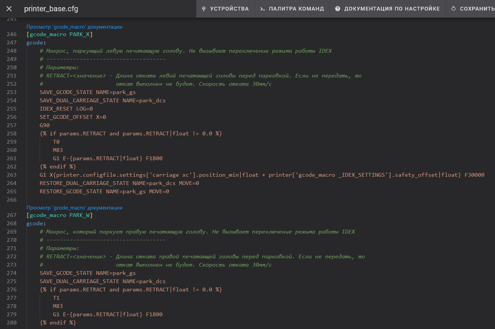

---
authors:
  - sorkin
icon: lucide/command
title: VOSTOK - Макросы
description: Гайд по макросам в конфигурации VOSTOK
---

# Макросы

## Описание

В конфигурации VOSTOK используется принцип размещения документации рядом с кодом. То есть инструкции по использованию макросов располагаются там же, где сами макросы - в `printer_base.cfg`. Тем не менее, для удобства пользователей и индексации макросов поиском сайта, информация о них продублирована на этой странице.

!!! note "Данные на этой странице даны для конфигурации последней версии. Если у вас более старая версия конфигурации, то некоторые макросы у вас могут отличаться или отсутствовать"

## Пользовательские макросы

### PARK_X

Макрос, паркующий левую печатающую голову. Не вызывает переключение режима работы IDEX

| Параметр | Тип | Описание |
| :------- | :-: | :------- |
| RETRACT | float | Длина отката левой печатающей головы перед парковкой. Если не передать, то откат выполнен не будет. Скорость отката 30мм/с |

### PARK_W

Макрос, паркующий правую печатающую голову. Не вызывает переключение режима работы IDEX

| Параметр | Тип | Описание |
| :------- | :-: | :------- |
| RETRACT | float | Длина отката правой печатающей головы перед парковкой. Если не передать, то откат выполнен не будет. Скорость отката 30мм/с |

### PARK_XW

Макрос, паркующий обе печатающие головы. Не вызывает переключение режима работы IDEX

Не имеет параметров.

### IDEX_MODE_FULL_CONTROL

Макрос, включающий режим полного контроля IDEX. При этом левая печатающая голова контролируется через ось X, а правая - через ось W. К примеру, команда `G1 X20 W100` одновременно переместит левую голову в координату 20, а правую в координату 100.

| Параметр | Тип | Описание |
| :------- | :-: | :------- |
| LOG | 0\|1 | Если указано 1, то в консоль будет выведено сообщение о переключении режима. По умолчанию 1 |

### IDEX_RESET

Макрос, сбрасывающий режим работы IDEX. После него будет задействована левая печатающая голова.

| Параметр | Тип | Описание |
| :------- | :-: | :------- |
| LOG | 0\|1 | Если указано 1, то в консоль будет выведено сообщение о переключении режима. По умолчанию 1 |

### IDEX_MODE_COPY

Макрос, который переводит IDEX в повторяющий режим.

| Параметр | Тип | Описание |
| :------- | :-: | :------- |
| PRINTHEAD_DISTANCE | float | Расстояние между печатающими головами. Если не указано, то будет использовано значение по умолчанию из `printer.cfg` |
| MOVE | 0\|1 | Если указано 1, то правая печатающая голова будет перемещена на PRINTHEAD_DISTANCE относительно левой. По умолчанию 0 |
| LOG | 0\|1 | Если указано 1, то в консоль будет выведено сообщение о переключении режима. По умолчанию 1 |

### IDEX_MODE_MIRROR

Макрос, который переводит IDEX в зеркальный режим.

| Параметр | Тип | Описание |
| :------- | :-: | :------- |
| MOVE | 0\|1 | Если указано 1, то обе печатающие головы будут переведены в базовое положение. Если 0, то головы перемещаться не будут. По умолчанию 0 |
| LOG | 0\|1 | Если указано 1, то в консоль будет выведено сообщение о переключении режима. По умолчанию 1 |

### T0

Макрос смены инструмента, совместимый со скриптом быстрой смены инструмента от Дмитрия Бутюгина ([ссылка на скрипт](https://github.com/dmbutyugin/klipper/blob/generic-cartesian/scripts/gcode/fast_tool_swaps.py)). Если указать хотя бы одну из координат XYZ, то следующая печатающая голова будет автоматически перемещена в эту координату с откатом.

| Параметр | Тип | Описание |
| :------- | :-: | :------- |
| X | float | Координата по X, в которую должна переместиться следующая печатающая голова |
| Y | float | Координата по Y, в которую должна переместиться следующая печатающая голова |
| Z | float | Координата по Z, в которую должна переместиться следующая печатающая голова |

### T1

Макрос смены инструмента, совместимый со скриптом быстрой смены инструмента от Дмитрия Бутюгина ([ссылка на скрипт](https://github.com/dmbutyugin/klipper/blob/generic-cartesian/scripts/gcode/fast_tool_swaps.py)). Если указать хотя бы одну из координат XYZ, то следующая печатающая голова будет автоматически перемещена в эту координату с откатом.

| Параметр | Тип | Описание |
| :------- | :-: | :------- |
| X | float | Координата по X, в которую должна переместиться следующая печатающая голова |
| Y | float | Координата по Y, в которую должна переместиться следующая печатающая голова |
| Z | float | Координата по Z, в которую должна переместиться следующая печатающая голова |

### SET_W_OFFSETS

Установка смещений правой печатающей головы. Эти смещения работают только при классическом режиме работы, то есть когда одновременно задействована только одна печатающая голова. В зеркальном и повторяющем режимах эти смещения не учитываются. Смещения по Z нет, т.к. у VOSTOK печатающие головы должны быть физически выставлены в один уровень с помощью регулировок на печатающей голове.

| Параметр | Тип | Описание |
| :------- | :-: | :------- |
| X | float | Смещение по X. Положительное значение смещает голову вправо, отрицательное - влево |
| Y | float | Смещение по Y. Положительное значение смещает голову ближе к задней части принтера, отрицательное - ближе к передней |

### PRINT_END

Макрос окончания печати. Сбрасывает режим работы, выключает нагреватели и вентиляторы, паркует обе печатающие головы, сдвигает стол в крайнее нижнее положение.

Не имеет параметров.

### CANCEL_PRINT

Отмена текущей печати.

Не имеет параметров.

### PAUSE

Приостановка текущей печати.

Не имеет параметров.

### IDEX_SHAPER_CALIBRATE

Макрос калибровки Input Shaping, учитывающий особенности IDEX-принтеров. Требует установки `GCODE_SHELL_COMMAND`, который можно установить через KIAUH в разделе Extensions.

Работает следующим образом:

1. Удаляются все файлы калибровки из папки `/tmp`. Если они вам нужны, то сделайте бэкап перед запуском макроса.
2. Паркуются все оси. Установка акселерометра не должна мешать парковке.
3. В зависимости от значения параметра `TEST_W`, снимаются данные для оси X или W.
4. Если не выключен параметр `TEST_Y`, то для оси Y снимаются данные в 3 точках: по центру стола, вблизи края стола, а также когда обе печатающие головы находятся вблизи центра стола.
5. По полученным данным строятся АЧХ `x.png` и `y.png`, которые сохраняются в `~/printer_data/config`. Если эти файлы уже есть, то они будут перезаписаны.

| Параметр | Тип | Описание |
| :------- | :-: | :------- |
| TEST_W | 0\|1 | Если включить (установить 1), то тест будет проведён для оси W. Если выключить или не указывать, то для оси X |
| TEST_Y | 0\|1 | Если включить (установить 1) или не указывать, то тест будет проведён также для оси Y |

### ENABLE_EQUAL_PA

Включает режим одинакового Pressure Advance для печатающих голов. Подробности о режиме см. в макросе `SET_PRESSURE_ADVANCE`.

Не имеет параметров.

### DISABLE_EQUAL_PA

Выключает режим одинакового Pressure Advance для печатающих голов. Подробности о режиме см. в макросе `SET_PRESSURE_ADVANCE`.

Не имеет параметров.

### SET_PRESSURE_ADVANCE

Если режим одинакового Pressure Advance выключен (по умолчанию), то этот макрос работает как стандартный `SET_PRESSURE_ADVANCE` Klipper. Если режим включён через макрос `ENABLE_EQUAL_PA`, то команда устанавливает одинаковые значения `ADVANCE` и `SMOOTH_TIME` для обеих печатающих голов. В этом случае параметр `EXTRUDER` игнорируется.

Данный режим используется для ускоренной калибровки Pressure Advance. Сгенерируйте калибровочный G-код для зеркального или повторяющего режима, и перед его запуском включите режим одинакового Pressure Advance. Таким образом можно за одну печать откалибровать сразу две печатающие головы. После калибровки не забудьте выключить режим одинакового Pressure Advance с помощью макроса `DISABLE_EQUAL_PA` или перезагрузив прошивку.

| Параметр | Тип | Описание |
| :------- | :-: | :------- |
| EXTRUDER | string | Имя секции экструдера из конфигурации (например, `extruder` или `extruder_stepper`). Если не указано, то используется экструдер активного хотэнда |
| ADVANCE | float | k-фактор Pressure Advance |
| SMOOTH_TIME | float | Время сглаживания Pressure Advance |

### SET_PA_VALUES

Установить значения PA для левой и правой печатающей головы, которые будут применены при начале следующей печати. Используется для того, чтобы передать значения PA из слайсера в прошивку до вызова макроса начала печати. Если вызвать без параметров, то установятся значения по умолчанию (0.0/0.03 на обе головы).

| Параметр | Тип | Описание |
| :------- | :-: | :------- |
| EXTRUDER | 0\|1 | Номер инструмента, для которого передаётся значение. 0 - левая печатающая голова, 1 - правая |
| ADVANCE | float | k-фактор Pressure Advance |
| SMOOTH_TIME | float | Время сглаживания Pressure Advance |

### APPLY_PA_VALUES

Применить значения PA для левой и правой печатающей головы. Вызывается автоматически из макросов начала печати.

Не имеет параметров.

### SET_NEXT_PRINT_MODE

Установить режим IDEX для следующей печати. Нужен для того, чтобы передать данные о режиме печати до вызова макроса начала печати.

| Параметр | Тип | Описание |
| :------- | :-: | :------- |
| MODE | 0\|1\|2 | Режим печати. 0 - классический, 1 - дублирующий, 2 - зеркальный. Если не передать значение, то будет установлен классический режим |

### RESET_VARIABLES

Сброс переменных IDEX к состоянию по умолчанию. Вызывается автоматически через `delayed_gcode` после перезагрузки прошивки.

Не имеет параметров.

### CALC_OFFSET

Макрос для автоматического расчёта смещения правой печатающей головы. Рассчитанные значения не применяются автоматически - их нужно вручную передать в `SET_W_OFFSETS`.

| Параметр | Тип | Описание |
| :------- | :-: | :------- |
| XL | float | Расстояние от стенки нижней части до стенки верхней части слева. Обязательный параметр |
| XR | float | Расстояние от стенки нижней части до стенки верхней части справа. Обязательный параметр |
| YF | float | Расстояние от стенки нижней части до стенки верхней части спереди. Обязательный параметр |
| YB | float | Расстояние от стенки нижней части до стенки верхней части сзади. Обязательный параметр |

## Служебные макросы

Это макросы, которые не предназначены для прямого использования, но нужны для работы других макросов.

### _IDEX_VARIABLES

Внутреннее хранилище переменных конфигурации IDEX. Содержит:

| Переменная | Значение |
| :--------- | :------- |
| `active_tool` | Номер активной печатающей головы. 0 - левая, 1 - правая |
| `equal_pa_mode` | 1 приравнивает PA на правой печатающей голове к значению на левой |
| `next_print_mode` | 0 - классический режим, 1 - дублирующий режим, 2 - зеркальный режим |
| `e0_pa` | Значение PA для левой печатающей головы |
| `e0_pa_smooth_time` | Время сглаживания PA для левой печатающей головы |
| `e1_pa` | Значение PA для правой печатающей головы |
| `e1_pa_smooth_time` | Время сглаживания PA для правой печатающей головы |

### _HOME_Z

Вспомогательный макрос, используемый внутри `homing_override`. Не удаляйте. Проверяет, находится ли печатающая голова в пределах стола, и в зависимости от этого либо паркует ось Z, либо выдаёт ошибку о том, что датчик автоуровня находится не над столом.

## Устаревшие макросы

Эти макросы оставлены для совместимости с предыдущими версиями. Лучше избежать их применения т.к. скорее всего, в одно из следующих версий они будут удалены.

### PRINT_START

Макрос-прокладка для вызова уже специфических для разных режимов работы IDEX макросов начала печати.

| Параметр | Тип | Описание |
| :------- | :-: | :------- |
| MODE | 0\|1\|2 | Режим печати. 0 - классический, 1 - дублирующий, 2 - зеркальный. Если не указано, то будет использовано значение параметра `next_print_mode` |
| E0_TEMPERATURE | int | Температура хотэнда левой печатающей головы. Обязательный параметр. В классическом режиме можно установить 0, тогда эта печатающая голова не будет использоваться. В других режимах должно быть не меньше 140 |
| E1_TEMPERATURE | int | Температура хотэнда правой печатающей головы. Обязательный параметр. В классическом режиме можно установить 0, тогда эта печатающая голова не будет использоваться. В других режимах должно быть не меньше 140 |
| BED_TEMPERATURE | int | Температура стола. Если значение не передано, то температура будет сброшена до 0 |
| PRINTHEAD_DISTANCE | float | Расстояние между печатающими головами. Если не указано, то будет использовано значение по умолчанию из `printer.cfg`. В классическом и зеркальном режиме не делает ничего |

### PRINT_START_CLASSIC

Макрос начала печати для классического режима работы IDEX. То есть либо печать одной печатающей головой, либо печать двумя попеременно.

| Параметр | Тип | Описание |
| :------- | :-: | :------- |
| E0_TEMPERATURE | int | Температура хотэнда левой печатающей головы. Обязательный параметр. Если голова не должна использоваться, то стоит передать 0 |
| E1_TEMPERATURE | int | Температура хотэнда правой печатающей головы. Обязательный параметр. Если голова не должна использоваться, то стоит передать 0 |
| BED_TEMPERATURE | int | Температура стола. Если значение не передано, то температура будет сброшена до 0 |

### PRINT_START_MIRROR

Макрос начала печати для зеркального режима работы IDEX.

| Параметр | Тип | Описание |
| :------- | :-: | :------- |
| E0_TEMPERATURE | int | Температура хотэнда левой печатающей головы. Обязательный параметр. Не может быть ниже 140 |
| E1_TEMPERATURE | int | Температура хотэнда правой печатающей головы. Обязательный параметр. Не может быть ниже 140 |
| BED_TEMPERATURE | int | Температура стола. Если значение не передано, то температура будет сброшена до 0 |

### PRINT_START_COPY

Макрос начала печати для дублирующего (повторяющего) режима работы IDEX.

| Параметр | Тип | Описание |
| :------- | :-: | :------- |
| E0_TEMPERATURE | int | Температура хотэнда левой печатающей головы. Обязательный параметр. Не может быть ниже 140 |
| E1_TEMPERATURE | int | Температура хотэнда правой печатающей головы. Обязательный параметр. Не может быть ниже 140 |
| BED_TEMPERATURE | int | Температура стола. Если значение не передано, то температура будет сброшена до 0 |
| PRINTHEAD_DISTANCE | float | Расстояние между печатающими головами. Если не указано, то будет использовано значение по умолчанию из `printer.cfg` |