---
authors:
    - sorkin
icon: material/hammer-wrench
title: VOSTOK - Навесное оборудование
description: Пошаговый гайд по установке навесного оборудования
---

# Навесное оборудование

## Гибкий кабель-канал

### Крепление

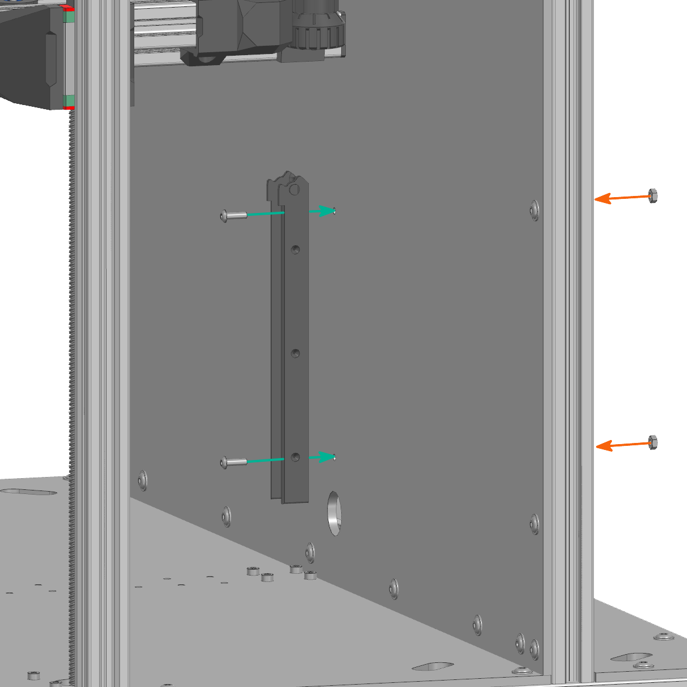

1. Установите крепление гибкого кабель-канала `V9-343` на среднюю панель зашивки `V9-421` с помощью винтов M3x10 с полукруглой головкой;
2. Закрепите гайками M3.

### Звенья

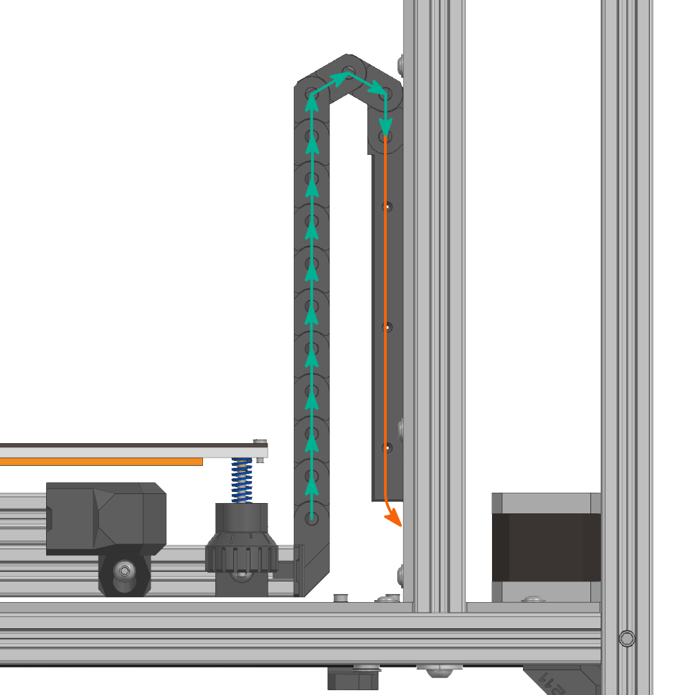

1. Соберите кабель-канал, последовательно нанизывая звенья `V9-341` на провода стола, после чего закрепляя их к ранее установленным звеньям;
2. Выведите провода в отсек электроники;
3. Закройте крепление кабель-канала `V9-343` крышкой `V9-344` (не показано на изображении).

## Защита ремней

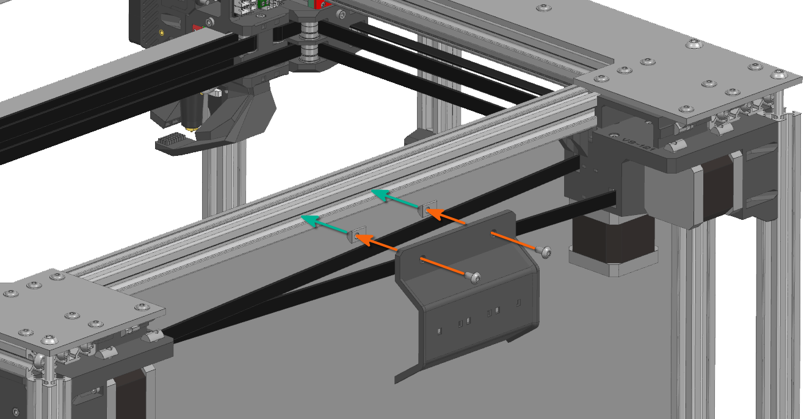

1. Заложите пазовые гайки M4 во вспомогательную балку портала `V9-1A`;
2. Установите защиту ремней `V9-447` и закрепите её винтами M4x8 с полукруглой головкой.

## Проходные заглушки

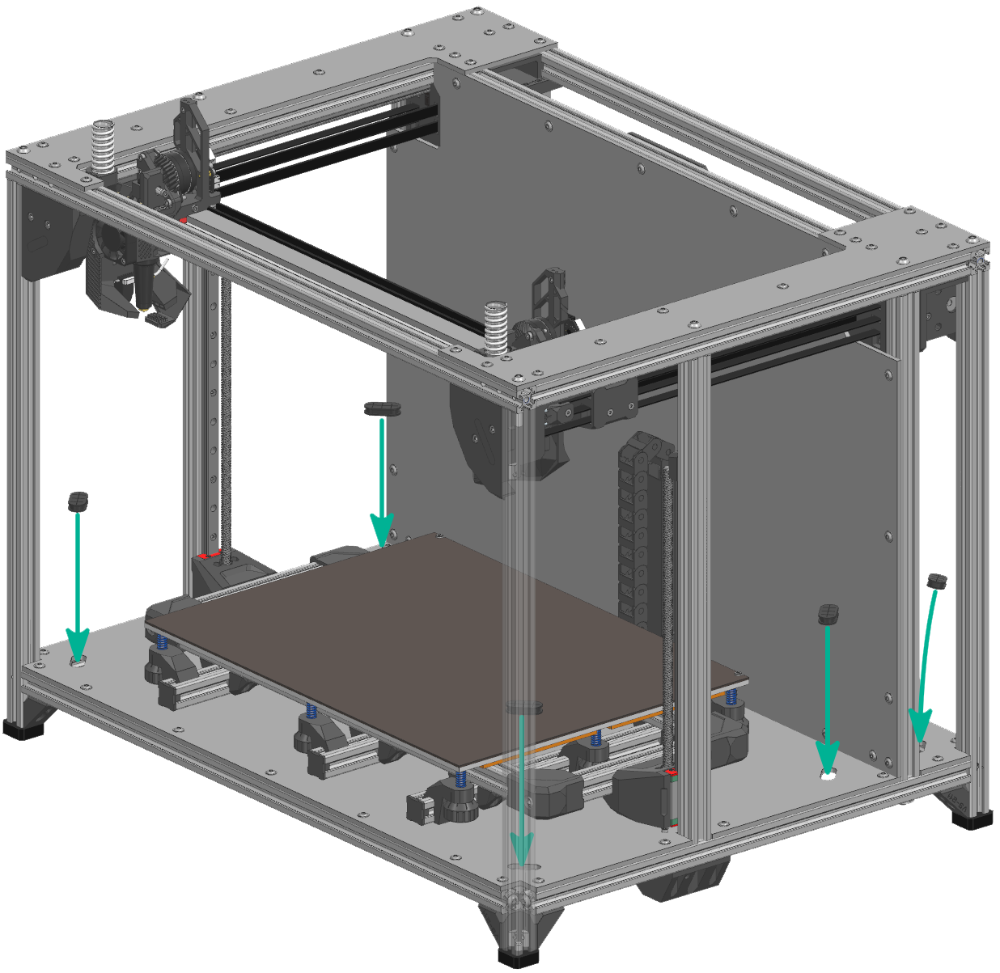

1. Установите проходные заглушки `V9-452` в нижнюю панель зашивки `V9-451`.

## Панель портала

### Задняя центральная крышка

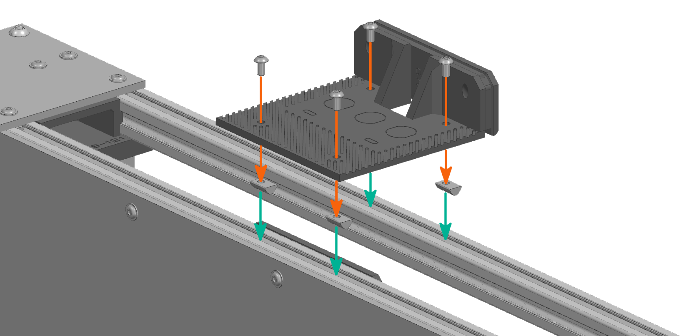

1. Заложите пазовые гайки M4 в заднюю поперечную балку портала;
2. Установите заднюю центральную крышку портала

### Боковые крышки

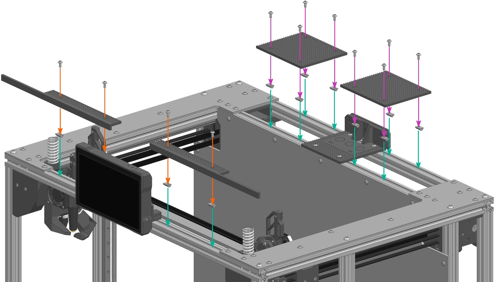

1. Заложите пазовые гайки M4 в переднюю, заднюю и вспомогательную поперечные балки портала;
2. Установите передние крышки `V9-443` и закрепите их винтами M4x8 с полукруглой головкой;
3. Установите задние крышки `V9-445` и закрепите их винтами M4x8 с полукруглой головкой.

## Катушкодержатель

### Сборка

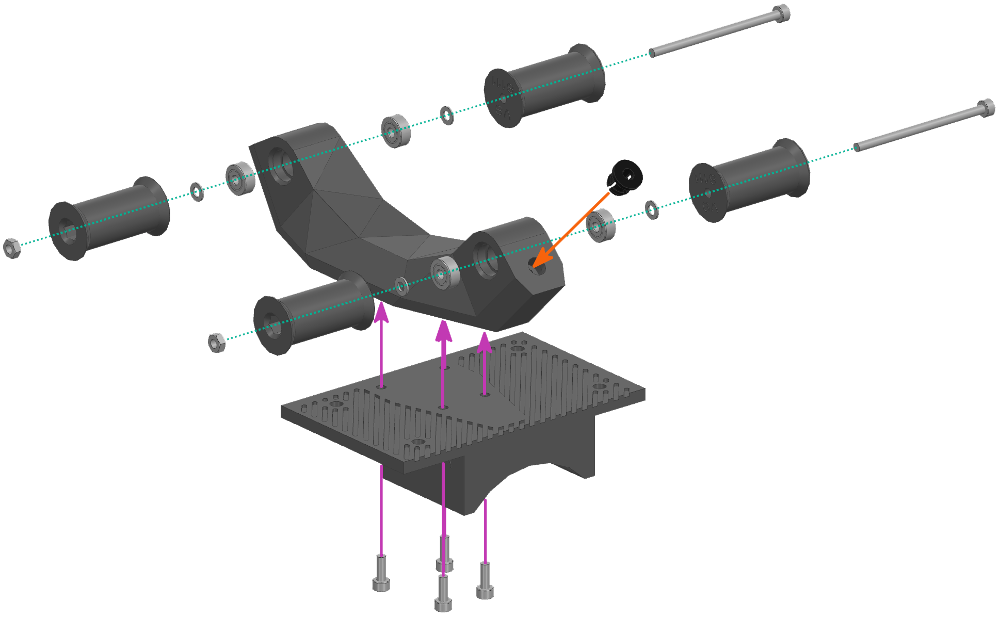

1. Соберите ролики:  
      1. Винт M3x50 с цилиндрической головкой;
      2. Ролик `V9-6111`;
      3. Шайба M3;
      4. Подшипник 623;
      5. Корпус катушкодержателя `V9-612`;
      6. Подшипник 623;
      7. Шайба M3;
      8. Ролик `V9-6111`;
      9. Гайка M3;
2. Установите фиттинг;
3. Установите корпус `V9-612` на базу `V9-613` и закрепите винтами M3x8 с цилиндрической головкой.

### Установка

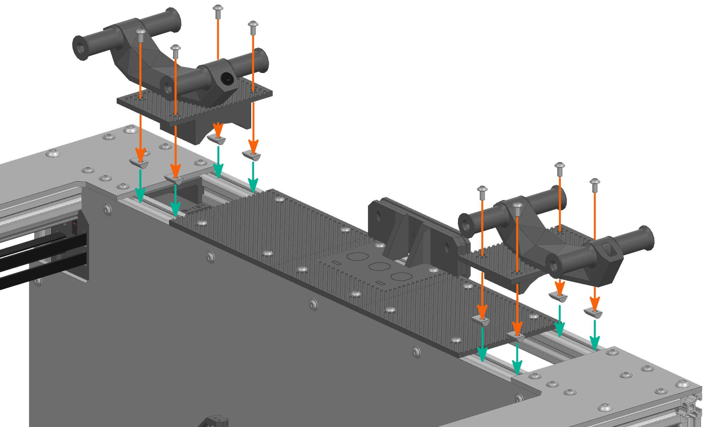

1. Заложите пазовые гайки M4 в заднюю и вспомогательную балки портала;
2. Установите катушкодержатели и закрепите их винтами M4x8 с полукруглой головкой.

## Нагреватель АТК

!!! note "На данный момент способ установки нагревателя экспериментальный. Он может быть изменён в будущем"

### Термистор нагревателя

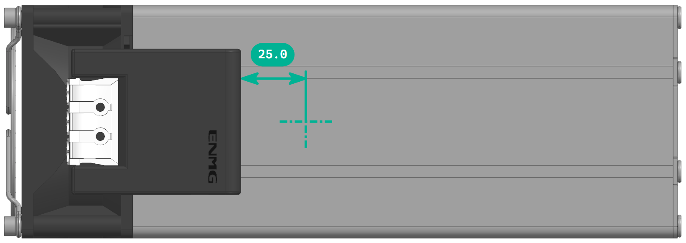

1. Просверлите отверстие Ø 2.5 мм и нарежьте в нём резьбу M3 как показано на изображении;
2. Закрутите термистор в него.

### Термистор термокамеры

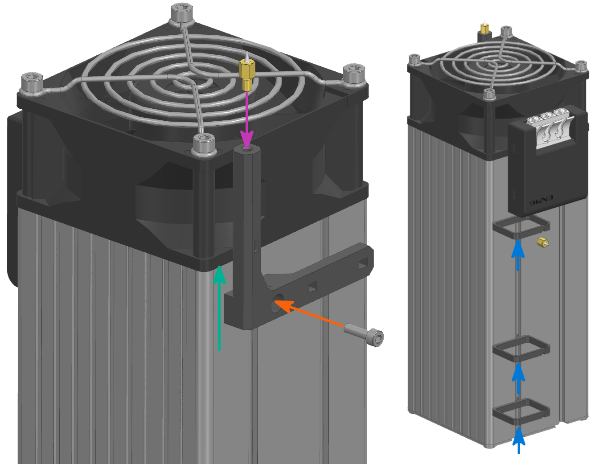

1. Установите крепление термистора `V9-633` на корпус нагревателя;
2. Закрепите винтом M3x10 с цилиндрической головкой;
3. Закрутите термистор в крепление;
4. (опционально) Установите крепления провдов `V9-632`. Их можно задвинуть по пазу или вставить и повернуть.

### Установка

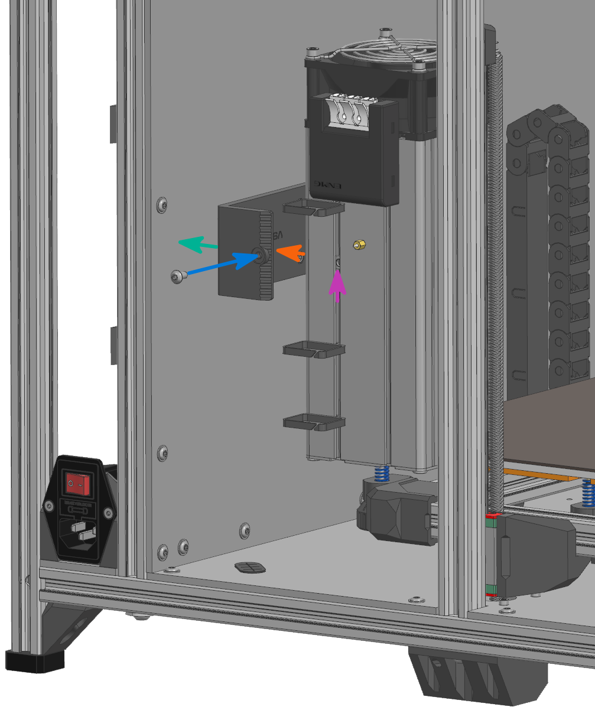

!!! info "Так как нагреватель термокамеры - это опциональное и экспериментальное оборудование, то отверстия для его крепления в панели зашивки не предусмотрены. Если вы хотите установить нагреватель, то отверстия вам придётся сверлить самому с помощью шаблона `V9-74`. Допускатся как сделать резьбовые отверстия в самой панели, так и сделать свободные отверстия и использовать гайки с обратной стороны"

1. Установите крепление термокамеры `V9-631` на среднюю панель зашивки `V9-421` и закрепите с помощью винтов M3x10 с цилиндрической головкой;
2. Установите нагреватель в крепление;
3. Заложите квадратные гайки М4 в пазы нагревателя;
4. Отрегулируйте по высоте, чтобы нагреватель был немного ниже печатающих голов. После этого закрепите всё винтами M4x8 с полукруглой головкой.

## Стойки купола

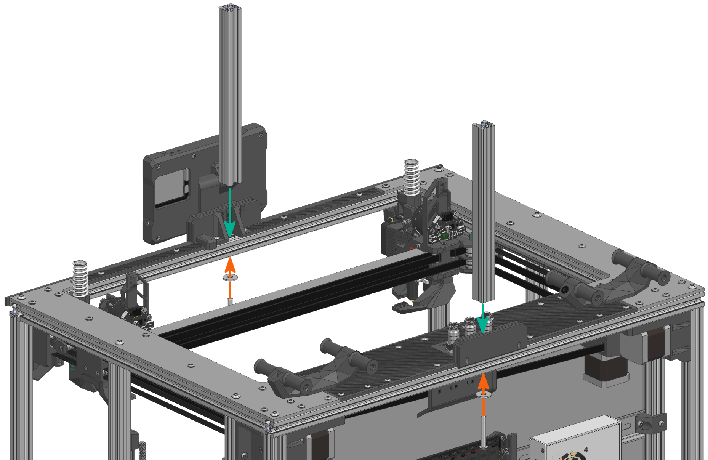

1. Установите стойки купола `V9-473`;
2. Закрепите их винтами M6x40 с полукруглой головкой через кузовные шайбы M6.

## ws7040

### Разветвитель CPAP трубки

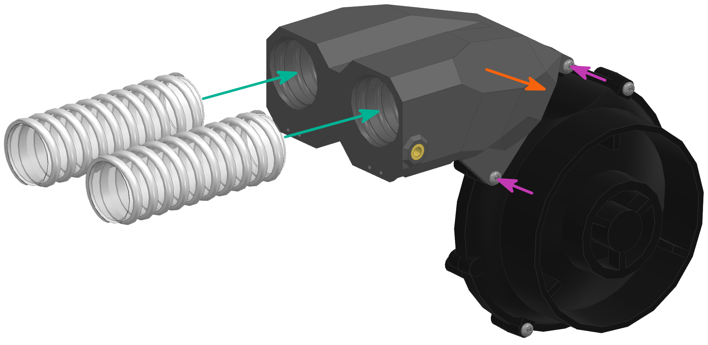

1. Закрутите трубки с печатающих голов в разветвитель `V9-623`;
2. Установите разветвитель на ws7040;
3. Закрепите на 2 штатных винта.

### Разветвители PTFE трубок

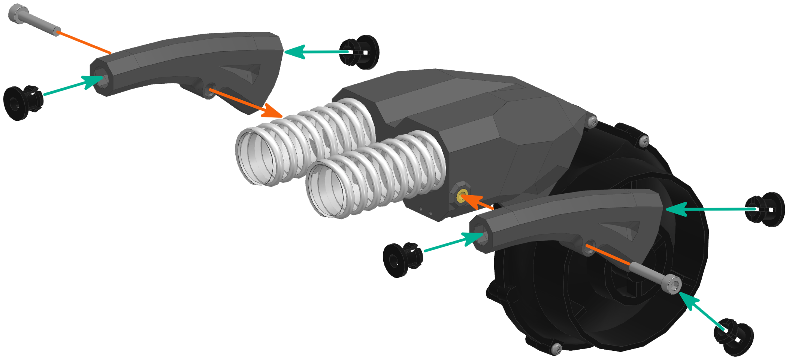

1. Установите фиттинги в разветвители PTFE трубок `V9-624`;
2. Установите разветвители PTFE трубок на разветвитель CPAP трубки `V9-623` и зафиксируйте винтами M3x16 с цилиндрической головкой. Не перетяните винт, разветвитель PTFE трубок должен свободно вращаться на нём.

### Крепление

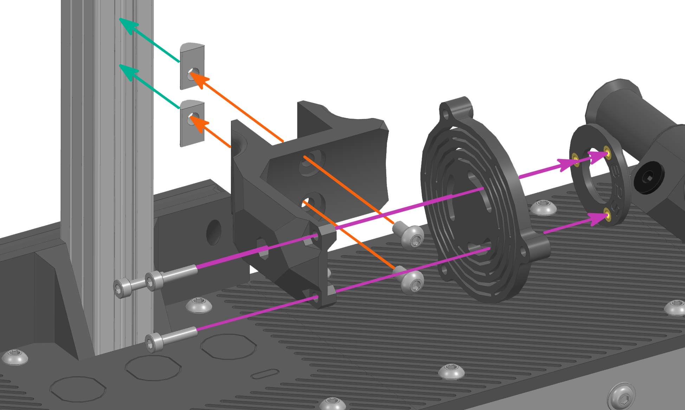

1. Заложите пазовые гайки M4 в заднюю стойку купола;
2. Установите крепление `V9-622` и закрепите его винтами M4x8 с полукруглой головкой;
3. Установите демпфер `V9-621`, на него прижимное кольцо `V9-625`, и скрепите всё винтами M3x12 с цилиндрической головкой.

### Установка ws7040

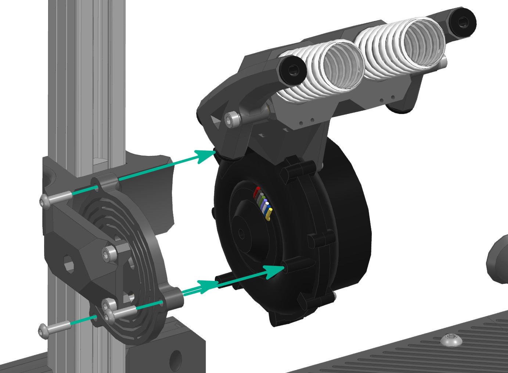

1. Установите ws7040 и закрепите его винтами M3x10 с полукруглой головкой.

