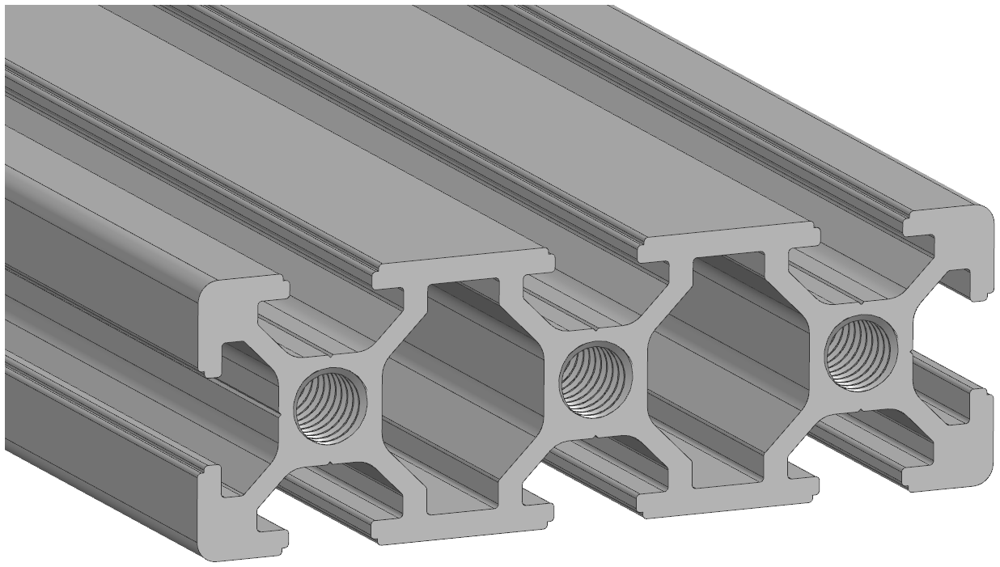
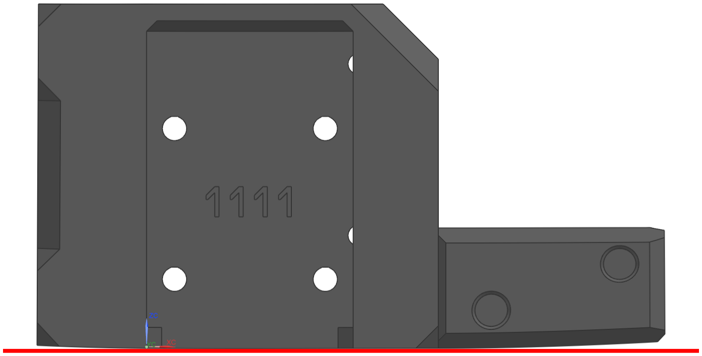
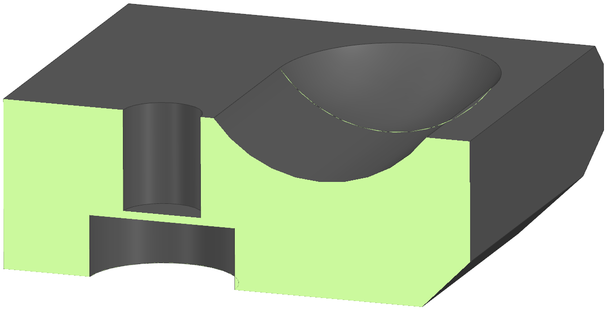
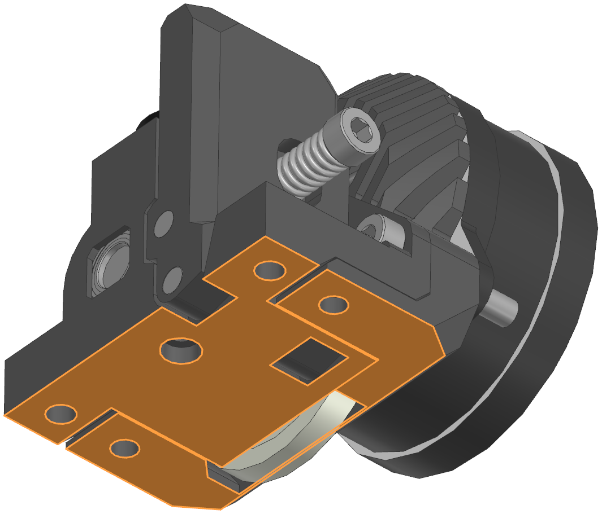
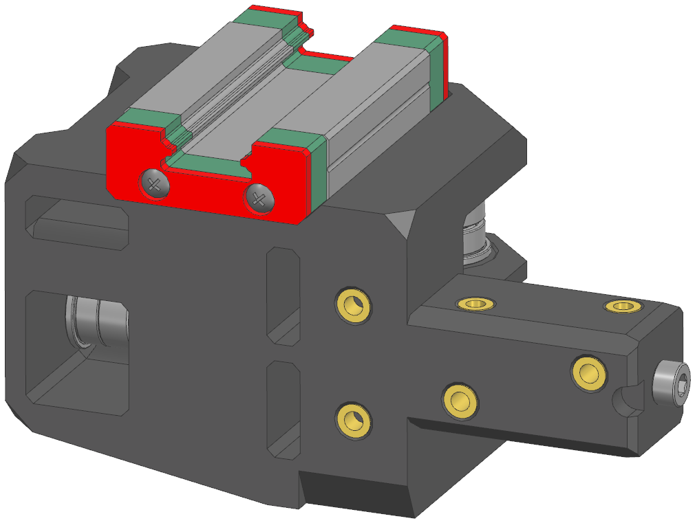
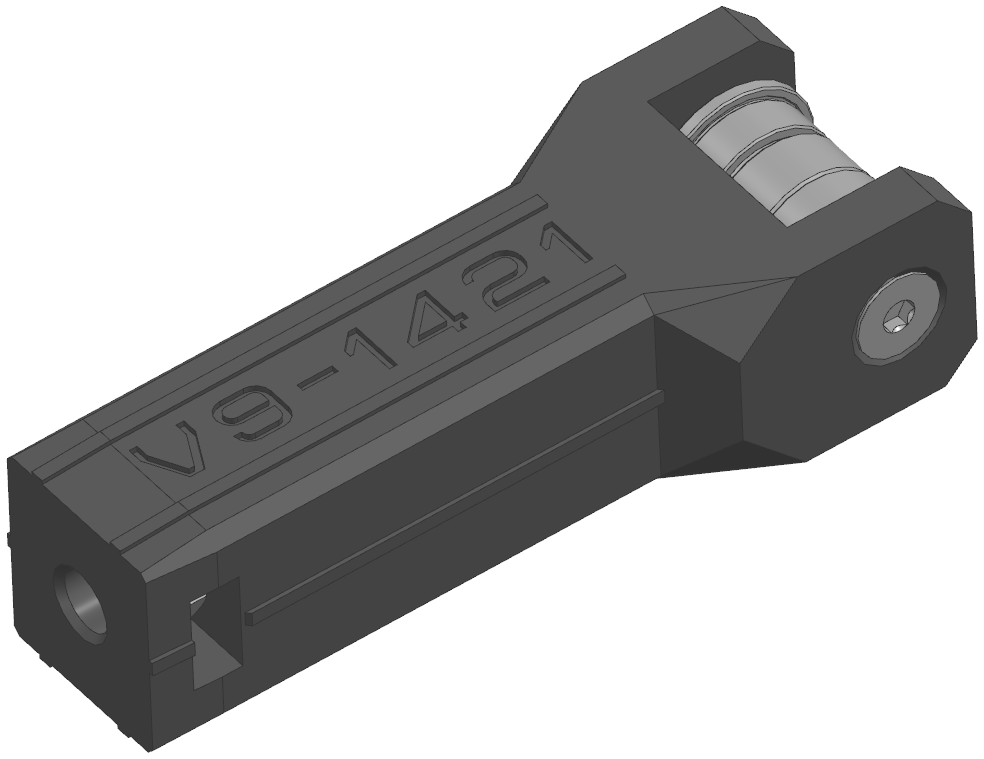

---
authors:
  - sorkin
icon: lucide/package-open
title: VOSTOK - Подготовка
description: Гайд по подготовке деталей к сборке 3D принтера
---

# Подготовка к сборке

## Проверка деталей

Список того, что следует проверить **перед** началом сборки принтера:

1. Длина профилей не должна отличаться от заданной в чертежах более чем на 1мм. Особенно критично сравнить длину стоек оси Z. Если профили 2020 V-slot будут заметно отличаться по длине от других стоек, то это может привести к изгибу портала;
2. На профилях не должно быть замятий и прочих повреждений. Особенно это касается 2020 V-slot профилей т.к. замятие на них почти гарантированно приведёт к проблемам в работе оси Z;
3. Профили и труба оси X должны быть прямыми. Просто сложите их вместе, и сразу увидите если какие-то из них кривые;
4. Труба оси Х должна иметь правильную длину и **толщину стенки**. Очень много продавцов, включая соберизавод, любят занижать толщину стенки вплоть до -0.5мм или прислать трубу на несколько миллиметров длиннее\короче. Если такое случилось с вами, возвращайте эту трубу и ищите соответствующую спецификации;
5. Обязательно проведите аудит покупных, печатных и стандартных изделий перед началом сборки.

## Смятая резьба

{ width="200" align="left" }

Нарезать резьбу и сверлить отверстия надо аккуратно и не торопясь. Если вы поторопитесь и сомнёте резьбу в каком-то из профилей, то потом при эксплуатации принтера винт может вырвать из профиля, и рама в этой точке ослабнет. Если это произойдёт с какой-то из стоек, то заменить профиль будет достаточно легко. А вот заменить какой-либо из профилей портала после сборки - уже задача, требующая разборки половины принтера. Поэтому сорвали резьбу или каким-то другим образом повредили профиль портала - проще заменить его до сборки принтера.

## Искривлённые детали

{ width="200" align="left" }

Часто при печати инженерными материалами, имеющими высокую усадку, детали получаются искривлёнными. Для некоторых деталей, например, декоративных панелей, это не критично, и при желании вы можете использовать их. Но несущие детали, в особенности каретки оси Y, приводы осей XWY, натяжители ремней, детали подающего механизма и т.д., должны быть ровными. Иначе после сборки могут начаться проблемы - закусывание рельс, поджирание ремня и т.д.

!!! tip "Можно попробовать спасти искривившуюся деталь. Положите деталь на стол принтера в том положении, в котором она печаталась, нагрейте стол до температуры печати, и продержите так несколько часов. Работает не всегда, но иногда помогает и деталь становится ровной"

## Жертвенные слои

{ width="200" align="left"}

Для того, чтобы цекованные отверстия не требовали поддержек для печати, многие из них закрыты жертвенными слоями в 1-2 слоя. Такие отверстия после печати необходимо прочистить. Проще всего - сверлом соответствующего диаметра или круглым надфилем.

!!! note "В некоторых местах, например, в корпусах приводов осей X и W, несмотря на наличие подобных элементов, рекомендуется использование поддержек. По возможности - легкоотделяемых с 0 зазором"

## Привалочные плоскости

{ width="200" align="left" }

Даже очень хорошо настроенный принтер не может выдать идеально плоские поверхности. Поэтому перед сборкой рекомендуется осмотреть напечатанные детали на предмет слегка выступающих углов или других геометрических дефектов на привалочных плоскостях. Дефекты стоит обработать надфилем, но без фанатизма - достаточно просто ровной поверхности без сильно выпирающих углов и прочих подобных элементов.

## Вплавляемые резьбовые втулки

{ width="200" align="left"}

Те соединения, которые может потребоваться неоднократно размыкать после сборки принтера, выполнены на резьбовых втулках. Отверстия под втулки во всех деталях имеют диаметр 4.3мм, что должно хорошо подходить для резьбовых втулок, указанные в спецификации. При использовании втулок большего диаметра отверстия придётся рассверливать.

!!! note "Предполагается, что то, в какие отверстия надо вплавлять втулки, очевидно по форме детали. Если вам не очевидно, то придётся открывать и смотреть сборку - там отображены все крепёжные элементы"

!!! warning "Наплывы филамента, остающиеся после вплавления втулок, необходимо срезать вровень с поверхностью. Если втулка вплавлена не до конца, то вплавить её глубже или спилить выступающую часть надфилем"

## Сминаемые элементы

{ width="200" align="left"}

Ползуны натяжителей ремней и выступающие элементы на каретках оси Y специально выполнены так, чтобы их сечение было больше сечения отверстий, в которые они вставляются. Это необходимо для того, чтобы исключить люфт в этих соединениях. Тем не менее, если печатать немного в плюс по размеру, то может возникнуть ситуация, когда собрать соединение окажется невозможным. В таком случае придётся прибегнуть к доработке деталей по месту напильником. Главное - обрабатывать по чуть-чуть, чтобы не допустить люфта в соединении.

!!! tip "Размер этих элементов значительно проще подгонять пока принтер еще не собран"
