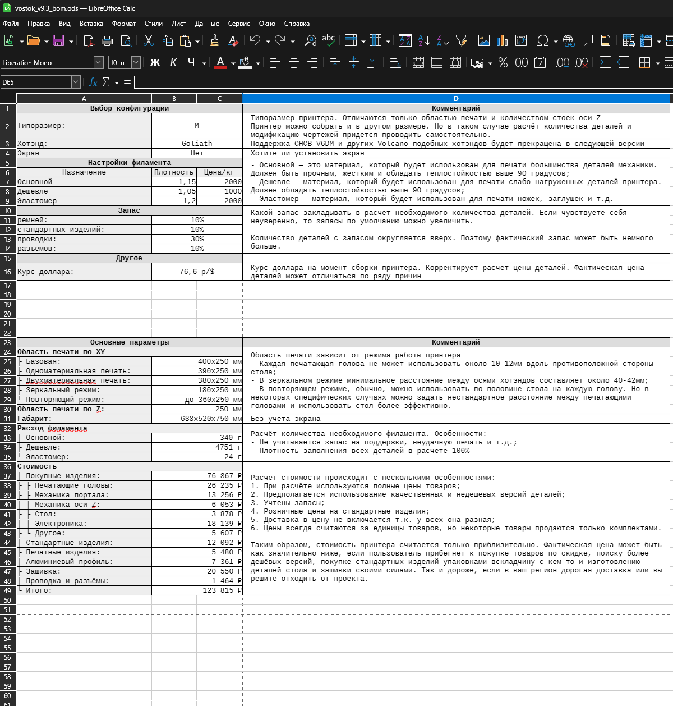
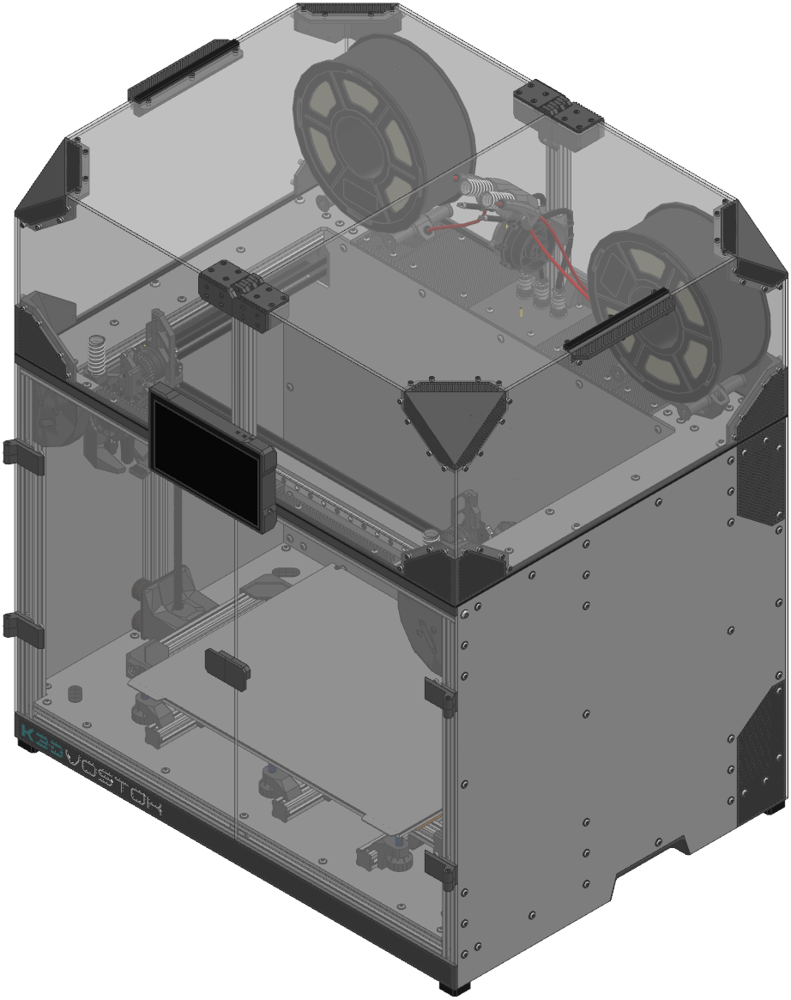
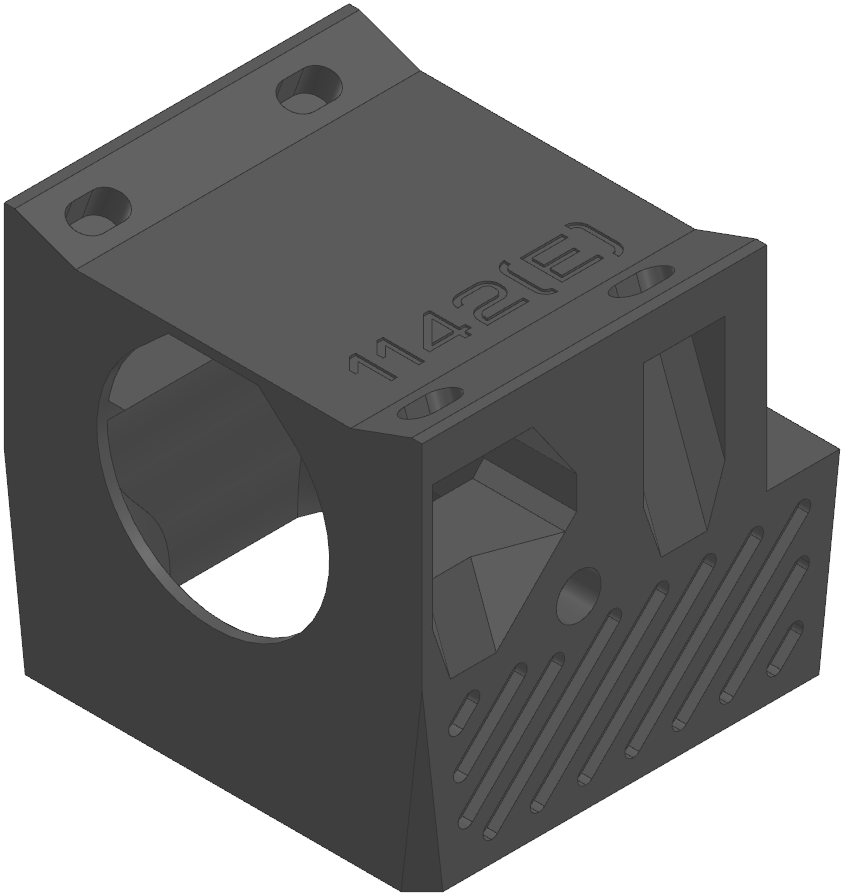
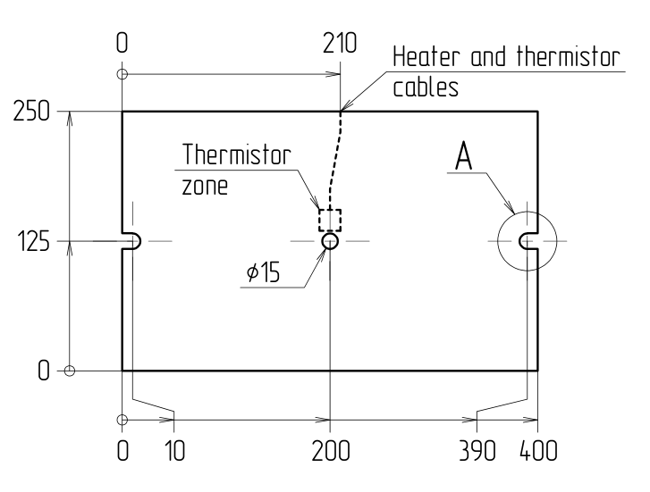
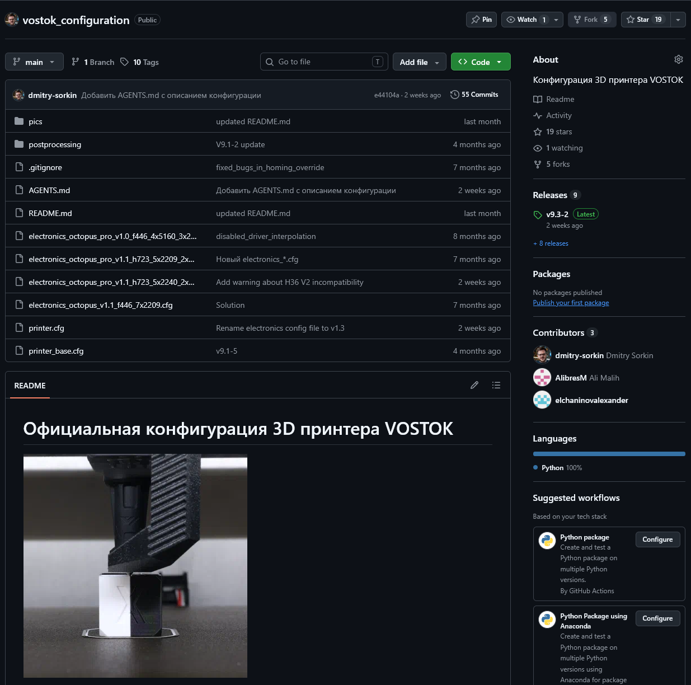
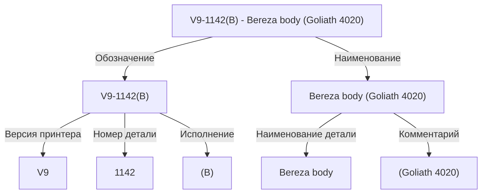
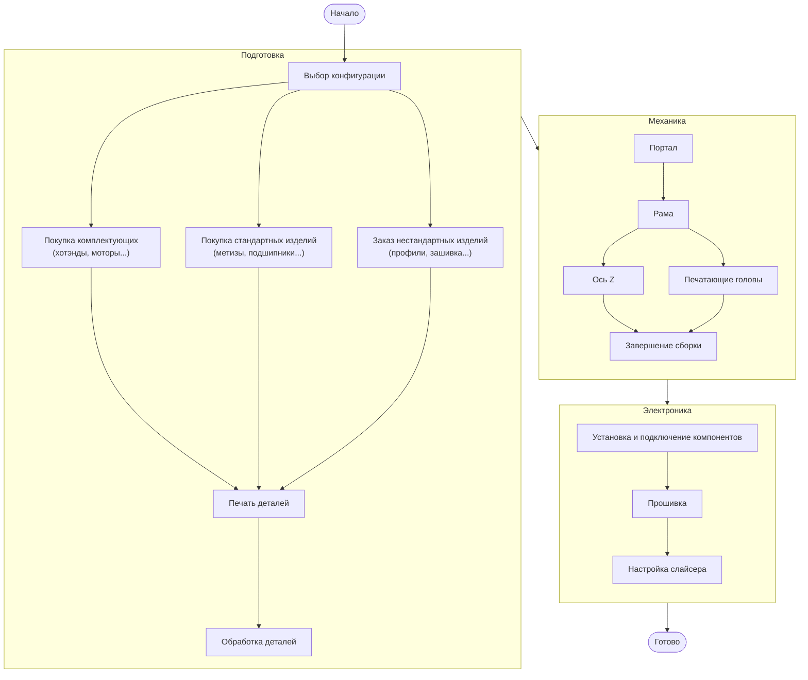

---
authors:
  - sorkin
icon: lucide/list-todo
title: VOSTOK - Начало
description: Что делать, если вы захотели собрать VOSTOK?
---

# С чего начать сборку VOSTOK

Итак, вы решили собрать K3D VOSTOK. Перед тем, как вы приступите к каким-либо действиям по этому поводу, рекомендую прочитать эту статью. В ней я постараюсь дать базовую информацию, которая поможет проще ориентироваться в проекте и избегать некоторых распространённых ошибок.

## Структура документации

Чтобы понимать где какую информацию искать, надо понимать структуру проекта. Документация VOSTOK поставляется в виде нескольких скачиваемых файлов:

### Спецификация

{ width="250" }

Спецификация - это главный файл проекта. В нём содержится:

- Выбор конфигурации принтера;
- Расчёт основных параметров принтера: габаритов, стоимости, количества используемого филамента и так далее;
- Список покупных и стандартных деталей, которые необходимо приобрести. Включая ссылки на них;
- Список печатных деталей;
- Список проводов и разъёмов.

Сборка принтера начинается с открытия этого файла. Во время этапа подготовки этот файл сильно упростит вам поиск необходимых деталей, а также позволит легко вести учёт того, что уже куплено/напечатано, а что еще нет.

### Сборка

{ width="250" }

В составе документации поставляется полная сборка принтера в форматах STEP (.stp) и Parasolid (.x_t). Особенности:

- Сборка предоставляется только для размера M. Для других размеров сборок нет и не планируется т.к. они особо не отличаются;
- В сборке есть и находятся на своих местах все варианты всех деталей. Поэтому, если вы хотите посмотреть как, что и куда крепится, необходимо будет скрыть варианты деталей, не относящиеся к вашей конфигурации принтера;
- Детали в сборке уже имеют в себе оптимизации под 3D печать. Вариантов деталей без этих оптимизаций нет;
- Нужную деталь легко найти в сборке, если пользоваться обозначением детали.

### STL файлы

{ width="250" }

Детали для печати предлагаются в наиболее совместимом формате STL. Особенности:

- Все детали расположены в оптимальной для печати ориентации;
- На большинство деталей нанесено обозначение, позволяющее легко найти её в спецификации или сборке;
- Детали, имеющие надписи, имеют несколько тел в одном STL файле. Это позволяет:
    - Получить едва заметную надпись, если ничего не делать с моделями;
    - Убрать надпись, если объединить тела;
    - Разбить деталь на тела и назначить телам букв печать другим материалом, чтобы получить контрастную надпись;
    - Разбить деталь на тела и удалить тела букв, чтобы получить рельефную надпись;
- Подавляющее большинство деталей оптимизированы под печать таким образом, чтобы поддержки были не нужны. Тем не менее, с поддержками многие места печатаются проще.

### Чертежи

{ width="250" }

Для нестандартных деталей предоставляются чертежи. Их можно разделить на 2 типа:

1. Чертежи деталей, которые производятся резкой, поставляются в формате DXF. Это стандартный формат, с которым умеют работать большинство компаний, занимающихся резкой листовых материалов;
2. Чертежи деталей, которые производятся вручную, поставляются в формате PDF.

В большинстве случаев, если вы собираетесь заказать производство нестандартных деталей на стороне, то достаточно будет просто передать исполнителю чертежи и он сам поймёт как произвести эти детали.

### Конфигурация

{ width="250" }

VOSTOK использует нестандартную версию Klipper'а, котоарая поддерживает независимое управление печатающими головами. Под эту версию нет документации, поэтому самостоятельное конфигурирование сильно затруднено. Вдобавок к этому, IDEX требует довольно специфичных макросов для правильной калибровки Input Shaping, Pressure Advance, а также работы разных режимов работы. Это дополнительно усложняет конфигурирование принтера.

Чтобы упростить этот момент, для VOSTOK поставляется стандартная конфигурация, которая выложена на [:material-github: GitHub](https://github.com/dmitry-sorkin/vostok_configuration){ target="_blank" }, а также набор инструкций по установке прошивки и настройке слайсера.

## Система названий

Перед началом сборки принтера, полезно разобраться в системе названий деталей т.к. это позволяет значительно проще ориентироваться в проекте. Название состоит из нескольких частей:

Наименование, включая комментарий - это просто человекочитаемое название детали. Оно нужно только и исключительно для того, чтобы можно было понять что это за деталь, не открывая модель.

Обозначение - это куда более важная часть названия. Это уникальный номер детали, который проставляется везде: и в спецификации, и в сборке, и в инструкциях, и даже на 3D моделях деталей. Благодаря этому очень легко связать информацию из разных частей документации.

Еще проще это становится если понимать структуру обозначения:

- Версия принтера `V9` - это VOSTOK v9.x. На данный момент у всех деталей версия одинаковая т.к. в 9 версии принтера все детали были переделаны. То есть деталей от предыдущих версий не осталось;
- Номер детали отражает место детали в иерархической структуре сборки. К примеру, `1142` означает, что эта деталь входит в сборку `1140` (у сборок в конце всегда 0). Сборка `1140` входит в сборку `110`. Сборка `110` входит в сборку `10`. А сборка `10` входит в общую сборку принтера `00`. Таким образом очень легко понять где искать деталь, с какими деталями эта собирается и т.д.;
- Исполнение - это вариант детали. К примеру, если у детали есть несколько вариантов под разные хотэнды, то они будут иметь один номер, но разный номер исполнения - `(A)`, `(B)`, `(C)` и т.д. В случае, если в принтере используется 2 зеркальных версии детали, то одна из них помечается `(L)` - левая, а другая `(R)` - правая. Иногда (L) в названии некоторых деталей `(L)` опускается т.к. левое исполнение всегда базовое.

## Последовательность действий

Также перед тем, как приступать к сборке, неплохо было бы понять оптимальную последовательность действий. Она не является истиной в последней инстанции, но в целом неплохо отражает то, какие этапы можно выполнять параллельно друг другу, а какие лучше выполнять последовательно и в каком порядке.

!!! note "Печатные детали можно изготавливать параллельно приобретению покупных. Но лучше отложить на более поздние этапы, чтобы, если вышло обновление принтера, начинать печатать уже обновлённые версии деталей"

