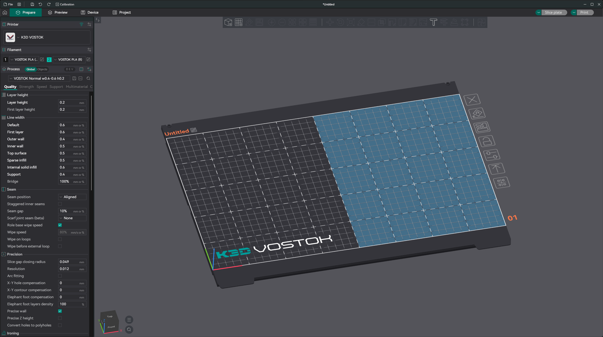
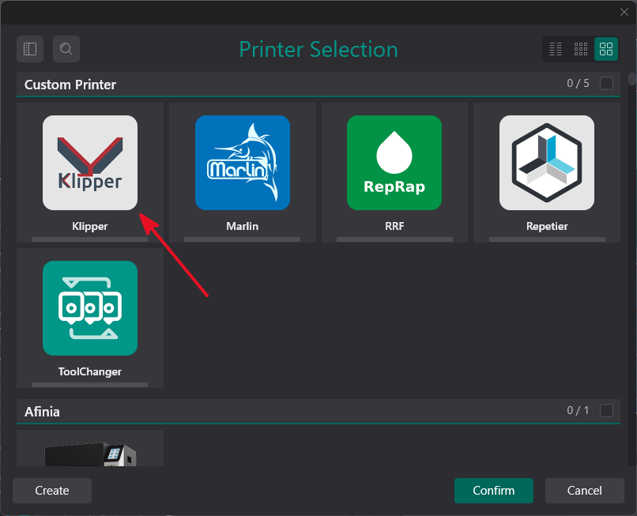
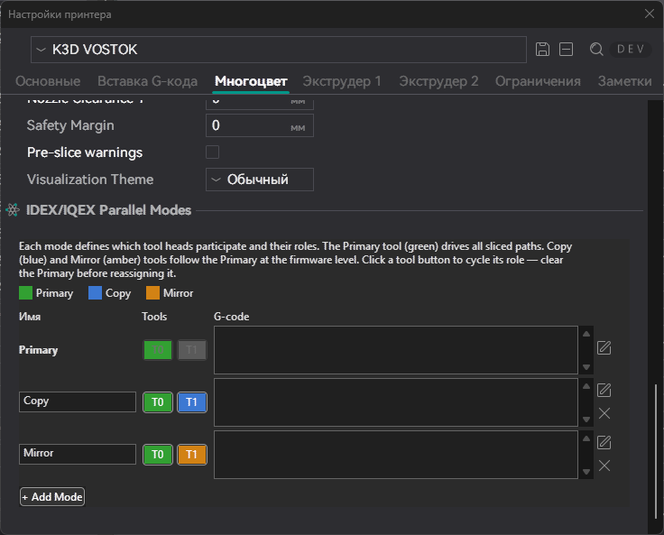
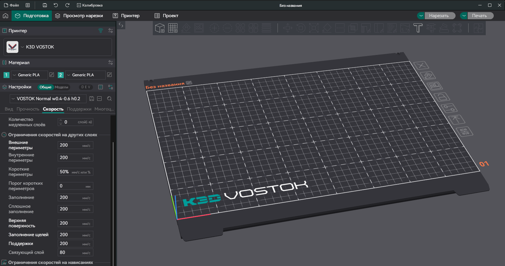

---
authors:
  - sorkin
icon: custom/orcaslicer
title: K3D VOSTOK - Конфигурация слайсера
description: Как правильно настроить PrusaSlicer и OrcaSlicer
---

# K3D VOSTOK - Конфигурация слайсера

Изначально в дополнение к конфигурации электроники поставлялся пример конфигурации слайсера. Это было удобно для первоначальной конфигурации принтера, когда у пользователя еще не было своих профилей. Но было очень неудобно для того, чтобы обновлять свои профили. А также это было неудобно обновлять. Поэтому основные моменты конфигурации VOSTOK в слайсерах было решено вынести в отдельную статью.

## Выбор слайсера

Для печати двумя головами попеременно, IDEX принтеру нужен G-код как для обычного двухэкструдерного принтера. А для работы зеркального и повторяющего режимов принтеру нужен G-код как для обычного одноэкструдерного принтера. Вторая печатающая голова переключается в режим зеркалирования/копирования просто макросом в стартовом G-коде. Эти функции поддерживаются любыми, даже очень старыми слайсерами. Поэтому использовать можно любой, просто надо будет создать 3 профиля принтера под 3 разных режима печати.



Тем не менее, в OrcaSlicer готовится PR с поддержкой IDEX принтеров. Плюсы этой поддержки:

- Один профиль принтера покрывает все режимы работы => изменения надо вносить только в 1 профиль, а не в 3;
- Режимы печати удобно переключаются. Наглядно видно в каком режиме принтер сейчас, какая у него область печати и т.д.;
- В дополнение к общему стартовому G-коду есть специфичный для каждого режима G-код;
- Плейсхолдеры вроде `is_extruder_used[1]` выдают корректные для IDEX значения, а также есть свои IDEX-специфичные плейсхолдеры вроде `imex_mode`. Благодаря этому можно писать более простые и корректные скрипты без костылей;
- Pressure Advance и некоторые другие параметры из профиля материала корректно применяются к разным печатающим головам без необходимости в обходных путях;
- Возможно настраивать разные значения адаптивного PA на разные головы.

Иными словами, эта поддержка принципиально ничего не меняет, но делает эксплуатацию принтера удобнее. Поэтому я рекомендую использовать именно версию OrcaSlicer с этой поддержкой. Единственный значимый минус этого варианта - пока эту поддержку не замерджат в основную ветку, придётся использовать кастомный билд из PR, который может быть нестабилен.

## Базовая настройка OrcaSlicer

### Установка OrcaSlicer с IMEX support PR

1. Откройте [страницу этого PR](https://github.com/OrcaSlicer/OrcaSlicer/pull/13086){ target="_blank" };
2. Перейдите на вкладку `Checks`;
3. В левой колонке нажмите на `Build all` вверху;
4. Внизу страницы в разделе `Artifacts` скачайте подходящий для вашей системы билд. Рекомендую использовать Portable версию, чтобы не удалять основную.

!!! warning "Обязательно сделайте бэкапы своих профилей перед установкой этой версии"

### Профиль принтера

{ width=500 }

Профиль надо основывать на базовом Klipper профиле. Возможна настройка и на основе другого профиля, но в этом случае потенциально могут возникнуть проблемы при обновлении базового профиля, а также при бэкапах и переносах профиля.

!!! note "Если какой-то параметр не попал в список, то его значение указывайте на свой выбор"

#### Раздел "Основные"

| Параметр | VOSTOK M9.x | VOSTOK L9.x | VOSTOK XL9.x | Комментарий |
| :------- | :---------: | :---------: | :----------: | :---------- |
| Область печати | X:400<br>Y:250 | X:400<br>Y:400 | X:500<br>Y:500 |  |
| Высота печати | 250 | 400 | 500 | Для Volcano-подобных хотэндов +20мм |
| Наилучшее расположение модели | X:0,25<br>Y:0,5 | X:0,25<br>Y:0,5 | X:0,25<br>Y:0,5 |  |
| Тип G-кода | Klipper | Klipper | Klipper |  |
| Относительные координаты экструдера | вкл. | вкл. | вкл. |  |
| Вспомогательный вентилятор | выкл. | выкл. | выкл. |  |
| Контроль температуры в термокамере | вкл. | вкл. | вкл. | Если вы не ставите нагреватель термокамеры, то включение этого параметра ни на что не повлияет |
| Вытяжной вентилятор | выкл. | выкл. | выкл. |  |

#### Раздел "Вставка G-кода"

##### G-код перед началом печати

``` gcode
{if (is_extruder_used[0] and is_extruder_used[1]) or imex_mode_index != 0}
  {local bed_temp = max(first_layer_bed_temperature[0],first_layer_bed_temperature[1])};При использовании 2 печатающих голов, температура стола будет установлена наибольшей из температур для обоих используемых филаментов
{elsif is_extruder_used[1]}
  {local bed_temp = first_layer_bed_temperature[1]}
{else}
  {local bed_temp = first_layer_bed_temperature[0]}
{endif}

M190 S{bed_temp};Нагрев стола
G28;Автопарковка
IDEX_RESET;Сбрасываем режим IDEX на время выполнения скрипта начала печати

{if imex_mode_index == 0}
  BED_MESH_CALIBRATE ADAPTIVE=1;Для классического режима снимаем карту высот
{else}
  BED_MESH_CLEAR;Для дублирующего и зеркального режима сбрасываем 
{endif}

G1 F30000
PARK_XW;Парковка обеих печатающих голов
G1 Y0

{if is_extruder_used[0]}M104 T0 S{first_layer_temperature[0]}{endif}
{if is_extruder_used[1] or imex_mode_index != 0}M104 T1 S{first_layer_temperature[1]}{endif}
{if is_extruder_used[0]}M109 T0 S{first_layer_temperature[0]}{endif}
{if is_extruder_used[1] or imex_mode_index != 0}M109 T1 S{first_layer_temperature[1]}{endif}

M83;Переводим экструдер в относительные координаты

{if imex_mode_index != 0 or (is_extruder_used[0] and is_extruder_used[1])}
  IDEX_MODE_MIRROR MOVE=1
{elsif imex_mode_index == 0}
  T{initial_extruder}
{endif}
G1 Z2 F600;Опускаем стол
G1 X1 Y0 F30000;Перемещаемся к началу линии очистки
G1 Z0.3 F600;Опускаемся на высоту печати линии очистки
G1 Y30 E20 F300;Печатаем линию очистки
G1 F30000

{if imex_mode_index == 0};Классический режим
  IDEX_RESET
  {if initial_extruder == 0}
    PARK_W
  {else}
    PARK_X
  {endif}
{elsif imex_mode_index == 1};Дублирующий режим
  IDEX_MODE_COPY MOVE=1;Включаем дублирующий режим с перемещением печатающих голов в базовую позицию
{elsif imex_mode_index == 2};Зеркальный режим
  IDEX_MODE_MIRROR MOVE=1;Включаем зеркальный режим с перемещением печатающих голов в базовую позицию
{endif}

M220 S100
M221 S100
G92 E0

;Подготовка скрипта быстрой смены инструмента
{if imex_mode_index == 0}
  M104 T0 S0
  M104 T1 S0
  {if is_extruder_used[0] and is_extruder_used[1]}
    ;fast_tool_swaps_start
  {endif}
  T{initial_extruder}
  {if is_extruder_used[0]}M104 T0 S{first_layer_temperature[0]}{endif}
  {if is_extruder_used[1] or imex_mode_index != 0}M104 T1 S{first_layer_temperature[1]}{endif}
{endif}
```

##### G-код после завершения печати

``` gcode
PRINT_END
```

##### G-код перед сменой слоя

``` gcode
G92 E0
```

##### G-код смены материала

``` gcode
T{next_extruder}
```

#### Раздел "Многоцвет"


| Параметр | Все размеры | Комментарий |
| :------- | :---------: | :---------- |
| Общий экструдер | выкл. |  |
| Количество экструдеров | 2 |  |
| Политика нагрева стола | Наибольшая температура |  |
| Время смены инструмента | 0.7с | Можно изменить, если сделаете замер на своём принтере |
| IDEX/IQEX Printer | вкл. |  |
| Firmware-managed zones | выкл. |  |
| Gantry count | 1 |  |
| Tools per Gantry | 2 |  |
| Tool 0 Position | Слева |  |
| Nozzle clearance X | 21 | Для стоковой печатающей головы |
| Nozzle clearance Y | 0 |  |
| Safety Margin | 0 |  |
| Pre-slice warning | вкл. | После того, как поймёте как работает поддержка IDEX в OrcaSlicer, сможете выключить |



В подразделе IDEX/IQEX Parallel Modes:

1. Добавьте к `Primary` еще два режима и назовите их `Copy` и `Mirror`. Порядок важен!
2. Прощёлкайте по иконкам `T0` `T1` рядом с ними, чтобы они стали такого же цвета, как на скриншоте;
3. Поля G-кодов стоит оставить пустыми т.к. вся логика инициализации печати идёт в `G-код перед началом печати`.

#### Разделы "Экструдер"

!!! note "Неуказанные параметры по вашему усмотрению"

| Параметр | Все размеры | Комментарий |
| :------- | :---------: | :---------- |
| Объём сопла | Не используется |  |
| Смещение координат экструдера | X:0<br>Y:0 | В стандартной конфигурации VOSTOK'а смещения указываются в прошивке |
| Откат при смене слоя | вкл |  |
| Очистка сопла при откате | вкл | Строго необходимо для скрипта быстрой смены материала |
| Длина движения очистки | $2 \times d_{сопла}$ |  |
| Откат при смене материала - длина | 2 |  |
| Доп. подача после отката | 0 | В prusaslicer и всех его форках есть баг, при котором при первом переключении печатающей головы длинный возврат не случается. Компенсировать это надо либо настройкой черновой башни, либо использованием скрипта быстрой смены инструмента (см. ниже) |

#### Раздел "Ограничения"

Настройки в этом разделе влияют только на расчёт времени печати. На саму печать не влияют и не используются ни в каких скриптах. Поэтому можете не настраивать тут ничего, или настроить согласно ограничениям в прошивке принтера.

### Профиль филамента

Профили филамента настраиваются как обычно, но с парой особенностей:

- Рекомендуется создавать сразу по 2 профиля для каждого филамента - 1 для левой и 1 для правой печатающей головы. Таким образом можно будет указывать разные настройки для разных печатающих голов даже если они печатают одинаковыми материалами;
- Настройки Pressure Advance работают для каждой головы отдельно. Включая адаптивный PA;
- Температуры работают корректно. То есть каждый хотэнд будет нагрет до той температуры, которая указана в его профиле филамента. Переключение с температуры первого слоя на температуру остальных слоёв тоже работает индивидуальной для каждого хотэнда;
- Температура стоал будет выставлена по максимальной температуре стола для двух материалов;
- Поток, настройки откатов, ограничение максимаьного объёмного расхода и т.д. применяются только от левой печатающей головы;
- Параметры из вкладки `Многоцвет` на работу принтера при использовании скрипта быстрой смены инструмента не влияют.

### Профиль печати

Профили печати настраиваются как обычно, но с парой особенностей:

- !!! warning "Для корректной работы скрипта быстрой смены инструмента обязательно надо отключить `Предотвращение течи материала`. Эта функция реализуется скриптом, и может вступить в конфликт с реализацией этой функции в слайсере"
- Черновая башня при работе скрипта быстрой смены инструмента не нужна, но и проблем с печатью не вызовет;
- То, какой печатающей головой будут печататься поддержки, настраивается на вкладке `Поддержки`;
- То, какой печатающей головой будут печататься линии разных типов, настраивается на вкладке `Многоцвет`;
- Рекомендуется не включать печать периметров снаружи-внутрь т.к. из-за особенностей работы скрипта быстрой смены инструмента могут быть небольшие дефекты в районе шва. Если хотите красивые периметры, то в OrcaSlicer лучше использовать `Точные периметры`.

## Дополнительные настройки

### Скрипт быстрой смены инструмента

Если вы хотите, чтобы ваш VOSTOK мог менять головы без печати черновой башни, то вам необходимо настроить скрипт быстрой смены инструмента. Информация о его настройке и установке вынесена в отдельную статью.

[Перейти к настройке скрипта быстрой смены инструмента](./fast_tool_swaps.md){ .md-button .md-button--primary }

### Модель и текстура стола



1. Скачайте модели и текстуры для вашего типоразмера принтера:

  | Типоразмер | Модель | Текстура |
  |:-|:-:|:-:|
  | **M** | [:material-download:](./assets/vostok_m9_bed_model_full.stl){ download="vostok_m9_bed_model_full.stl" } | [:material-download:](./assets/vostok_m9_bed_texture_full.png){ download="vostok_m9_bed_texture_full.png" } |
  | **L** | [:material-download:](./assets/vostok_l9_bed_model_full.stl){ download="vostok_l9_bed_model_full.stl" } | [:material-download:](./assets/vostok_l9_bed_texture_full.png){ download="vostok_l9_bed_texture_full.png" } |
  | **XL** | [:material-download:](./assets/vostok_xl9_bed_model_full.stl){ download="vostok_xl9_bed_model_full.stl" } | [:material-download:](./assets/vostok_xl9_bed_texture_full.png){ download="vostok_xl9_bed_texture_full.png" } |

2. Поместите модель и текстуру в удобную папку у вас на компьютере. Желательно чтобы эта папка находилась там, откуда вы случайно не удалите эти файлы, а также чтобы по пути к ней не было кириллицы;
3. Перейдите в `Профиль принтера` → `Основные` → `Область печати`;
4. В открывшемся окне в качестве текстуры выберите файл `vostok_*9_bed_texture_full.png` из папки под ваш типоразмер принтера;
5. В качестве модели выберите `vostok_*9_bed_model_full.stl` из папки под ваш типоразмер принтера;
6. Сохраните изменения.

!!! tip "Если вы собираете VOSTOK в нестандартном размере, то модель и текстуру придётся делать самостоятельно. В качестве исходника для текстуры стола используйте файлы `.afdesign` (Affinity) из [:material-download: архива](./assets/vostok_v9.x_bed_models_and_textures.7z){ download="vostok_v9.x_bed_models_and_textures.7z" }. В качестве исходников модели стола используйте модели из сборки принтера"

## Общие рекомендации при нарезке

- Помните, что зона около 10-12мм вблизи левого края стола не покрывается правой печатающей головой, и такая же зона около правого края стола не покрывается левой головой. На данный момент проверки на выход модели в эту зону нет;
- Толщину первого слоя лучше устанавливать побольше, чтобы компенсировать небольшое смещение по Z голов друг относительно друга;
- Помните, что при печати в зеркальном и повторяющем режимах, настройки выставляются сразу для обеих печатающих голов. Поэтому параметры лучше устанавливать на безопасные значения;
- Чтобы избегать задевания детали головами при переключениях, лучше использовать Z-hop. Это не обязательно, но сильно снижает риски отрыва деталей.
