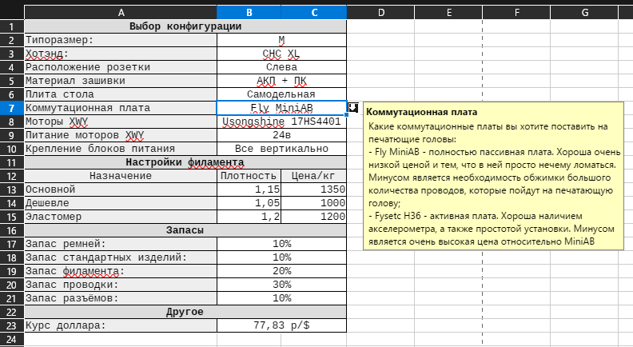
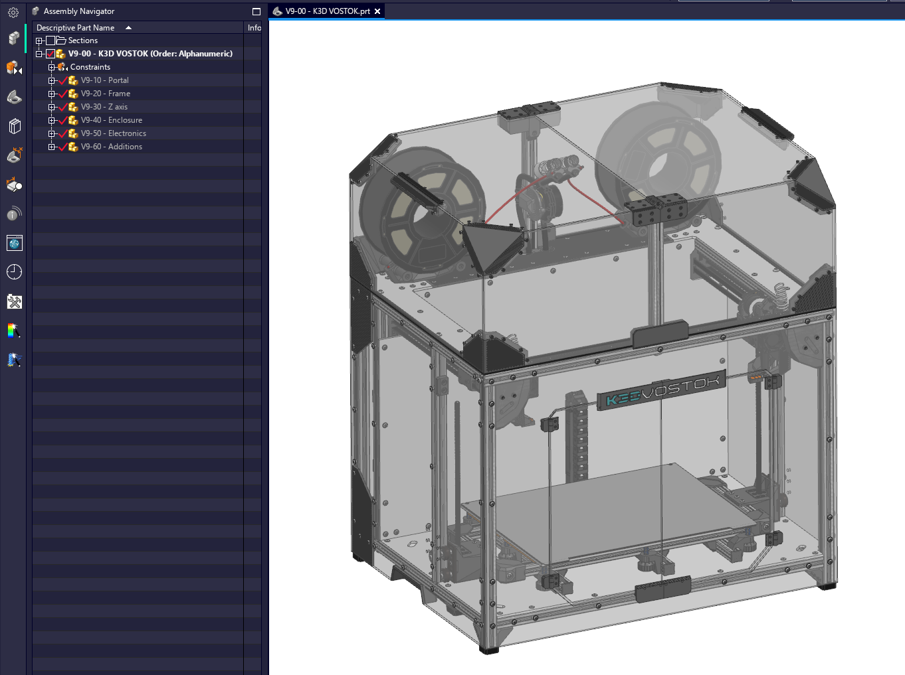

!!! warning "На данный момент инструкция по сборке принтера не закончена. Если вы не можете собрать принтер без инструкций, то лучше рассмотрите покупку серийно производимой модели"

# С чего начать сборку VOSTOK

Эта статья должна дать понимание об общей последовательности действий при сборке K3D VOSTOK. Этот процесс можно разделить на 4 основных этапа:

1. Выбор конфигурации;
2. Получение деталей;
3. Сборка принтера;
4. Настройка принтера.

Далее рассмотрим каждый из этапов отдельно:

## Выбор конфигурации

K3D VOSTOK может быть собран в разных размерах и с разными опциями. Поэтому сборку стоит начать с выбора подходящей под ваши цели конфигурации. Это делается в спецификации (BOM), представляющей из себя таблицу [LibreOffice](https://ru.libreoffice.org/){ target="_blank" }.

В ней на первой странице вам необходимо выбрать размер, тип хотэндов, материал зашивки и т.д. После этого внизу страницы вы сможете посмотреть информацию о внешнем габарите принтера и его приблизительной цене.

Несколько важных особенностей:

- Указывается полный габарит принтера, включая катушки (они располагаются внутри). Для открытия купола потребуется дополнительное место сбоку и сверху от принтера;
- Стоимость как принтера в целом, так и отдельных его составляющих, указана с учётом запаса стандартных изделий, проводки и т.д. Но при этом рассчитываются эти значения по цене товара без учёта скидок. Учитывая, что распродажи на AliExpress проходят очень часто, а также можно подключить кэшбек, собрать принтер можно дешевле;
- Данные по ценам обновляются не часто. Учитывая волатильность курса доллара, а также часто изменяющиеся цены, данные могут достаточно быстро устареть;
- VOSTOK в размерах L и XL имеет очень большой внешний габарит + большую массу. Из-за этого могут возникнуть сложности с его расположением, а также перемещением. Поэтому, если нет серьёзной необходимости в такой большой области печати, то рекомендуется собирать размер M;
- Хоть VOSTOK поддерживает установку Volcano-совместимых хотэндов, но они значимо ограничивают его характеритики при относительно небольшой экономии денег. Поэтому рекомендуется всё-таки смотреть в сторону CHC XL или Goliath.

!!! tip "Спецификацию с выбранной конфигурацией стоит сохранить в надёжном месте. Потом будет очень удобно вести учёт купленных и распечатанных деталей прямо в спецификации"

## Получение деталей

Детали VOSTOK условно делятся на:

- Покупные, то есть хотэнды, моторы, ремни, рельсы, платы и т.д.;
- Стандартные, то есть крепёж, подшипники и т.д.;
- Печатные;
- Профили;
- Детали зашивки;
- Проводка и разъёмы.

Состав и количество деталей, которые надо купить/распечатать/произвести рассчитывается в спецификации на соответствующих листах. Там же даны ссылки на примеры товаров и есть подробные комментарии.

!!! note "Для заказа профилей, зашивки и деталей стола воспользуйтесь чертежами этих деталей"
!!! tip "Лучше всего отложить печать пластиковых деталей на последний момент перед сборкой т.к. если печатать сильно заранее, то есть шанс, что выйдет обновление и придётся перепечатывать часть деталей"
!!! note "Печатаемые детали уже расположены в оптимальной для печати ориентации. Рекомендации по печати содержатся в комментариях в спецификации"

## Сборка принтера

К сожалению, на текущий момент инструкция по сборке принтера не готова. Но вы можете воспользоваться предоставляемыми в форматах Parasolid и STEP сборками VOSTOK. В большинстве случаев, просто покрутив сборку, становится понятно в какой последовательности и как соединять детали.

!!! note "Сборка предоставляется только для размера M. L и XL отличаются только удвоенным количеством стоек оси Z"

Общая последовательность сборки:

1. Балка оси Х без печатающих голов:
      1. Заложите внутренние винты в каретки оси Y (после установки роликов их заложить не получится);
      2. Установите ролики в каретки оси Y;
      3. Просверлите отверстия в балке оси X и нарежьте в них резьбу;
      4. Установите рельсу оси X на балку;
      5. Установите каретки оси Y на балку;
      6. Прикрутите каретки печатающих голов на каретки рельсы;
      7. Установите подшипники в каретки печатающих голов;
2. Портал:
      1. Соберите раму портала на ровном основании;
      2. Установите покупные панели портала на раму портала;
      3. Установите рельсы оси Y на раму портала;
      4. Заложите ролики в приводы осей XW;
      5. Установите шкивы на моторы осей XWY;
      6. Установите моторы X и W на приводы;
      7. Установите приводы на раму портала;
      8. Соберите натяжители ремней и установите их на раму портала;
      9. Проведите ремни осей XW при снятых моторах оси Y;
      10. Установите моторы оси Y на приводы;
      11. Проведите ремни оси Y;
3. Нижняя часть рамы:
      1. Соберите нижний портал рамы;
      2. Установите нижнюю панель зашивки;
      3. Установите стойки;
      4. Установите среднюю панель зашивки;
      5. Установите портал на стойки и прикрутите его;
4. Стол с рамой: 
      1. Соберите 3 плеча рамы стола;
      2. Соберите раму стола;
      3. Плиту стола обезжирьте и наклейте на неё грелку;
      4. Обезжирьте плиту с другой стороны и наклейте на неё магнитную наклейку;
      5. Установите плиту стола на раму стола;
5. Ось Z:
      1. Соберите и установите каретки оси Z на стойки;
      2. Соберите и установите корпуса приводов оси Z;
      3. Установите мотор оси Z на нижнюю панель зашивки (в отсеке электроники);
      4. Установите ходовые винты в приводы;
      5. Соберите и установите натяжители и ремень;
      6. Вставьте стол с рамой в каретки оси Z спереди;
      7. Установите задние защитные уголки;
6. Печатающие головы:
      1. Установите хотэнды в корпусы печатающих голов;
      2. Соберите подающие механизмы. Обратите внимание, что для их сборки необходимо укоротить вал промежуточной шестерни BMG;
      3. Установите подающие механизмы на корпусы печатающих голов;
      4. Установите корпусы печатающих голов на каретки XW;
      5. Установите кронштейны коммутационных плат и коммутационные платы;
      6. Установите вентиляторы хотэндов;
      7. Соберите системы охлаждения;
      8. Установите системы охлаждения на печатающие головы;
7. Электроника:
      1. Установите DIN рейки;
      2. Установите модули на соответствующие им кронштейны;
      3. Установите модули на DIN рейки;
      4. Соберите и установите компрессор системы охлаждения модели;
      5. Прокиньте провода с печатающей головы в отсек электроники;
      6. Подключите провода с печатающих голов согласно схеме для вашей электроники. Схемы содержатся в начале файлов конфигурации электроники для прошивки (см. настройка принтера);
      7. Подключите остальные модули друг к другу;
8. Завершение сборки;
      1. Установите панели зашивки;
      2. Соберите и установите держатели катушек;
      3. Соберите и установите купол;
      4. Установите дверцы.

## Настройка принтера

Для VOSTOK подготовлена конфигурация со всеми нужными для работы IDEX макросами, а также пример конфигурации для слайсера и скрипт быстрой смены материала. Инструкции и ссылки на скачивание на данный момент постятся на [GitHub](https://github.com/dmitry-sorkin/vostok_configuration).
