---
authors:
  - sorkin
icon: lucide/plug
title: K3D VOSTOK - Схемы подключения
description: Подробные схемы подключения всех электронных компонентов VOSTOK
---

# Схемы подключения

## 220В проводка

- Рекомендуется вести 220В провода отдельно от продов 24В, и тем более от сигнальных проводов;
- Для удобства коммутации, в проекте есть 3х WAGO 222-415, которые не показаны на схеме. Их использование не обязательно, но значимо упрощает работу с проводкой 220в;
- Рекомендуется кинуть заземление на раму принтера, раму стола и плиту стола, а также использовать розетку с УЗО или установить УЗО в принтер.

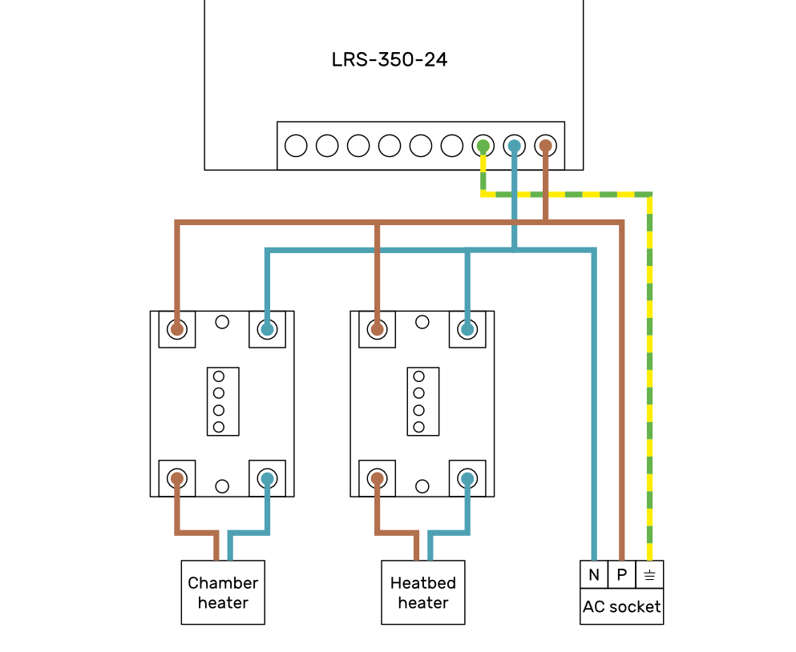{ .rounded }

## 24В силовая проводка

- На питание материнской платы сечение провода минимум 20AWG (0.52 мм²);
- На питание остальных потребителей минимум 22AWG (0.33 мм²) на каждого.

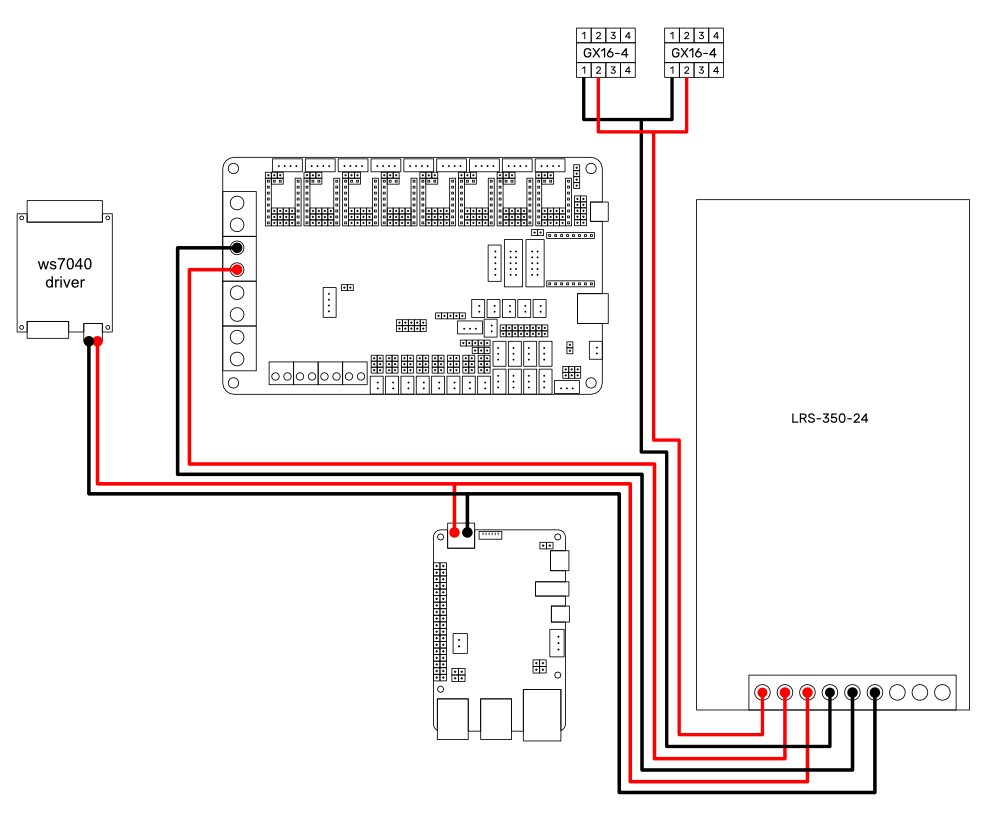{ .rounded }

## Джамперы

Расположение джамперов для использования со штатной конфигурацией и `electronics_octopus_pro_v1.1_h723_5x2240_2xH36.cfg`.

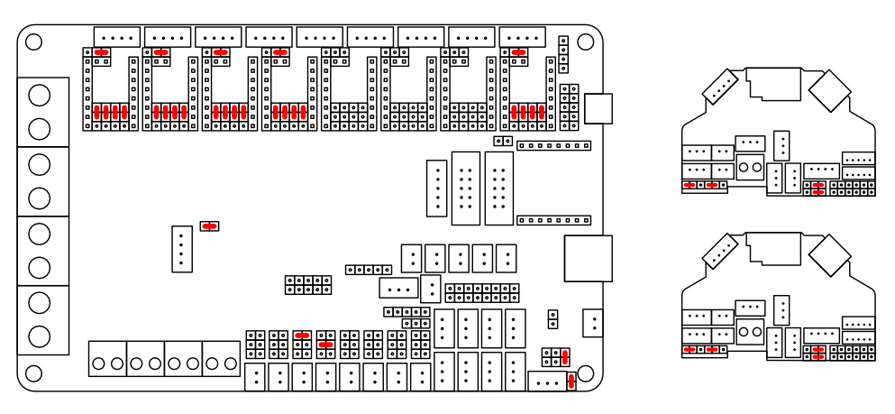{ .rounded }

## Драйверы и моторы

Цвета проводов у разных моторов могут отличаться. Но это не проблема т.к. при неправильном подключении мотор просто будет двигаться рывками или трещать на месте. Никакого вреда ни ему, ни драйверу не будет. В случае, если столкнулись с таким, то попробуйте:

1. Поменяйте местами пины 2 и 3 в разъёме;
2. Если не помогло, поменяйте местами пины 1 и 3 в разъёме.

Одно из этих действий точно должно привести подключение к корректному состоянию.

Если направление вращения двигателя инвертировано, то лучше всего инвертировать DIR пин в конфигурации. Но также можно просто инвертировать все пины в разъёме (1-2-3-4 -> 4-3-2-1).

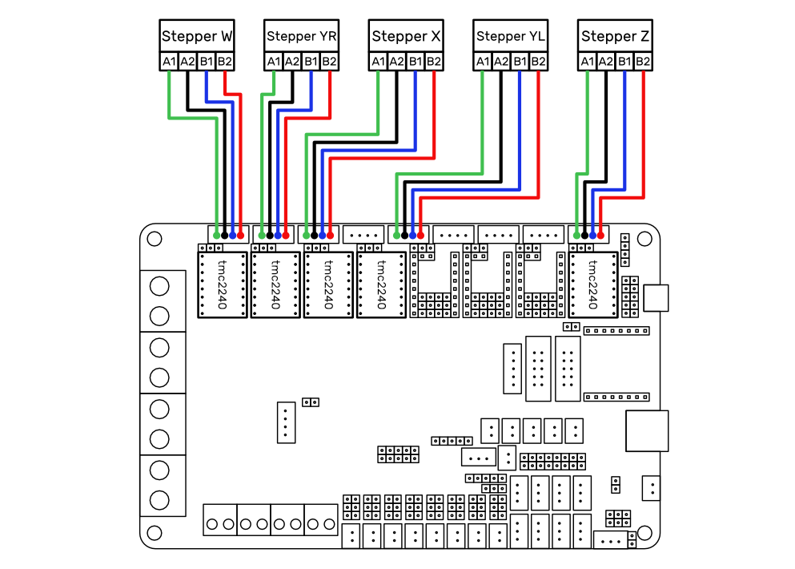{ .rounded }

## ws7040

- Цвета проводов у драйвера ws7040 могут отличаться от производителя к производителю.

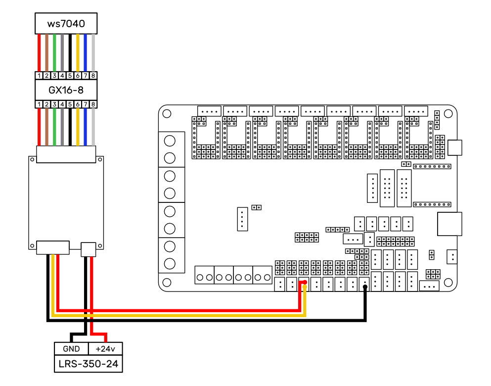{ .rounded }

## Нагревательный стол

- Рекомендуется вместе с проводами, отображёнными на схеме, кинуть еще 2 провода - заземление рамы и плиты стола (на схеме не показано);
- Если будете использовать реле не по спецификации, то перед подключением проводов к ним внимательно ознакомьтесь со схемой реле. Большинство других реле требуют другого подключения.

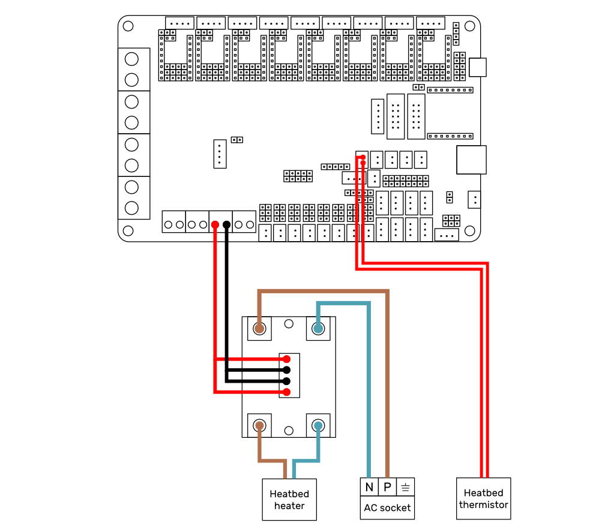{ .rounded }

## Нагреватель термокамеры

- Если будете использовать реле не по спецификации, то перед подключением проводов к ним внимательно ознакомьтесь со схемой реле. Большинство других реле требуют другого подключения;
- Chamber thermistor - термистор, снимающий температуру воздуха. Располагается на панели портала недалеко от разъёмов на печатающие головы;
- Chamber heater thermistor - термистор, располагающийся на нагревателе термокамеры;
- Питание вентилятора нагревателя термокамеры не показано т.к. у разных нагревателей оно должно быть устроено по-разному. В общем случае рекомендуется замена вентилятора на 24в с поддержкой ШИМ, чтобы управлять им из прошивки.

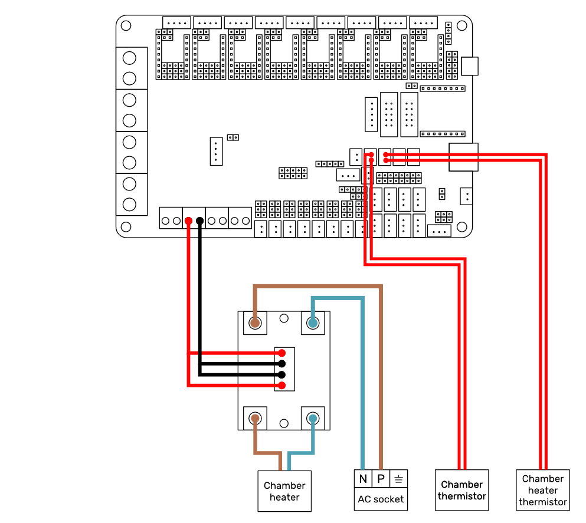{ .rounded }

## Подключение печатающих голов

- Номера пинов на разъёмах GX16 можно посмотреть прямо на пластиковом сепараторе;
- Перед включением принтера настоятельно рекомендуется убедиться, что пины на разъёмах GX16 подключены строго по номерам.

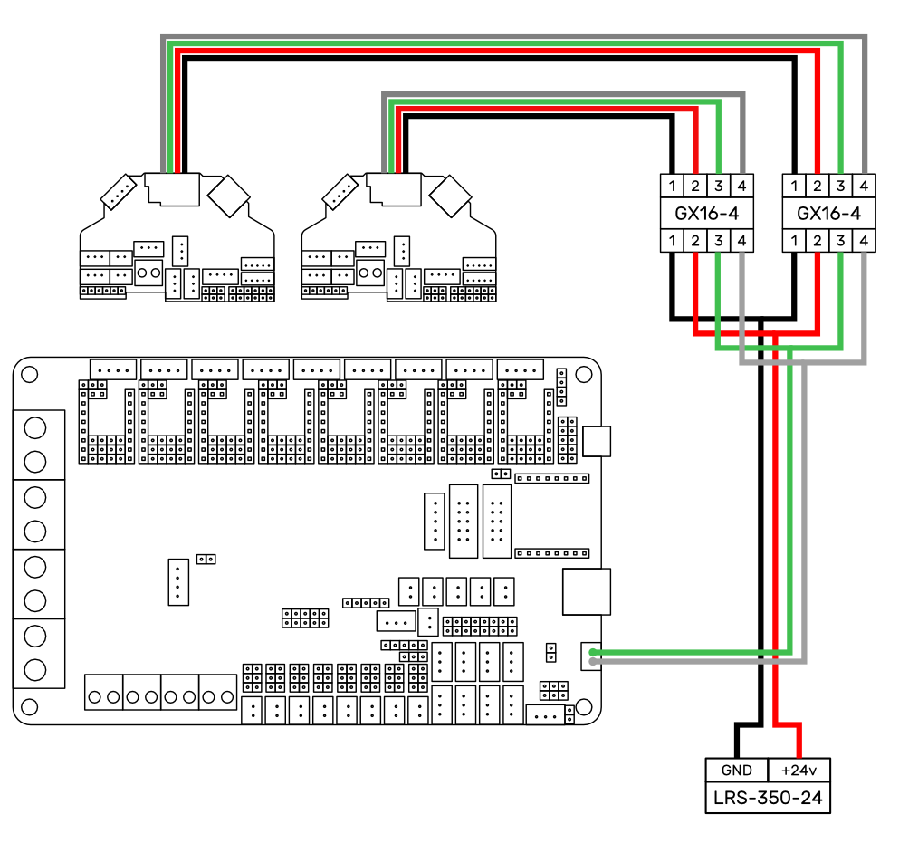

## Потребители печатающих голов

- Показана схема подключения потребителей на левой печатающей голове. На правой печатающей голове всё аналогично, кроме того, что там отсутствует MicroProbe.

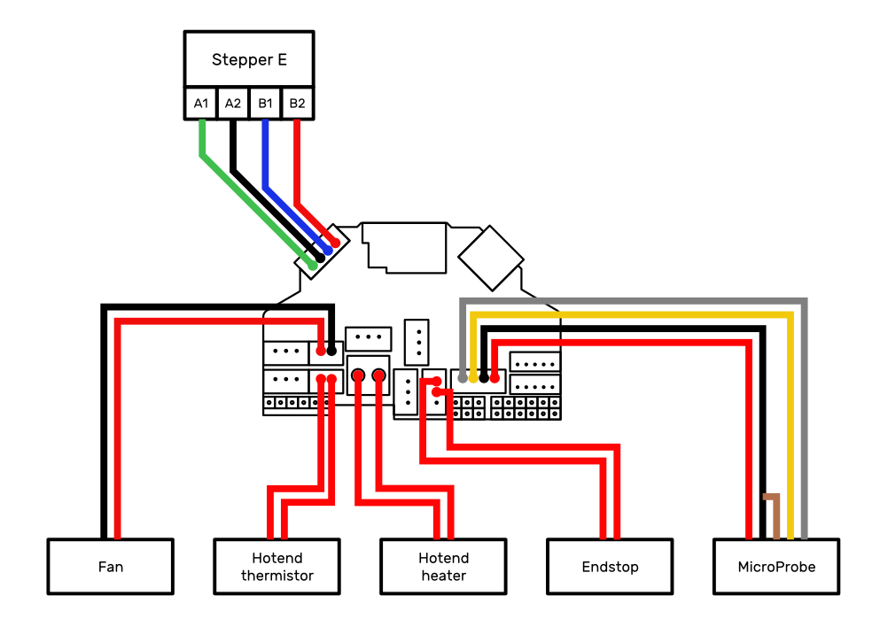{ .rounded }

## Другое

Остальные потребители - вентиляторы, подсветка, концевики.

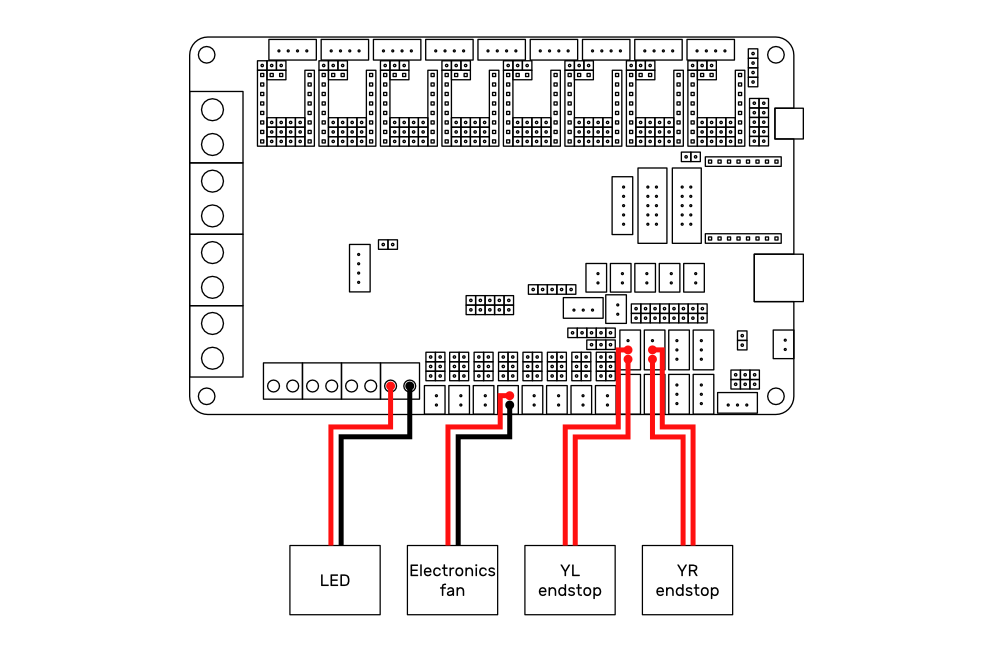{ .rounded }

## Схемы подключения для другой электроники

При использовании другой электроники ориентируйтесь на схемы подключения, расположенные в начале каждого файла `electronics_*.cfg`.

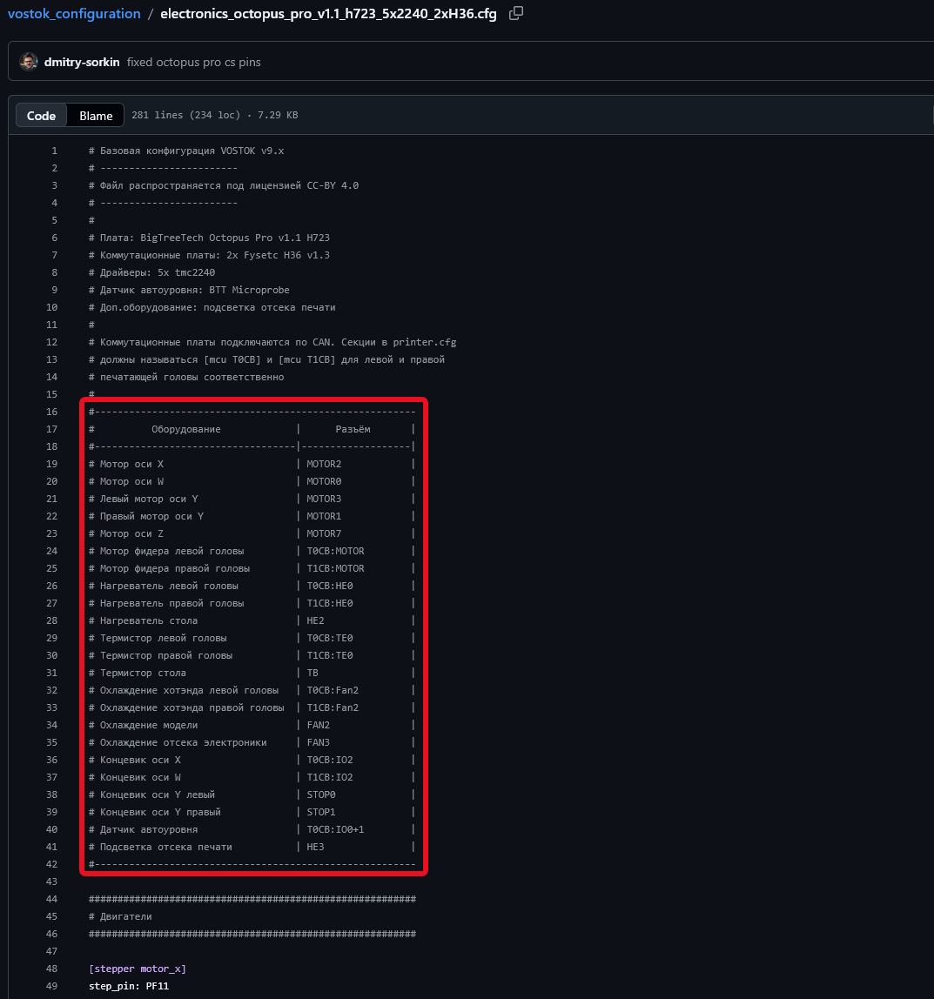{ .rounded }