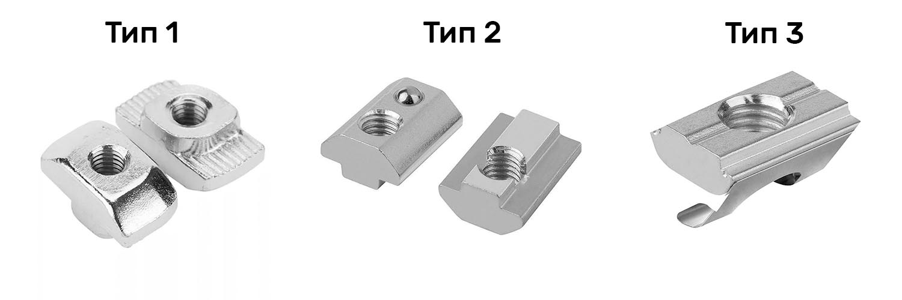
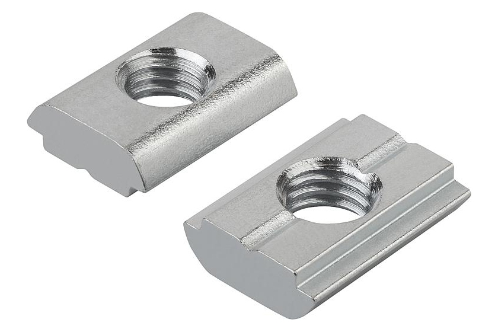
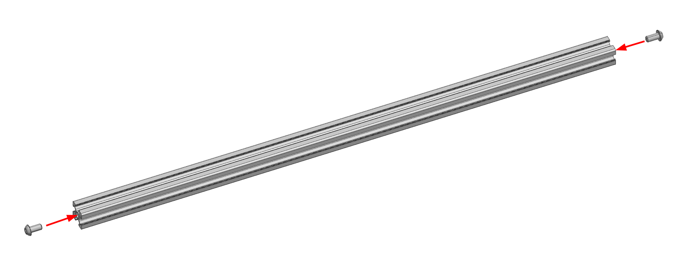
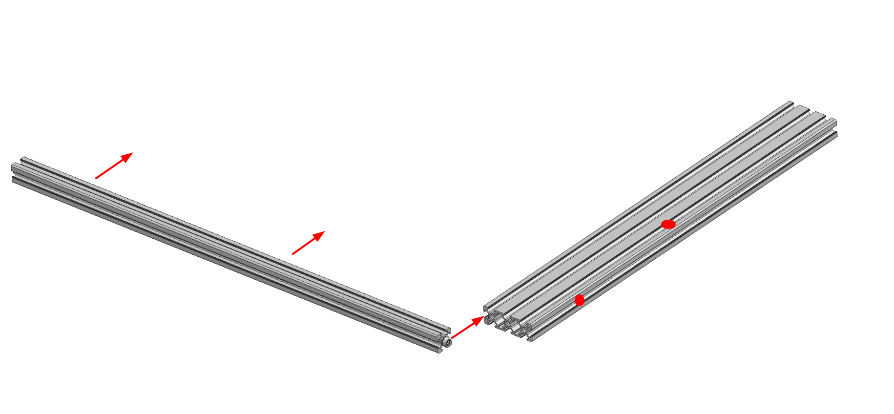
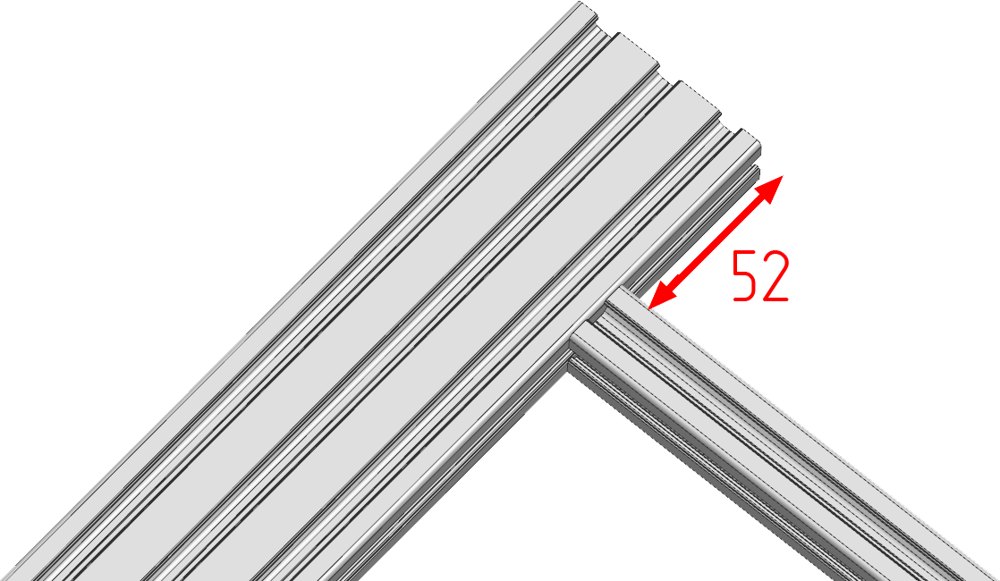
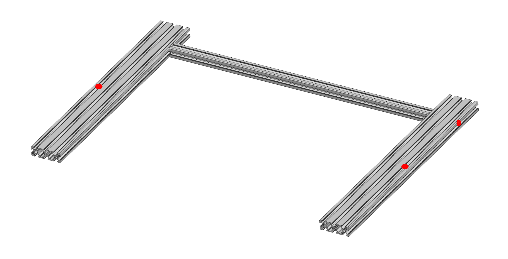
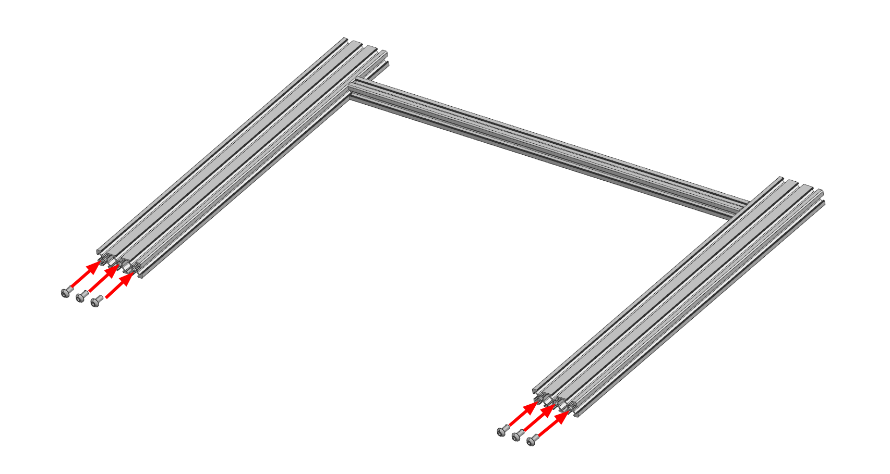
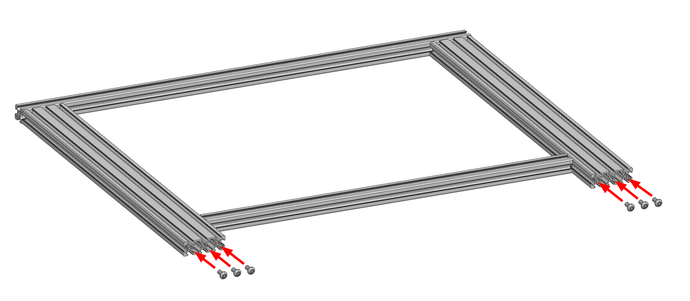
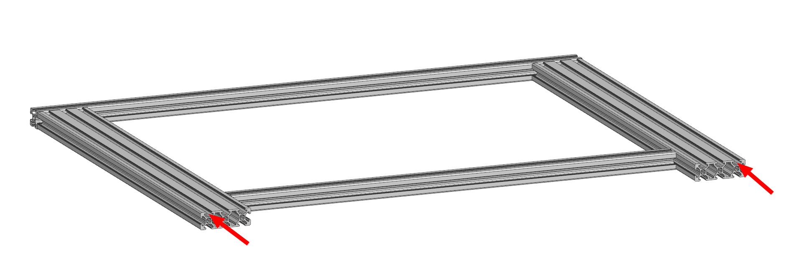
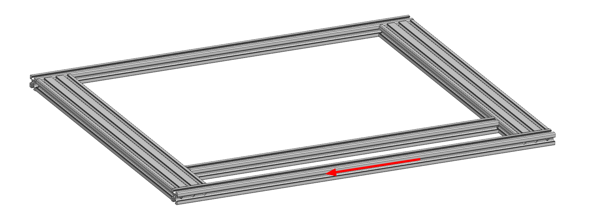

# Сборка портала

<iframe width="900" height="400" src="https://www.youtube.com/embed/7GxtSSZW7pc" title="K3D VOSTOK v0.4 - Сборка рамы" frameborder="0" allow="accelerometer; autoplay; clipboard-write; encrypted-media; gyroscope; picture-in-picture" allowfullscreen></iframe>

## Пазовые гайки

Зашивка и большинство деталей механики принтера крепятся к профилям через пазовые гайки. Они бывают нескольких типов.

На изображении выше представлено 3 типа пазовых гаек, рекомендуемых для сборки принтера. Тип 1 может устанавливаться в паз и выниматься из него свободно, но неудобен так как не всегда нормально поворачивается в пазу и это надо контролировать. Типы 2 и 3 тоже можно устанавливать в паз и вынимать из него в любой момент, но они значительно более удобны в эксплуатации так как поставить их неправильно не получится, плюс они не падают в вертикальных пазах. В спецификации начиная с версии 0.8.3 рекомендуется тип 2.

До версии 0.8.3 рекомендовались другие гайки, которые не могут устанавливаться в паз после сборки рамы. Иными словами, их можно установить только заранее, на этапе сборки рамы. К сожалению, рассчитать в какой паз сколько гаек надо устанавливать - задача достаточно сложная ввиду того, что у VOSTOK'а бесчетное множество возможных вариантов по комплектации и размеру области печати. Так что инструкции далее будут написаны исходя из того, что вы такими гайками не пользуетесь. 

Тем не менее, если вы всё-таки купили их, то вам придётся самостоятельно рассчитывать количество закладываемых в каждый паз гаек. Вам может помочь для этого скрытый лист в спецификации. Посмотреть на него можно кликнув правой кнопкой по списку листов -> `показать листы` -> `Расчёт крепежа для зашивки`. Обратите внимание, что крепежные точки там рассчитываются только для панелей зашивки. Крепежные точки для деталей механики там не учитываются.

## Сборка портала

### Установка поперечной балки

Вкрутите 2 винта М6х12 в торцы вспомогательной балки портала. Не докручивайте до конца, оставьте около 3 мм от головки до стенки профиля.

Задвиньте головку одного из винтов на вспомогательной балке в боковой паз продольной балки. Ориентируйте продольную балку так, чтобы вертикальное отверстие в ней было в дальнем пазу от вспомогательной балки.

Продвиньте вспомогательный профиль так, чтобы был доступ до винта в ней ключом через поперечное отверстие во вспомогательной балке. Выровняйте балки в плоскости и выставьте изображенное на картинке выше расстояние равным 52 мм. Стяните соединение.

### Установка второй продольной балки

Прикрепите вторую продольную балку портала к ранее собранным частям зеркально первой продольной балке. Обратите внимание, что на обеих продольных балках вертикальные отверстия для стоек оси Z должны располагаться на внешней стороне портала.

### Установка передней поперечной балки

Закрутите 6 винтов М6х12 в отверстия в передних торцах продольных балок портала. Не докручивайте винты до конца, оставьте расстояние от головок винтов до проифиля около 3мм. 

Расположите поперечную балку портала так, чтобы 6 отверстий оказались в плоскости портала. Задвиньте эту балку как показано на изображении выше. Выровняйте углы и плоскости, после чего зафиксируйте соединения. Сильно затягивать на этом этапе не нужно.

### Установка задней поперечной балки

В торцы продольных балок вкрутите 6шт винтов М6х12. Не докручивайте до конца, оставьте зазор от головки до профиля около 3мм.

Во внешние верхние пазы продольных балок заложите:

- Если принтер собирается с 4 стойками оси Z, то по 3шт. винт М6х12;
- Если принтер собирается с 2 стойками оси Z, то по 2шт. винт М6х12.

Задвиньте переднюю балку по головкам винтов как это показано на изображении выше. После этого выровняйте всё и закрутите винты. Не затягивайте сильно.

## Регулировка портала

Процесс регулировки собранного портала достаточно прост:

1. Портал надо положить на ровную поверхность вверх-ногами (чтобы вложенные в пазы винты торчали вверх);
2. На 3 угла портала кладутся грузы, например, катушки филамента, кастрюли с водой или подобное;
3. На свободном от грузов углу ослабляется крепление;
4. Балки выравниваются между собой по плоскостям и крепление затягивается;

Повторить эту последовательность действий для всех углов, после чего проверить ортогональность балок угольником. Если всё сходится, то процесс сборки портала завершен. Если не сходится, то, скорее всего, какие-то из профилей неправильно нарезаны. Например, длиннее или короче, чем надо, торец не под прямым углом к профилю и т.д. В таком случае вам придётся искать в чём конкретно проблема и устранять её доступными для вас способами. Например, торцевать профили нормально, подложить фольгу под торцы и т.д.
