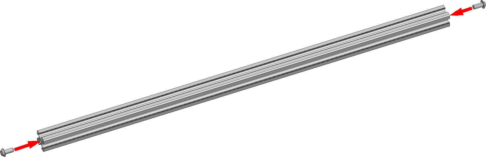
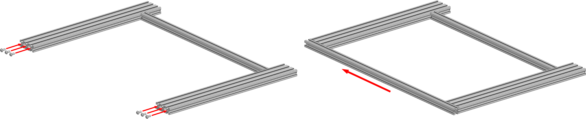

# Сборка портала

<iframe width="900" height="400" src="https://www.youtube.com/embed/7GxtSSZW7pc" title="K3D VOSTOK v0.4 - Сборка рамы" frameborder="0" allow="accelerometer; autoplay; clipboard-write; encrypted-media; gyroscope; picture-in-picture" allowfullscreen></iframe>

## Пазовые гайки

Зашивка и большинство деталей механики принтера крепятся к профилям через пазовые гайки. Они бывают нескольких типов.

<figure markdown>
  { width="600" }
</figure>

На изображении выше представлено 3 типа пазовых гаек, рекомендуемых для сборки принтера. Тип 1 может устанавливаться в паз и выниматься из него свободно, но неудобен так как не всегда нормально поворачивается в пазу и это надо контролировать. Типы 2 и 3 тоже можно устанавливать в паз и вынимать из него в любой момент, но они значительно более удобны в эксплуатации так как поставить их неправильно не получится, плюс они не падают в вертикальных пазах. В спецификации начиная с версии 0.8.3 рекомендуется тип 2.

<figure markdown>
  { width="400" }
</figure>

До версии 0.8.3 рекомендовались другие гайки, которые не могут устанавливаться в паз после сборки рамы. Иными словами, их можно установить только заранее, на этапе сборки рамы. К сожалению, рассчитать в какой паз сколько гаек надо устанавливать - задача достаточно сложная ввиду того, что у VOSTOK'а бесчетное множество возможных вариантов по комплектации и размеру области печати. Так что инструкции далее будут написаны исходя из того, что вы такими гайками не пользуетесь. 

Тем не менее, если вы всё-таки купили их, то вам придётся самостоятельно рассчитывать количество закладываемых в каждый паз гаек. Вам может помочь для этого скрытый лист в спецификации. Посмотреть на него можно кликнув правой кнопкой по списку листов -> `показать листы` -> `Расчёт крепежа для зашивки`. Обратите внимание, что крепежные точки там рассчитываются только для панелей зашивки. Крепежные точки для деталей механики там не учитываются.

## Сборка портала

### Установка поперечной балки

<figure markdown>
  { width="500" }
</figure>

Вкрутите 2 винта М6х12 в торцы вспомогательной балки портала. Не докручивайте до конца, оставьте около 3 мм от головки до стенки профиля.

<figure markdown>
  { width="500" }
</figure>

Задвиньте головку одного из винтов на вспомогательной балке в боковой паз продольной балки. Ориентируйте продольную балку так, чтобы вертикальное отверстие в ней было в дальнем пазу от вспомогательной балки.

<figure markdown>
  { width="400" }
</figure>

Продвиньте вспомогательный профиль так, чтобы был доступ до винта в ней ключом через поперечное отверстие во вспомогательной балке. Выровняйте балки в плоскости и выставьте изображенное на картинке выше расстояние равным 52 мм. Стяните соединение.

### Установка второй продольной балки

<figure markdown>
  { width="400" }
</figure>

Прикрепите вторую продольную балку портала к ранее собранным частям зеркально первой продольной балке. Обратите внимание, что на обеих продольных балках вертикальные отверстия для стоек оси Z должны располагаться на внешней стороне портала.

### Установка передней поперечной балки

<figure markdown>
  { width="900" }
</figure>

Закрутите 6 винтов М6х12 в отверстия в передних торцах продольных балок портала. Не докручивайте винты до конца, оставьте расстояние от головок винтов до проифиля около 3мм. 

Расположите поперечную балку портала так, чтобы 6 отверстий оказались в плоскости портала. Задвиньте эту балку как показано на изображении выше. Выровняйте углы и плоскости, после чего зафиксируйте соединения. Сильно затягивать на этом этапе не нужно.

### Установка задней поперечной балки

<figure markdown>
  { width="900" }
</figure>

1. В торцы продольных балок вкрутите 6шт винтов М6х12. Не докручивайте до конца, оставьте зазор от головки до профиля около 3мм;
2. В пазы, отмеченные синими стрелками, заложите винты М6х12:
      1. Если принтер собирается с 4 стойками оси Z, то по 3шт. винт М6х12;
      2. Если принтер собирается с 2 стойками оси Z, то по 2шт. винт М6х12;
3. Задвиньте переднюю балку по головкам винтов как это показано на изображении выше. После этого выровняйте всё и закрутите винты. Не затягивайте сильно.

## Регулировка портала

Процесс регулировки собранного портала достаточно прост:

1. Портал надо положить на ровную поверхность вверх-ногами (чтобы вложенные в пазы винты торчали вверх);
2. На 3 угла портала кладутся грузы, например, катушки филамента, кастрюли с водой или подобное;
3. На свободном от грузов углу ослабляется крепление;
4. Балки выравниваются между собой по плоскостям и крепление затягивается;

Повторить эту последовательность действий для всех углов, после чего проверить ортогональность балок угольником. Если всё сходится, то процесс сборки портала завершен. Если не сходится, то, скорее всего, какие-то из профилей неправильно нарезаны. Например, длиннее или короче, чем надо, торец не под прямым углом к профилю и т.д. В таком случае вам придётся искать в чём конкретно проблема и устранять её доступными для вас способами. Например, торцевать профили нормально, подложить фольгу под торцы и т.д.

---

<table class="navitable">
    <tbody>
        <tr>
            <td><a class="md-button" href="../profiles_preparation" style="width: 100%; padding-left: 0em; padding-right: 0em;"><svg xmlns="http://www.w3.org/2000/svg" viewBox="0 0 24 24"><path d="M20 11v2H8l5.5 5.5-1.42 1.42L4.16 12l7.92-7.92L13.5 5.5 8 11h12Z"></path></svg> Подготовка профилей</a></td>
            <td><a class="md-button" href="../lower_frame" style="width: 100%; padding-left: 0em; padding-right: 0em;">Нижняя часть рамы <svg xmlns="http://www.w3.org/2000/svg" viewBox="0 0 24 24"><path d="M4 11v2h12l-5.5 5.5 1.42 1.42L19.84 12l-7.92-7.92L10.5 5.5 16 11H4Z"></path></svg></a></td>
        </tr>
    </tbody>
</table>

<meta name='discourse-username' content='DISCOURSE_USERNAME'>

---

<a property="dct:title" rel="cc:attributionURL" href="https://k3d.tech/vostok/">K3D VOSTOK</a> by Dmitry Sorkin is licensed under <a href="http://creativecommons.org/licenses/by/4.0/?ref=chooser-v1" target="_blank" rel="license noopener noreferrer" style="display:inline-block;">CC BY 4.0</a>

