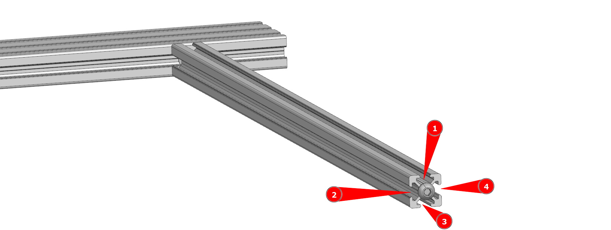
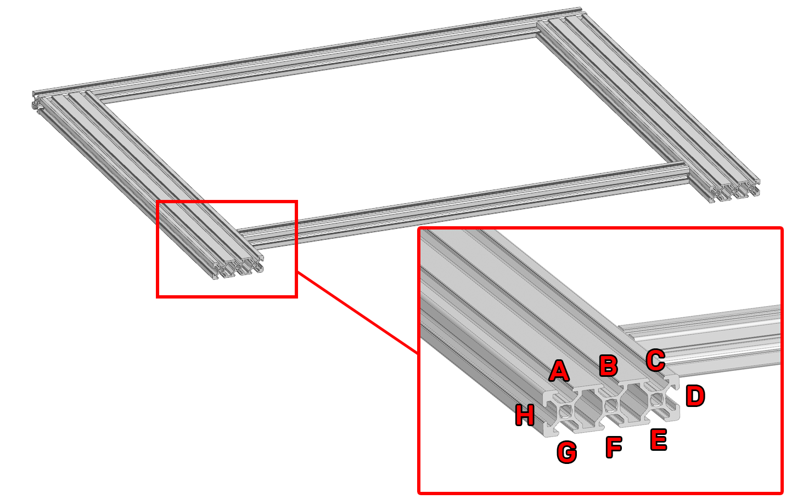

# Шаг 2 - Сборка портала

<iframe width="900" height="400" src="https://www.youtube.com/embed/7GxtSSZW7pc" title="K3D VOSTOK v0.4 - Сборка рамы" frameborder="0" allow="accelerometer; autoplay; clipboard-write; encrypted-media; gyroscope; picture-in-picture" allowfullscreen></iframe>

Процесс сборки портала достаточно подробно описан в видео выше. Но там отсутсвует информация о закладке гаек в пазы. Так что лучше будет и посмотреть видео для понимания процесса в общем, и прочитать эту часть инструкции.

## Используемые детали и инструменты

| Наименование | Кол-во | Примечание |
|:------------ |:------:|:---------- |
| Продольная балка портала 2060 T-slot | 2 |  |
| Поперечная балка портала 2020 T-slot | 2 |  |
| Вспомогательная балка портала | 1 |  |
| Пазовая гайка М3 | х | Количество зависит от длины рельс оси У и расчитывается в спецификации, на листе `Стандартные изделия` в колонке `XY portal` |
| Пазовая гайка М4 | 56 | Учтены только те гайки, которые нельзя будет установить после сборки |
| Винт М6х12 ISO 7380-1 | 18-20 | Зависит от количества вертикальных стоек. Для 4 стоек надо 20 винтов, для 2 стоек хватит 18 |
| Шестигранный ключ 4 мм | 1 |  |
| Угольник | 1 | Желательно поверочный, если есть. Если нет, то нормального строительного хватит |
| Штангенциркуль | 1 | В крайнем случае можно использовать линейку, но это не так удобно |

## Сборка портала

### Установка поперечной балки

Вкрутите 2 винта М6х12 в торцы вспомогательной балки портала. Не докручивайте до конца, оставьте около 3 мм от головки до стенки профиля.

Задвиньте головку одного из винтов на вспомогательной балке в боковой паз продольной балки. Ориентируйте продольную балку так, чтобы вертикальное отверстие в ней было в дальнем пазу от вспомогательной балки.

Продвиньте вспомогательный профиль так, чтобы был доступ до винта в ней ключом через поперечное отверстие во вспомогательной балке. Выровняйте балки в плоскости и выставьте изображенное на картинке выше расстояние равным 52 мм. Стяните соединение.

### Закладывание метизов во вспомогательную балку

Заложите пазовые гайки М4 в пазы профиля:

- В первый паз (сверху портала) 5 шт.
- Во второй паз (ближе к переду портала) 5 шт. 
- В третий паз (снизу портала) 2 шт.
- В четвертый паз (ближе к задней части портала) 2 шт.

### Установка второй продольной балки

Прикрепите вторую продольную балку портала к ранее собранным частям зеркально первой продольной балке. Обратите внимание, что на обеих продольных балках вертикальные отверстия для стоек оси Z должны располагаться на внешней стороне портала.

### Установка передней поперечной балки

Закрутите 6 винтов М6х12 в отверстия в передних торцах продольных балок портала. Не докручивайте винты до конца, оставьте расстояние от головок винтов до проифиля около 3мм. 

Расположите поперечную балку портала так, чтобы 6 отверстий оказались в плоскости портала. Задвиньте эту балку как показано на изображении выше. Выровняйте углы и плоскости, после чего зафиксируйте соединения. Сильно затягивать на этом этапе не нужно.

### Закладывание метизов в продольные балки

Для закладки метизов в продольные балки надо понимать несколько вещей:

- Портал собирается вверх-ногами;
- Закладка метизов в правую и левую продольные балки зеркальна;
- Порядок метизов будет указан исходя из закладки с задней стороны портала (около вспомогательной балки);
- Пазы пронумерованы для левой продольной балки, если смотреть на портал сзади. Для правой балки нумерация зеркальна (C поменян с A, D поменян с H, G поменян с E).

Порядок закладки метизов:

1. В паз `A`:
      1. 1 шт. пазовая гайка М4;
      2. 2-3 шт. винт М6х12 (головкой в паз). Количество винтов зависит от количества вертикальных стоек оси Z. Для 2 стоек заложите 2 винта, для 4 стоек - 3 винта;
2. В паз `B` 4 шт. пазовая гайка М4;
3. В паз `C`:
      1. 1шт. пазовая гайка М4;
      2. Пазовые гайки М3 для установки рельсы. Количество расчитывается в спецификации (BOM) на листе `Стандартные изделия` в колонке `XY Portal`. Обратите внимание, что там количество указано для двух рельс, а в паз надо заложить половину от этого количества;
4. В паз `D` 2 шт. пазовая гайка М4;
5. В паз `E` 4 шт. пазовая гайка М4;
6. В паз `F` ничего не закладывается;
7. В паз `G` 4 шт. пазовая гайка М4;
8. В паз `H` 4 шт. пазовая гайка М4.

!!! warning "Не забудьте заложить метизы в профиль с другой стороны портала"

### Установка задней поперечной балки

В торцы продольных балок вкрутите 6шт винтов М6х12. Не докручивайте до конца, оставьте зазор от головки до профиля около 3мм.

Задвиньте переднюю балку по головкам винтов как это показано на изображении выше. После этого выровняйте всё и закрутите винты. Не затягивайте сильно.

## Регулировка портала

Процесс регулировки собранного портала достаточно прост:

1. Портал надо положить на ровную поверхность вверх-ногами (чтобы вложенные в пазы винты торчали вверх);
2. На 3 угла портала кладутся грузы, например, катушки филамента, кастрюли с водой или подобное;
3. На свободном от грузов углу ослабляется крепление;
4. Балки выравниваются между собой по плоскостям и крепление затягивается;

Повторить эту последовательность действий для всех углов, после чего проверить ортогональность балок угольником. Если всё сходится, то процесс сборки портала завершен. Если не сходится, то, скорее всего, какие-то из профилей неправильно нарезаны. Например, длиннее или короче, чем надо, торец не под прямым углом к профилю и т.д. В таком случае вам придётся искать в чём конкретно проблема и устранять её доступными для вас способами. Например, торцевать профили нормально, подложить фольгу под торцы и т.д.