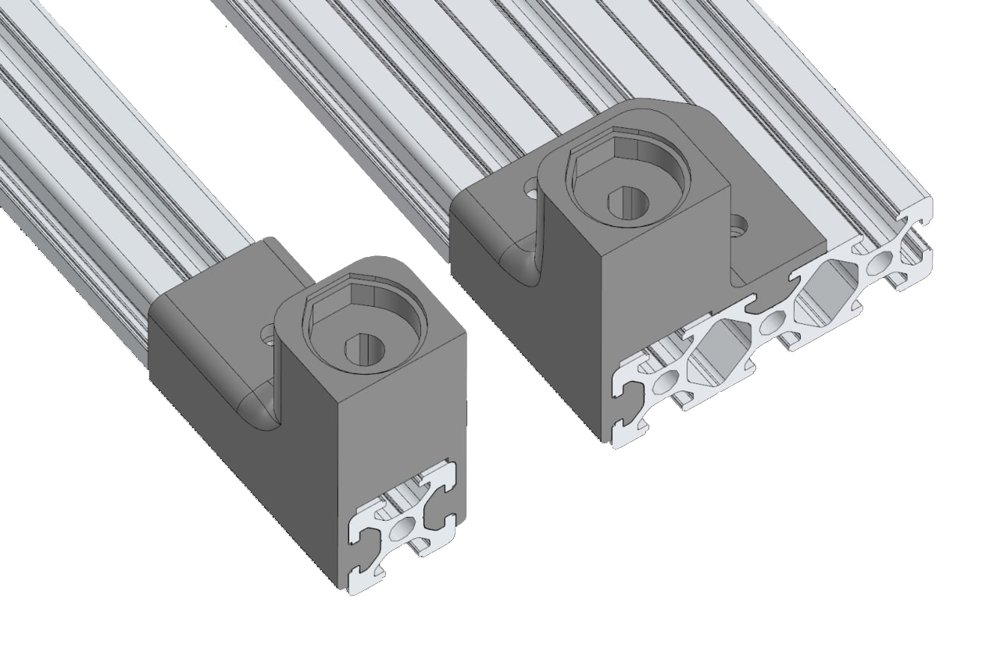
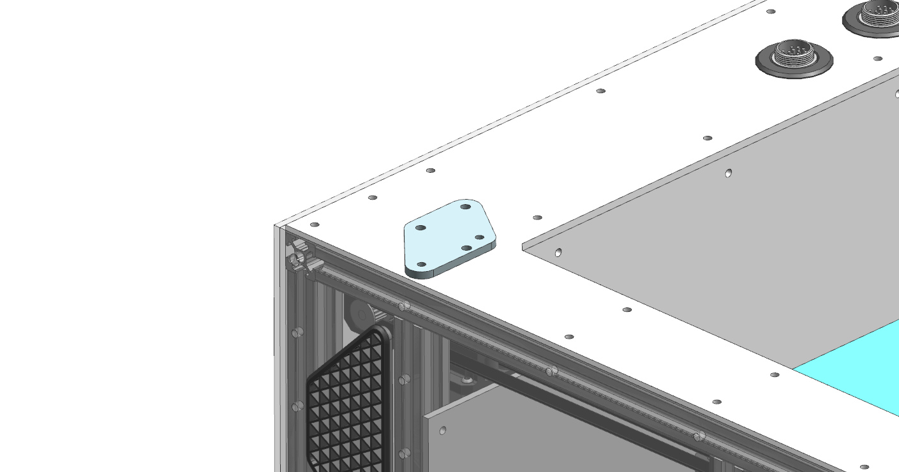

# Приспособления для сборки K3D VOSTOK

## Кондукторы для сверления профиля



Кондукторы для сверления профиля от Соберизавод. В кондукторах могут использоваться подшипники 606ZZ и F606ZZ (с фланцем). Для фиксации кондукторов на профиле нужны винты м4x8 c полукруглой головкой, и пазовый сухарь или т-гайка м4.

Ось сверления проходит в 10мм от торца кондуктора (часть, которая была направлена к столу при печати). Выставлять кондуктор очень удобно с помощью глубиномера штангенциркуля.

- [:material-printer-3d-nozzle: Для 2020 профиля](./releases/tools/drilling_jig_2020_v1.2.stl)
- [:material-printer-3d-nozzle: Для 2040 или 2060 профиля](./releases/tools/drilling_jig_2040-2060_v1.2.stl)

```
Автор: DeltaDesignRus
Telegram: @DeltaDesignRus
```

## Кондуктор для центрирования рельсы MGN9


Простой печатный кондуктор для того, чтобы центрировать рельсу оси Х на профиле 2020. Печатать нужно 2 штуки.

- [:material-printer-3d-nozzle: Кондуктор рельсы mgn9](./releases/tools/mgn9_center_tool.STL)

```
Автор: Artean
Ссылка на оригинал: https://www.thingiverse.com/thing:4198404
```

## Кондуктор для отверстий доступа к мотору оси X



Печатный кондуктор, который позволяет просверлить верхнюю панель зашивки и профили портала для обеспечения доступа ключом до винтов крепления мотора оси Х. Нужно сверло диаметром 5мм и длиной около 30мм не считая хвостовика.

!!! warning "Не спешите сверлить эти отверстия. В большинстве случаев можно обойтись без них"

- [:material-printer-3d-nozzle: Кондуктор отверстий мотора Х](./releases/tools/x_motor_change_holes_conductor.stl)
