# Сборка рамы стола

## Варианты рамы стола

Вариант рамы стола зависит от размера области печати, количества стоек и приводов оси Z, а также количества точек крепления стола к раме. Основными являются 2 варианта:

| Вариант с 1 поперечной балкой | Вариант с 2 поперечными балками |
| :---------------------------: | :-----------------------------: |
| 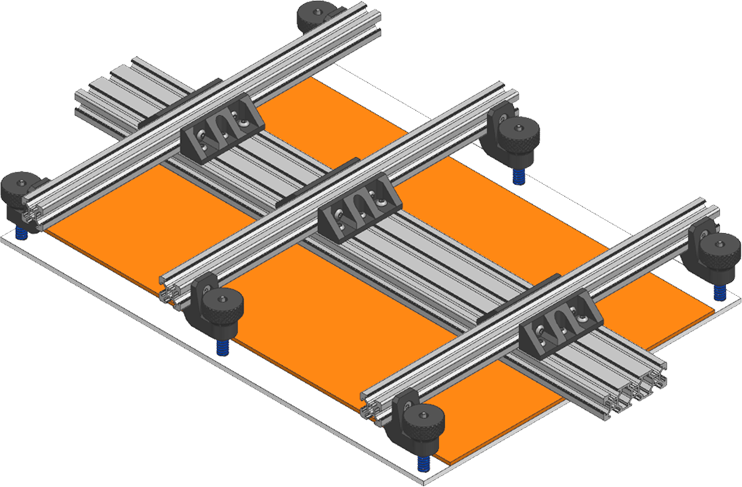 | 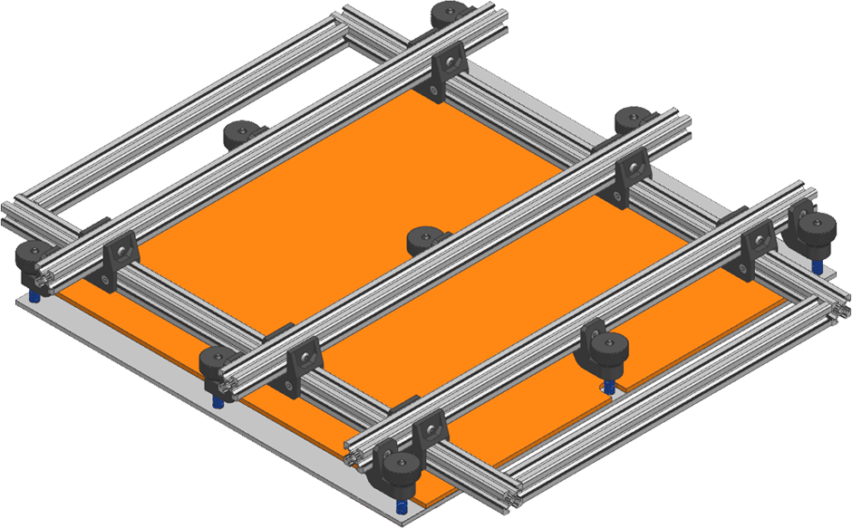 |

Вариант с 1 поперечной балкой обычно собирается с 4 или 6 точками крепления стола т.к. размещению центральных точек мешает поперечная балка. Также этот вариант может использоваться только при сборке VOSTOK'а с 2 стойками оси Z. Иными словами, это упрощенный вариант для принтеров с относительно небольшой областью печати по оси Y, примерно до 300мм.

Вариант с 2 поперечными балками является более универсальным. Он поддерживает любое количество точек крепления стола, от 4 до 9. Стол с такой рамой может быть установлен при любом количестве стоек и приводов оси Z. Но он является немного более сложным, поэтому предполагается, что он будет использоваться при габарите области печати более 300мм по оси Y.

## Сборка варианта с 1 поперечной балкой

### Подготовка печатных деталей

| Наименование | Ориентация | Количество | Предпочтительный материал |
|:------------ |:------:|:------:|:-----:|
| Bed arm end | 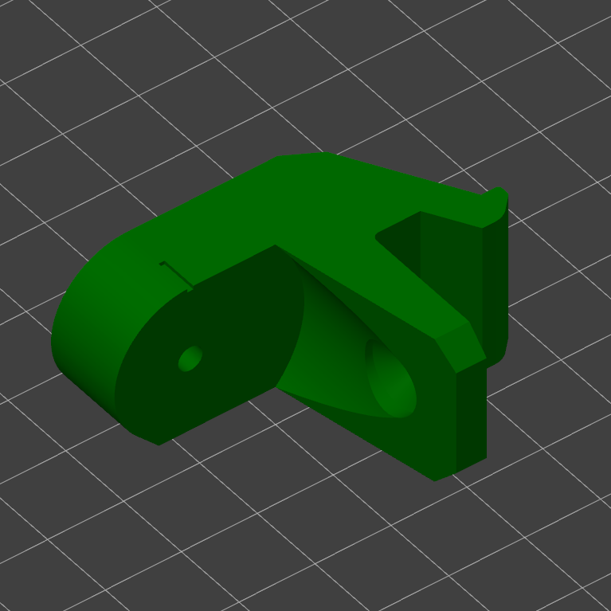{ width=200 } | По кол-ву точек крепления стола | Любой жёсткий с термостойкостью выше 80°C |
| Bed arm knob | 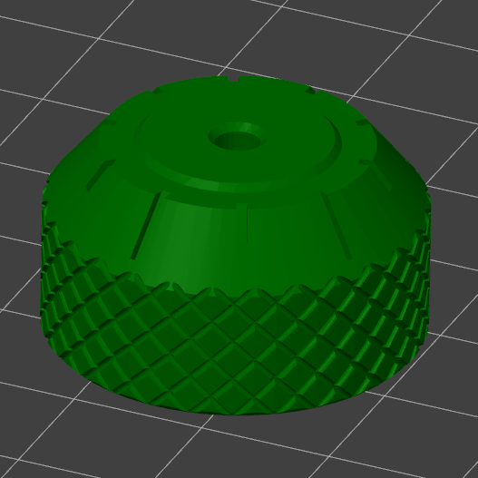{ width=200 } | По кол-ву точек крепления стола | Любой жёсткий с термостойкостью выше 80°C |
| 2020 to 2060 mount | 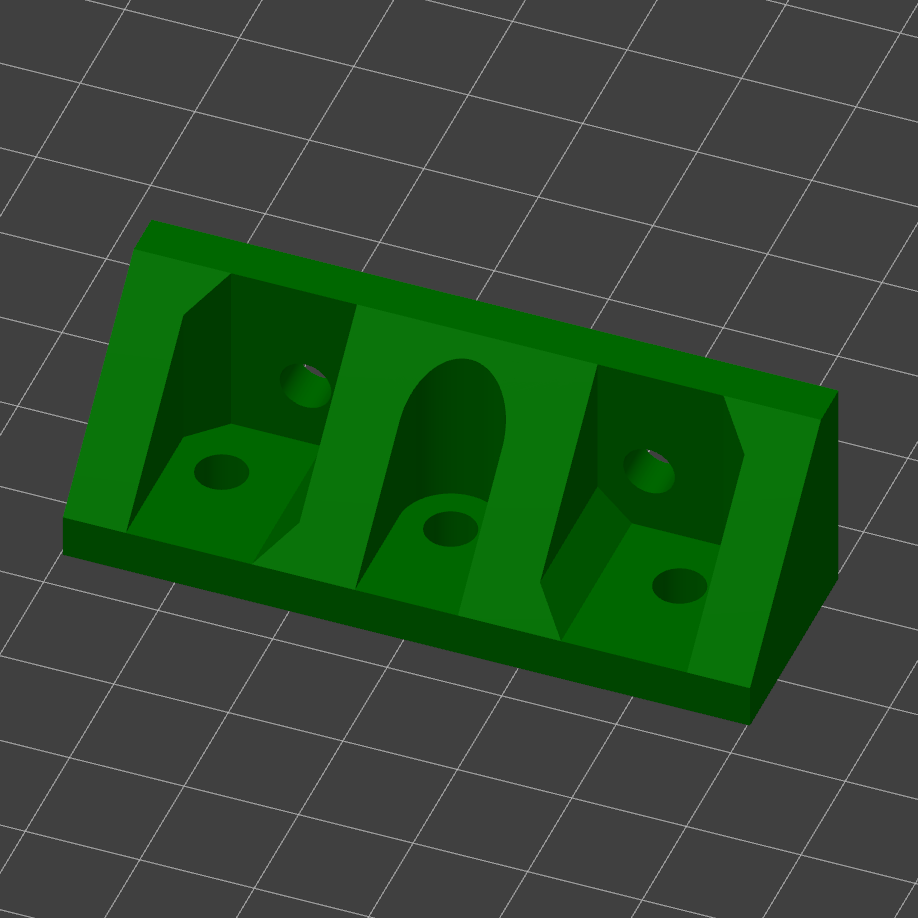{ width=200 } | По 2 на продольную балку | Любой жёсткий, кроме `PLA` |

Все детали печатаются без поддержек и не требуют какой-то постобработки, кроме удаления юбки.

### Сборка плеча

<figure markdown>
  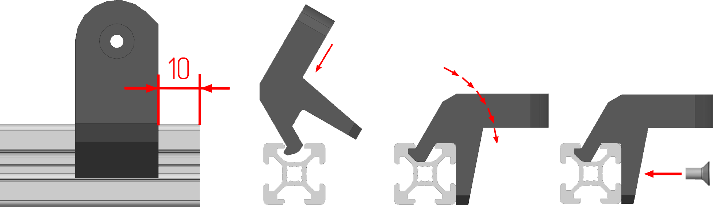{ width="700" }
</figure>

Концевые детали (bed arm end) устанавливаются в 10мм от края профиля как показано на картинке выше, и крепятся на 1 винт М4х8 с потайной головкой и 1 пазовую гайку М4 каждая.

<figure markdown>
  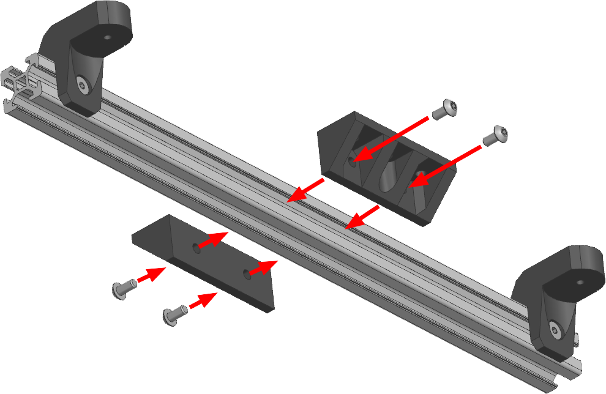{ width="500" }
</figure>

Два крепления профилей 2020 к 2060 устанавливаются в центрах плеч и крепятся на 2 винта М4х8 с полукруглой или цилиндрической головкой и 2 пазовые гайки М4 каждое. На данном этапе винты затягивать не надо.

### Сборка рамы

<figure markdown>
  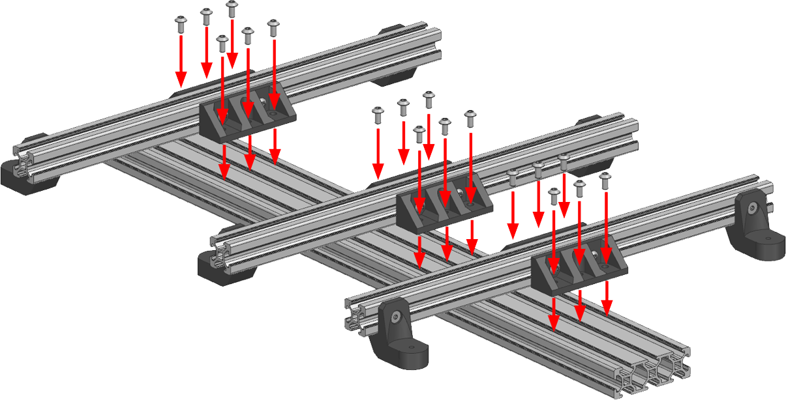{ width="500" }
</figure>

Прикрепите плечи рамы стола к профилю 2060 на 6 винтов М4х8 с полукруглой или цилиндрической головкой и 6 пазовых гаек М4 на каждое. Затягивать крепления на данном этапе не надо.

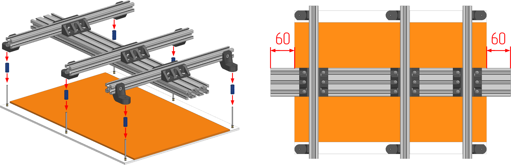{ width="1000" }

1. Положите стол принтера на любую горизонтальную поверхность винтами вверх;
2. Наденьте пружины на винты;
3. Подстраивая положение плеч на поперечной балке, установите раму на винты и добейтесь того, чтобы поперечная балка была центрирована относительно стола;
4. Затяните все крепления.

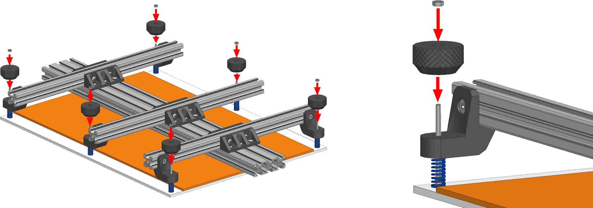{ width="850" }

Заложите в барашки по 1 гайке М3 и закрутите получившуюся конструкцию на винты стола.

## Сборка варианта с 2 поперечными балками

### Подготовка печатных деталей

| Наименование | Ориентация | Количество | Предпочтительный материал |
|:------------ |:------:|:------:|:-----:|
| Bed arm end | { width=200 } | По кол-ву точек крепления стола | Любой жёсткий с термостойкостью выше 80°C |
| Bed arm knob | { width=200 } | По кол-ву точек крепления стола | Любой жёсткий с термостойкостью выше 80°C |
| 2020 to 2020 mount | 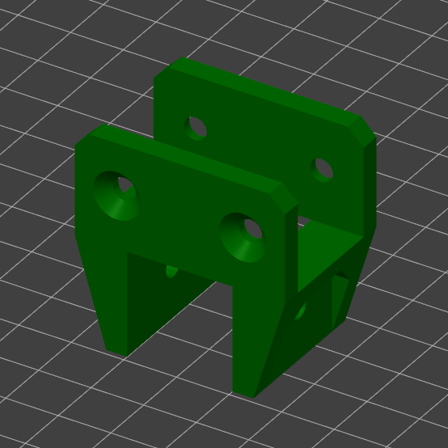{ width=200 } | По 2 на продольную балку | Любой жёсткий, кроме `PLA` |

Все детали печатаются без поддержек и не требуют какой-то постобработки, кроме удаления юбки.

### Сборка плеча

<figure markdown>
  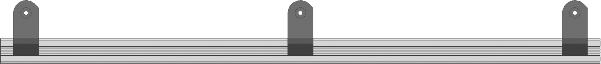{ width="700" }

  { width="700" }
</figure>

Концевые детали (bed arm end) устанавливаются в 10мм от края профиля как показано на картинке выше, а также в центре плеча. Каждая деталь крепится на 1 винт М4х8 с потайной головкой и 1 пазовую гайку М4.

### Сборка основания рамы

<figure markdown>
  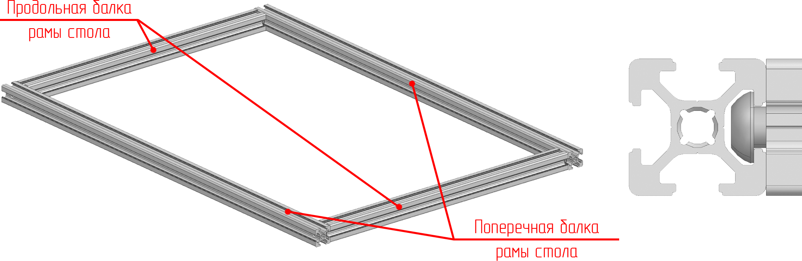{ width="850" }
</figure>

Расположите профили рамы стола на ровной горизонтальной поверхности и соедините между собой на винты М6х12 как показано на изображении выше. Чтобы проверить, что всё собрано ровно, промерьте диагонали полученного портала, они должны быть равны.

<figure markdown>
  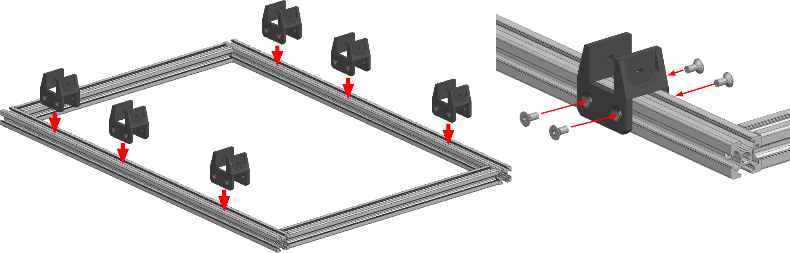{ width="1000" }
</figure>

Установите крепления профилей 2020 друг к другу по 3 на каждую поперечную балку основания рамы. Закрепите каждое крепление на 4 винта М4х8 и 4 пазовые гайки М4. Не затягивайте винты на данном этапе, детали должны сохранять подвижность.

### Сборка рамы

<figure markdown>
  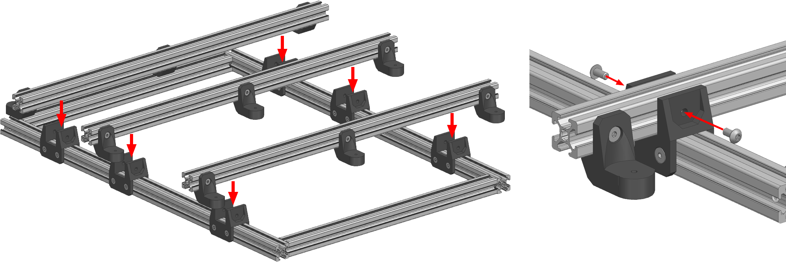{ width="1000" }
</figure>

Установите плечи на основание рамы и закрепите их на винты М4х8 и пазовые гайки М4. Не затягивайте винты на данном этапе, детали должны сохранять подвижность.

<figure markdown>
  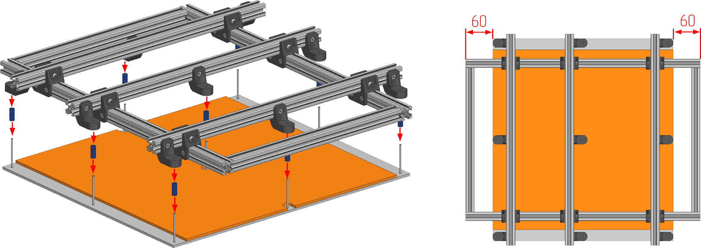{ width="850" }
</figure>

1. Положите стол принтера на любую горизонтальную поверхность винтами вверх;
2. Наденьте пружины на винты;
3. Подстраивая положение плеч на поперечной балке, установите раму на винты и добейтесь того, чтобы поперечная балка была центрирована относительно стола;
4. Затяните все крепления.

!!! note "В текущей версии конструкции концевая деталь плеча может блокировать доступ к одному из винтов крепления 2020 профилей друг к другу. Пока это не исправлено, вы можете либо не устанавливать эти винты т.к. 3 оставшихся будет более чем достаточно, либо частично разобрать раму чтобы получить доступ для этих винтов, затянуть их и собрать всё в обратном порядке"

<figure markdown>
  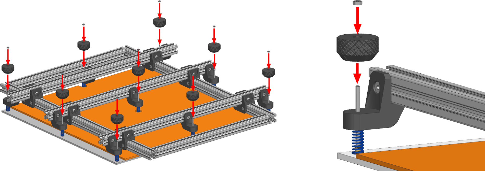{ width="1000" }
</figure>

Заложите в барашки по 1 гайке М3 и закрутите получившуюся конструкцию на винты стола.

---

<table class="navitable">
    <tbody>
        <tr>
            <td><a class="md-button" href="../bed_and_heating_pad/" style="width: 100%; padding-left: 0em; padding-right: 0em;"><svg xmlns="http://www.w3.org/2000/svg" viewBox="0 0 24 24"><path d="M20 11v2H8l5.5 5.5-1.42 1.42L4.16 12l7.92-7.92L13.5 5.5 8 11h12Z"></path></svg> Изготовление стола</a></td>
            <td><a class="md-button" href="../z_drive" style="width: 100%; padding-left: 0em; padding-right: 0em;">Ось Z <svg xmlns="http://www.w3.org/2000/svg" viewBox="0 0 24 24"><path d="M4 11v2h12l-5.5 5.5 1.42 1.42L19.84 12l-7.92-7.92L10.5 5.5 16 11H4Z"></path></svg></a></td>
        </tr>
    </tbody>
</table>

---

<meta name='discourse-username' content='DISCOURSE_USERNAME'>

---

<a property="dct:title" rel="cc:attributionURL" href="https://k3d.tech/vostok/">K3D VOSTOK</a> by Dmitry Sorkin is licensed under <a href="http://creativecommons.org/licenses/by/4.0/?ref=chooser-v1" target="_blank" rel="license noopener noreferrer" style="display:inline-block;">CC BY 4.0</a>
