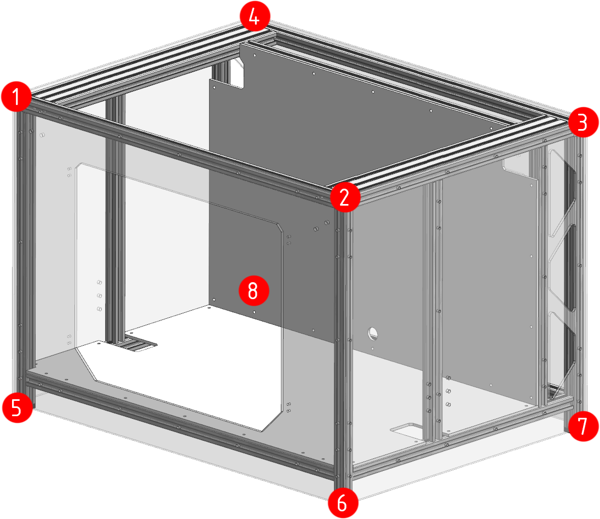

# Установка первой части зашивки и регулировка рамы

Ввиду того, что при притягивании листа зашивки к профилям, они автоматически выравниваются в одной плоскости, удобно совместить установку части панелей вместе с регулировкой рамы. Если по какой-то причине у вас еще нет зашивки, то можно отрегулировать всю раму с помощью угольника, штангенциркуля и линейки. 

Для начала этого этапа сборки портал должен быть собран и отрегулирован. Все соединения в нём уже должны быть протянуты. Нижняя часть рамы должна быть собрана, профили не сильно притянуты друг к другу, но ничего не шатается.

## Установка нижней панели

<figure markdown>
  { width="500" }
</figure>

Слегка отпустите винты (1) и (2). Не откручивайте слишком сильно, иначе головки винтов закусит в пазах. После этого поднимите вспомогательную балку повыше.

<figure markdown>
  { width="400" }
</figure>

Заложите пазовые гайки М4 в указанные пазы. Количество гаек можно определить по количеству отверстий в нижнем листе зашивки. Гайки надо расположить так, чтобы резьбовые отверстия совпадали с отверстиями в нижнем листе зашивки.

!!! note "Обратите внимание, что во вспомогательный профиль гайки закладываются снизу"

<figure markdown>
  { width="400" }
</figure>

Нижнюю панель зашивки заведите через переднюю или заднюю часть принтера под углом и опустите на нижние продольные и поперечные балки портала.

<figure markdown>
  { width="480" }
</figure>

Остабьте винты (1-8) так, чтобы профили получили подвижность. После этого прикрутите панель винтами М4x8 к профилям следя, чтобы торец панели вставал вровень со сторонами профиля. Это выровняет все нижние профили в плоскости. После окончания процесса затяните винты (1-8).

<figure markdown>
  { width="400" }
</figure>

Опустите вспомогательную поперечину на нижнюю панель зашивки.

<figure markdown>
  { width="450" }
</figure>

Переверните принтер и наживите винты М4x8 во все отверстия. Затягивать их на данном этапе не надо. Винты (1) и (2) следует оставить ослабленными, чтобы вспомогательная балка имела некоторую свободу движения.

## Установка средней панели

<figure markdown>
  { width="400" }
</figure>

Заложите пазовые гайки М4 в указанные пазы. Количество гаек можно определить по количеству отверстий в средней панели зашивки. Гайки надо расположить так, чтобы резьбовые отверстия совпадали с отверстиями в средней панели зашивки.

!!! note "Если вы используете пазовые гайки, которые не держатся в профиле, то можно положить принтер на заднюю часть, чтобы гравитация вам не мешала"

<figure markdown>
  { width="400" }
</figure>

На версии с 2 стойками оси Z удобно вставить панель сбоку и повернуть таким образом, как показано на картинке.

На версии с 4 стойками оси Z панель придётся вставлять спереди и поворачивать внутри принтера. Сложно предсказать возможность этой операции на разных соотношениях ширины, высоты и глубины принтера, так что придётся действовать по ситуации.

<figure markdown>
  { width="400" }
</figure>

Ослабьте винты в торцах вспомогательных стоек. После этого притяните среднюю панель зашивки к вспомогательным стойкам и балкам.

<figure markdown>
  { width="400" }
</figure>

Ввиду того, что вспомогательная поперечина портала уже была выставлена на расстояние 52мм от задней поперечины портала, эту балку двигать не надо. Также она через верхнюю часть средней панели выставит верхние концы стоек в правильное положение. Поэтому, если всё сделано верно, то надо отрегулировать только положение нижних концов вспомогательных стоек. Они должны быть в 52 миллиметрах от угловых стоек.

После выставления стоек на такое расстояние, затяните винты в следующей последовательности:

1. Винты в торцах стоек (которые крепят стойки к продольным балкам портала и основания);
2. Винты крепления нижней панели к вспомогательной поперечине;
3. Винты в торцах вспомогательной поперечины.

## Первый промежуточный контроль

<figure markdown>
  { width="400" }
</figure>

На этом этапе стоит проверить, что во всех указанных местах расстояние от вспомогательного до углового/заднего профиля ровно 52 мм. Если оно где-то отличается, то следует ослабить винты в этом месте и подвинуть профили.

Также в точках (1), (2), (5), (6) не помешает проверить перпендикулярность профилей.

В точках (3) и (4) стоит проверить, остались ли все профили в плоскости. Если нет, то позже, при установке панели портала, надо будет ослаблять винты крепления вспомогательной поперечины портала к другим элементам и регулировать по месту.

## Временная установка боковых панелей

Установка будет показана на примере одной панели. Для второй панели надо будет сделать то же самое.

<figure markdown>
  { width="400" }
</figure>

Заложите пазовые гайки М4 в указанные пазы. Количество гаек можно определить по количеству отверстий в боковой панели зашивки. Гайки надо расположить так, чтобы резьбовые отверстия совпадали с отверстиями в боковой панели зашивки.

!!! note "Если вы используете пазовые гайки, которые не держатся в профиле, то можно положить принтер на противоположную боковую часть, чтобы гравитация вам не мешала"

<figure markdown>
  { width="400" }
</figure>

Прикрепите панель винтами М4x8 через все отверстия, кроме отмеченных. Не затягивайте винты, просто прихватите панель к профилям.

## Установка передней панели

<figure markdown>
  { width="500" }
</figure>

Заложите пазовые гайки М4 в указанные пазы. Количество гаек можно определить по количеству отверстий в передней панели зашивки. Гайки надо расположить так, чтобы резьбовые отверстия совпадали с отверстиями в передней панели зашивки.

!!! note "Если вы используете пазовые гайки, которые не держатся в профиле, то можно положить принтер на заднюю часть, чтобы гравитация вам не мешала"

<figure markdown>
  { width="500" }
</figure>

Прикрепите панель винтами М4x8 через все отверстия, кроме отмеченных. Не затягивайте винты, просто прихватите панель к профилям.

## Установка задней панели

<figure markdown>
  { width="500" }
</figure>

Заложите пазовые гайки М4 в указанные пазы. Количество гаек можно определить по количеству отверстий в задней панели зашивки. Гайки надо расположить так, чтобы резьбовые отверстия совпадали с отверстиями в задней панели зашивки.

!!! note "Если вы используете пазовые гайки, которые не держатся в профиле, то можно положить принтер на переднюю часть, чтобы гравитация вам не мешала"

<figure markdown>
  { width="500" }
</figure>

Прикрепите панель винтами М4x8 через все отверстия, кроме отмеченных. Не затягивайте винты, просто прихватите панель к профилям.

## Регулировка нижней части рамы

<figure markdown>
  { width="450" }
</figure>

Ослабьте винты М6x12, указаные на изображении выше (фактически, все винты, скрепляющие профили нижней части рамы между собой). После этого затяните все винты М4x8 на всех установленных панелях зашивки, контролируя то, насколько ровно панели встают. Если всё ровно, то затяните винты М6x12, ослабленные ранее.

!!! note "На текущей версии принтера отверстия для некоторых винтов могут быть недостаточного диаметра, чтобы через них пролезал ключ. В таком случае, если у вас панели из дибонда, стали и других материалов, не склонных к образованию трещин, то вы можете просто рассверлить эти отверстия до 5-5.5мм. Это не помешает работе принтера в дальнейшем, но позволит легко провести регулировку. Если же панели у вас акриловые, то рассверливать их крайне не рекомендуется. Лучше будет зафиксировать все винты, кроме тех, к которым нет доступа. После этого придётся снимать панели, протягивать винты под ними и устанавливать панели обратно. Это долго, но так шанс, что акриловая панель треснет невелик."

## Второй промежуточный контроль

<figure markdown>
  { width="400" }
</figure>

В указанных углах посмотрите как встали панели зашивки. Если они стоят ровно, без выпирания и зазоров - это идеальный вариант, с рамой всё отлично.

Если есть зазоры или выпирания каких-либо панелей относительно других, то проверьте, чтобы эти зазоры/выпирания были равномерными от начала и до конца панели. Если они равномерные, то, скорее всего, либо профили, либо панели нарезаны с небольшим отклонением по размерам. В большинстве случаев это некритично и можно продолжать.

Если зазоры/выпирания сильно неравномерные, например, сверху выпирает одна панель на миллиметр, а снизу другая панель на миллиметр, то рама встала ромбом. В таком случае стоит попытаться расслабить крепления и подвигать профили так, чтобы всё встало ровно. В большинстве случаев даже с достаточно криво нарезанными профилями можно выставить всё так, чтобы было более-менее нормально.

<figure markdown>
  { width="400" }
</figure>

Если неравномерность зазоров/выпираний сильная, то перепроверьте диагонали панелей. У одной панели они должны сходиться с точностью до долей миллиметра. Если это не так, то это не рама встала ромбом, а сама панель нарезана криво. В таком случае либо придётся заменить панель, либо жить с кривыми зазорами.

## Снятие временно установленных панелей

В случае успешного промежуточного контроля, следует снять боковые и заднюю панели, так как они будут мешать дальнейшей сборке принтера. 

!!! warning "Переднюю панель надо обязательно оставить так как натяжители собираются через неё. Кроме того, она не мешает сборке механики принтера"

## Установка панели портала

<figure markdown>
  { width="800" }
</figure>

Заложите пазовые гайки М4 в указанные пазы. Количество гаек можно определить по количеству отверстий в панели портала. Гайки надо расположить так, чтобы резьбовые отверстия совпадали с отверстиями в панели портала.

Прикрепите панель винтами М4x8 через все отверстия, кроме отмеченных :). Так как панель устанавливается уже окончательно, то можно затянуть винты. Но не перетяните, так как акриловые панели от перетяжки лопаются, а композитные панели сминаются.

---

<table class="navitable">
    <tbody>
        <tr>
            <td><a class="md-button" href="../lower_frame" style="width: 100%; padding-left: 0em; padding-right: 0em;"><svg xmlns="http://www.w3.org/2000/svg" viewBox="0 0 24 24"><path d="M20 11v2H8l5.5 5.5-1.42 1.42L4.16 12l7.92-7.92L13.5 5.5 8 11h12Z"></path></svg> Нижняя часть рамы</a></td>
            <td><a class="md-button" href="../lph_assembly" style="width: 100%; padding-left: 0em; padding-right: 0em;">Печатающая голова LPH <svg xmlns="http://www.w3.org/2000/svg" viewBox="0 0 24 24"><path d="M4 11v2h12l-5.5 5.5 1.42 1.42L19.84 12l-7.92-7.92L10.5 5.5 16 11H4Z"></path></svg></a></td>
        </tr>
    </tbody>
</table>

---

<meta name='discourse-username' content='DISCOURSE_USERNAME'>

---

<a property="dct:title" rel="cc:attributionURL" href="https://k3d.tech/vostok/">K3D VOSTOK</a> by Dmitry Sorkin is licensed under <a href="http://creativecommons.org/licenses/by/4.0/?ref=chooser-v1" target="_blank" rel="license noopener noreferrer" style="display:inline-block;">CC BY 4.0</a>
