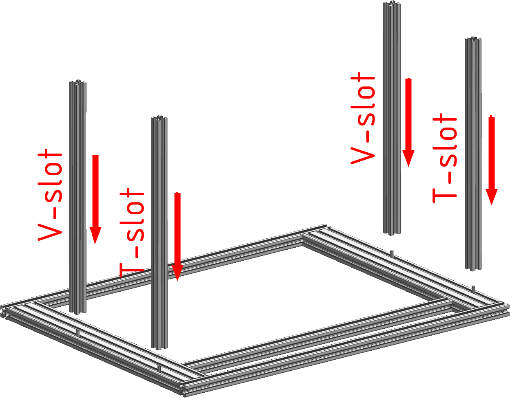
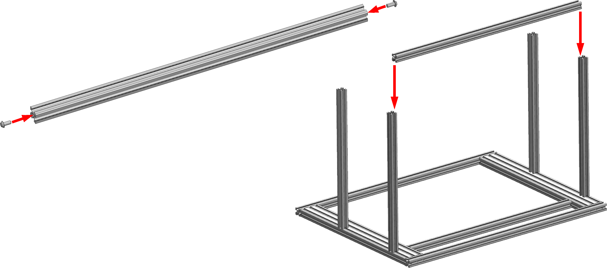
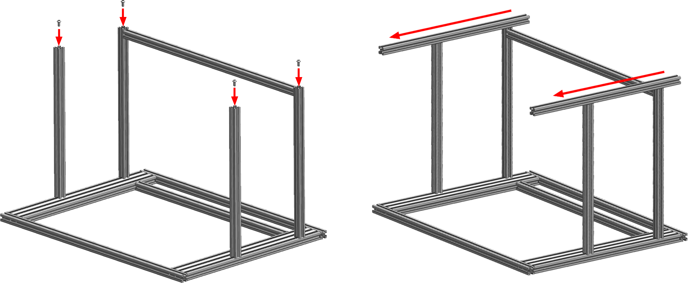
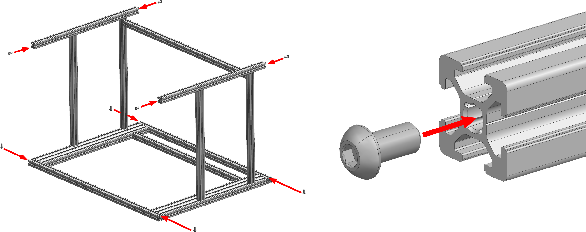
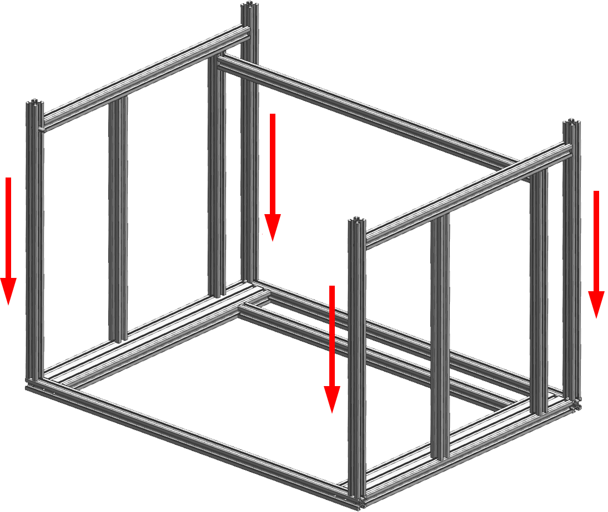
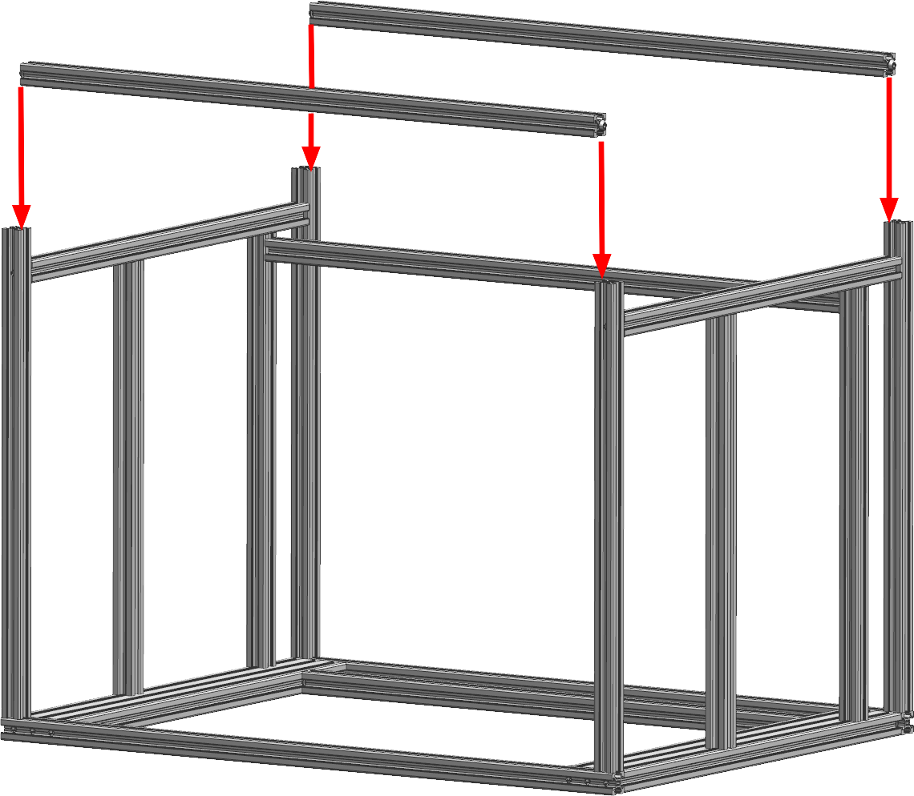
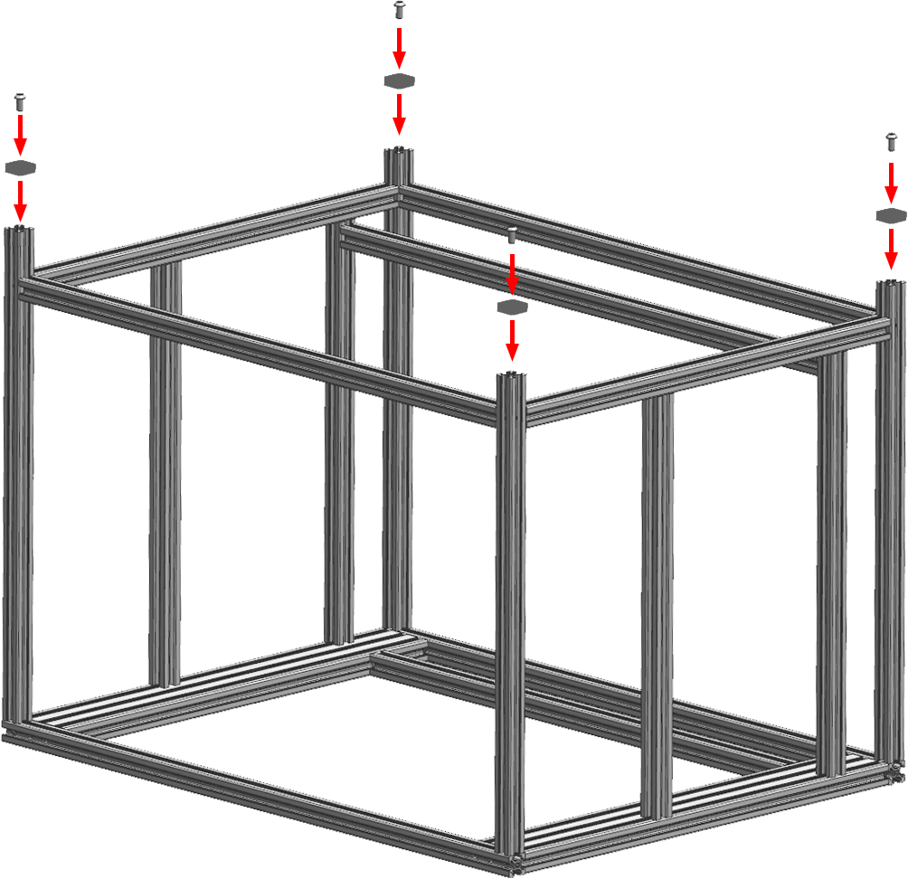

# Сборка нижней части рамы

<iframe width="900" height="400" src="https://www.youtube.com/embed/7GxtSSZW7pc" title="K3D VOSTOK v0.4 - Сборка рамы" frameborder="0" allow="accelerometer; autoplay; clipboard-write; encrypted-media; gyroscope; picture-in-picture" allowfullscreen></iframe>

Процесс сборки рамы достаточно подробно описан в видео выше. Но там отсутсвует информация о закладке гаек в пазы и не указывается порядок сборки. Так что лучше будет и посмотреть видео для понимания процесса в общем, и прочитать эту часть инструкции.

## Печатаемые детали

| Обозначение | Наименование | Кол-во | Примечание |
|:----------- |:------------ |:------:|:---------- |
| Vx-02-01 | Foot | 4 | Печатаются из любого эластомера с заполнением 100% |

## Сборка рамы

### Установка стоек оси Z и вспомогательных стоек

<figure markdown>
  { width="400" }
</figure>

В процессе сборки портала в пазы продольных балок портала закладываются винты М6х12. На этом этапе надо с их помощью прикрутить стойки оси Z (профиль 2020 V-slot) и вспомогательные стойки (профиль 2020 T-slot). Стойки оси Z прикручиваются в передней части, вспомогательные стойки в задней (там, где вспомогательная балка портала). 

!!! note "Выравнивать профили и сильно затягивать крепления на данном этапе не надо, просто прихватите, чтобы ничего не падало"

### Установка вспомогательной поперечины

<figure markdown>
  { width="800" }
</figure>

В торцы вспомогательной поперечины вкрутите винты М6х12. Не докручивайте их до конца, оставьте зазор от головки до профиля чуть более 2 мм.

Ориентируйте вспомогательную поперечину так, чтобы паз с 5 заложенными пазовыми гайками смотрел в сторону передней части принтера (там, где нет вспомогательной поперечины в портале), а паз с 7 пазовыми гайками смотрел в сторону нижней части принтера (от портала). После этого задвиньте вспомогательную поперечину как показано на картинке выше. 

!!! note "Выравнивать профили и сильно затягивать крепления на данном этапе не надо, просто прихватите, чтобы ничего не падало"

### Установка продольных балок основания

<figure markdown>
  { width="900" }
</figure>

В торцы стоек вкрутите винты М6х12. Не докручивайте их до конца, оставьте зазор от головки до профиля около 3 мм.

Ориентируйте продольные балки основания так, чтобы оси отверстий в них были расположены вертикально, плюс прикиньте совпадут ли отверстия с положением балки после задвигания их на место. Если совпадут, то задвигайте. Потом закрутите винты, но не затягивайте сильно.

### Установка угловых стоек

<figure markdown>
  { width="900" }
</figure>

1. Закрутите винты М6х12 в торцы продольных балок основания. Не докручивайте до конца, оставьте зазор от головки до профиля около 3 мм;
2. Заложите винты М6х12 в нижние пазы поперечных балок портала (в ориентации как на картинке находятся сверху, ближн к стойкам).

<figure markdown>
  { width="420" }
</figure>

Задние угловые стойки ориентируйте так, чтобы отверстия в них смотрели от портала (в ориентации как на изображении - вверх). После этого опустите их, заводя головки винтов в пазы, как показано на изображении. Первыми затягиваются винты в торцах угловых стоек, далее винты в основании рамы.

### Установка поперечных балок основания

<figure markdown>
  { width="400" }
</figure>

1. Закрутите винты М6х12 в торцы поперечных балок основания. Оставьте зазор между головкой и профилем чуть более 2 мм;
2. Опустите поперечные балки основания до уровня продольных балок основания и затяните винты.

!!! note "Выравнивать профили и сильно затягивать крепления на данном этапе не надо, просто прихватите, чтобы ничего не падало"

### Установка ножек

<figure markdown>
  { width="400" }
</figure>

Ножки прикручиваются к открытым торцам угловых стоек на винты М6х12.

### Регулировка всех соединений

Регулировка большинства соединений происходит при помощи панелей зашивки. Так что этот процесс будет описан в следующем шаге сборки принтера.

---

<table class="navitable">
    <tbody>
        <tr>
            <td><a class="md-button" href="../portal" style="width: 100%; padding-left: 0em; padding-right: 0em;"><svg xmlns="http://www.w3.org/2000/svg" viewBox="0 0 24 24"><path d="M20 11v2H8l5.5 5.5-1.42 1.42L4.16 12l7.92-7.92L13.5 5.5 8 11h12Z"></path></svg> Сборка портала</a></td>
            <td><a class="md-button" href="../enclosure_part_1" style="width: 100%; padding-left: 0em; padding-right: 0em;">Зашивка часть 1 <svg xmlns="http://www.w3.org/2000/svg" viewBox="0 0 24 24"><path d="M4 11v2h12l-5.5 5.5 1.42 1.42L19.84 12l-7.92-7.92L10.5 5.5 16 11H4Z"></path></svg></a></td>
        </tr>
    </tbody>
</table>

---

<meta name='discourse-username' content='DISCOURSE_USERNAME'>

---

<a property="dct:title" rel="cc:attributionURL" href="https://k3d.tech/vostok/">K3D VOSTOK</a> by Dmitry Sorkin is licensed under <a href="http://creativecommons.org/licenses/by/4.0/?ref=chooser-v1" target="_blank" rel="license noopener noreferrer" style="display:inline-block;">CC BY 4.0</a>
