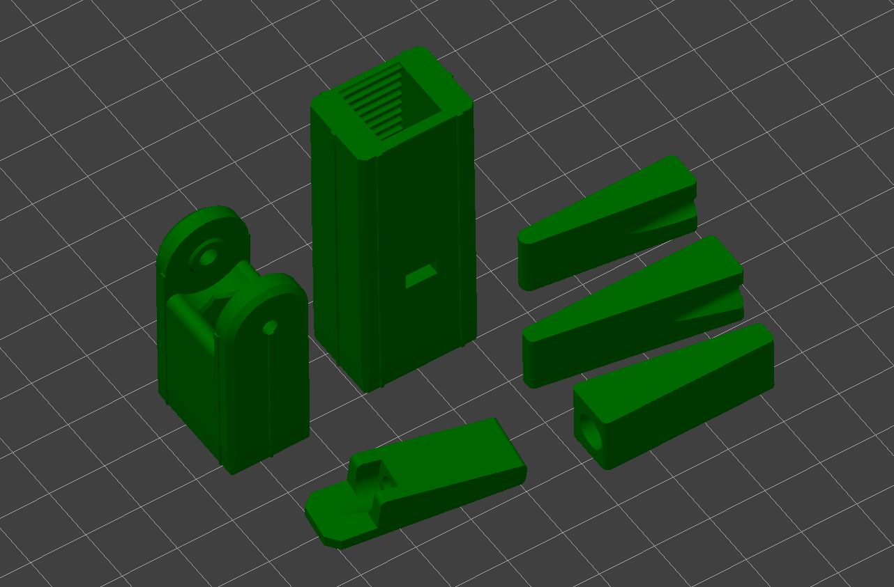
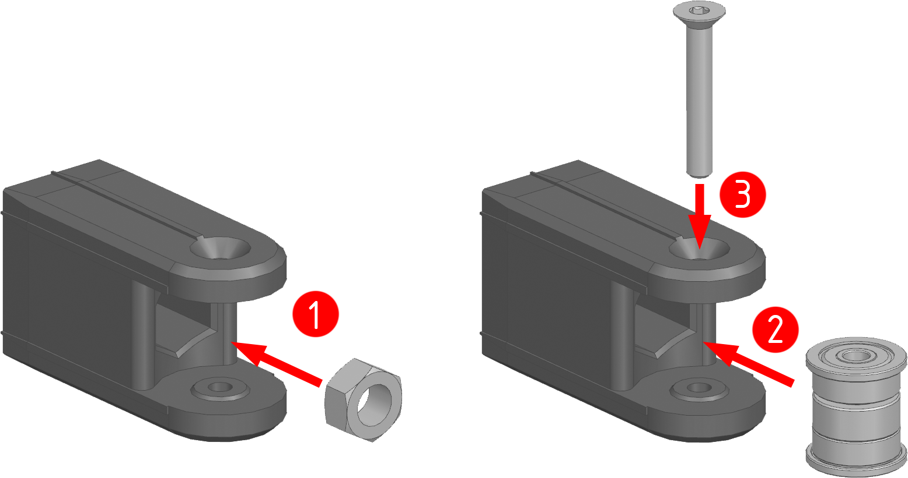

# Сборка и установка натяжителей ремней

## Подготовка печатных деталей

### Необходимые детали и материалы для них

| Наименование                   | Кол-во |        Предпочтительный материал         |
| :----------------------------- | :----: | :--------------------------------------: |
| Left belt tensioner base       |   1    |  Любой жесткий с термостойкостью >70°C   |
| Right belt tensioner base      |   1    |  Любой жесткий с термостойкостью >70°C   |
| Belt tensioner belt clamp      |   2    |  Любой жесткий с термостойкостью >70°C   |
| Belt tensioner plunger         |   2    |  Любой жесткий с термостойкостью >70°C   |
| Belt tensioner (roller) body   |   2    | `PETG`, `PA12`, `PA6`, `PA6 GF`, `PP GF` |
| Belt tensioner (0.5XY) body    |   2    | `PETG`, `PA12`, `PA6`, `PA6 GF`, `PP GF` |
| Belt tensioner (0.5XY) clamp   |   2    |  Любой жесткий с термостойкостью >70°C   |
| Belt tensioner (0.5XY) plunger |   2    |  Любой жесткий с термостойкостью >70°C   |
| Belt tensioner knob            |   4    |              Любой жесткий               |
| Belt tensioner knob cap        |   4    |              Любой жесткий               |

### Ориентация деталей и особенности печати

<figure markdown>
  { width="500" }
</figure>

Детали `* belt tensioner base` печатаются в ориентации, указанной на изображении выше. При этом требуется использовать поддержки "от стола".

Эти две детали являются очень крупными, но при этом от них требуется высокая прочность и жесткость. Так что рекомендуется использовать более дешевые материалы для печати, например, `PETG`. При этом лучше поставить толщину периметров, дна и крышки >2мм и 100% заполнения.

<figure markdown>
  { width="500" }
</figure>

Остальные детали печатаются без поддержек в указанной ориентации. Требуется любой жесткий и хорошо спекающийся материал. Периметры 2-3мм, 100% заполнения.

## Установка корпусов натяжителей

Для облегчения установки рекомендуется положить принтер на переднюю панель. Не забудьте поставить временные упоры для рельс, чтобы каретки не соскочили.

### Установка левого корпуса натяжителей

<figure markdown>
  { width="300" }
</figure>

Установите гайку М3 в углубление в нижней части `Left belt tensioner base` и продвиньте её до конца. Если она плохо держится, то лучше будет закрепить её каплей клея или чем-нибудь подобным.

<figure markdown>
  { width="900" }
</figure>

1. Заложите в указанные пазы пазовые гайки М4. В нижний паз поперечной балки закладывается 1 гайка, в вертикальную стойку 2 гайки;
2. Установите корпус натяжителей на место и зафиксируйте винтами М4х8.

### Установка правого корпуса натяжителей

Установка правого корпуса натяжителей происходит аналогично установке левого, но зеркально. Главное - не забыть заложить гайку М3 заранее, так как доступ к ней потеряется.

## Сборка ползунов натяжителей

### Сборка ползуна с роликом

<figure markdown>
  { width="500" }
</figure>

Ролик собирается из 2 подшипников F623, одного 623 и одной шайбы М3. Для удобства установки, можно предварительно собрать ролик и обернуть его полоской скотча. После сборки скотч надо будет снять.

<figure markdown>
  { width="700" }
</figure>

1. Установите гайку М5 в паз. Для надёжности лучше будет вклеить её;
2. Установите ролик в корпус ползуна;
3. Закрепите винтом М3х20 с потайной головкой.

### Сборка ползуна с фиксированным креплением ремня

<figure markdown>
  { width="700" }
</figure>

1. В детали Belt tensioner (0.5XY) body необходимо будет удалить мембраны в отверстиях под гайки. Проще всего удалить их сверлами D3 и D5 соответственно;
2. Установите гайки М3 и М5 в соответствующие углубления и, если они там плохо держатся, закрепите на клей.

<figure markdown>
  { width="900" }
</figure>

1. Заложите деталь `clamp` вырезом от зубчатой части;
2. Заложите деталь `plunger` язычком к зубчатой части;
3. Наживите винтом М3х30. Затягивать без ремня смысла нет.

### Сборка винтов натяжителей

<figure markdown>
  { width="600" }
</figure>

1. Вставьте болт М5х50 в деталь `Belt tensioner knob`. Для надёжности лучше всего будет приклеить его;
2. Приклейте колпачок.

## Окончательная сборка

Окончательная сборка натяжителей осуществляется одновременно с установкой ремня.

---

<table class="navitable">
    <tbody>
        <tr>
            <td><a class="md-button" href="../x_beam" style="width: 100%; padding-left: 0em; padding-right: 0em;"><svg xmlns="http://www.w3.org/2000/svg" viewBox="0 0 24 24"><path d="M20 11v2H8l5.5 5.5-1.42 1.42L4.16 12l7.92-7.92L13.5 5.5 8 11h12Z"></path></svg> Балка оси X</a></td>
            <td><a class="md-button" href="../xu_drives" style="width: 100%; padding-left: 0em; padding-right: 0em;">Приводы осей XU <svg xmlns="http://www.w3.org/2000/svg" viewBox="0 0 24 24"><path d="M4 11v2h12l-5.5 5.5 1.42 1.42L19.84 12l-7.92-7.92L10.5 5.5 16 11H4Z"></path></svg></a></td>
        </tr>
    </tbody>
</table>

---

<meta name='discourse-username' content='DISCOURSE_USERNAME'>

---

<a property="dct:title" rel="cc:attributionURL" href="https://k3d.tech/vostok/">K3D VOSTOK</a> by Dmitry Sorkin is licensed under <a href="http://creativecommons.org/licenses/by/4.0/?ref=chooser-v1" target="_blank" rel="license noopener noreferrer" style="display:inline-block;">CC BY 4.0</a>
