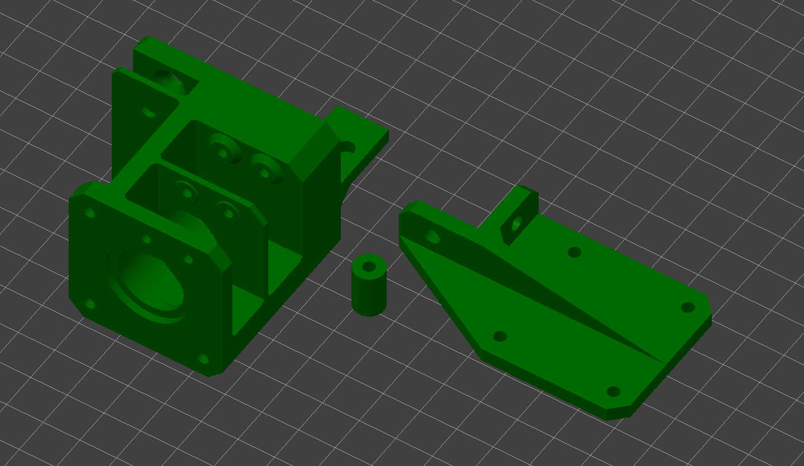
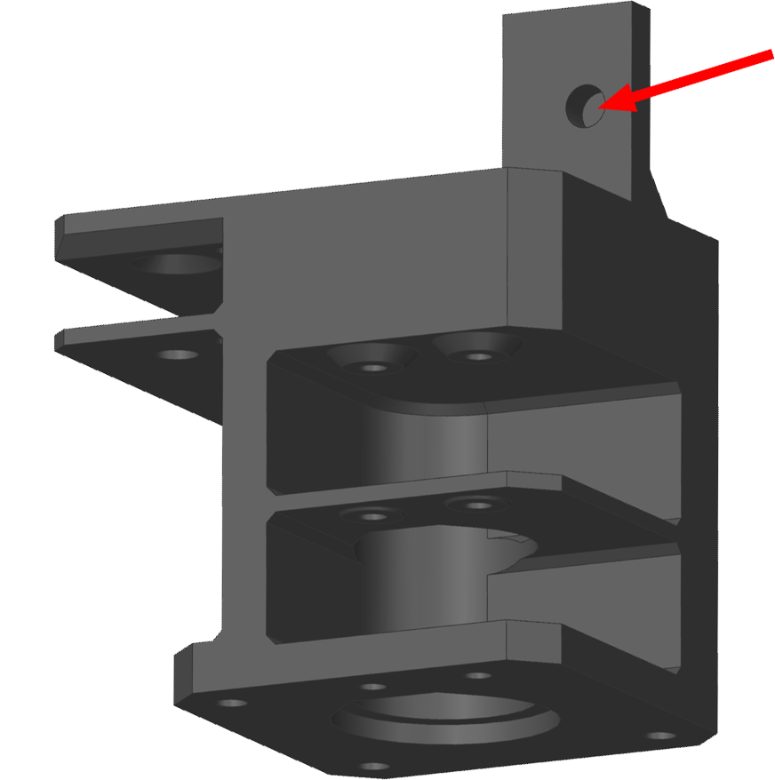
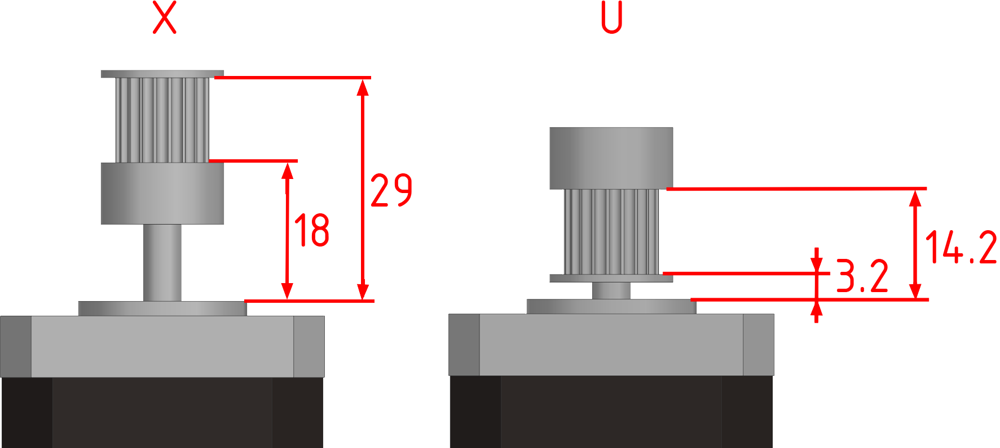
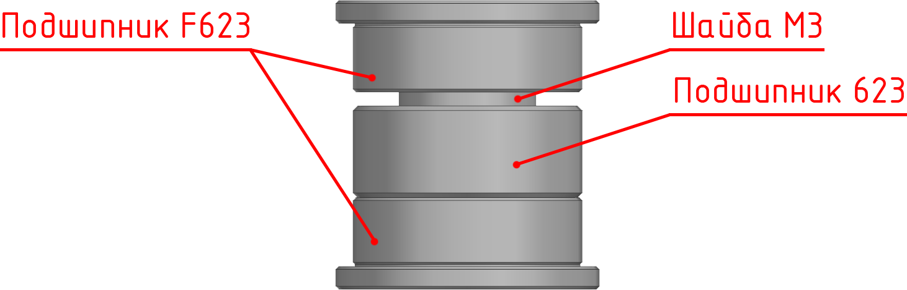
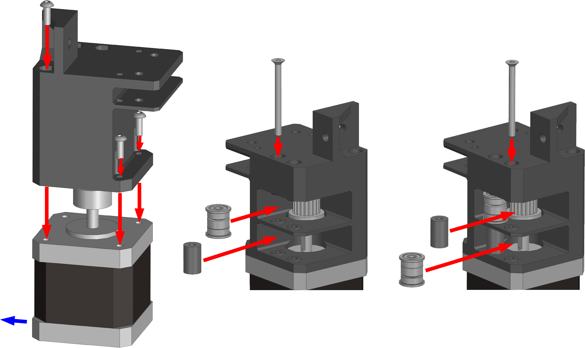
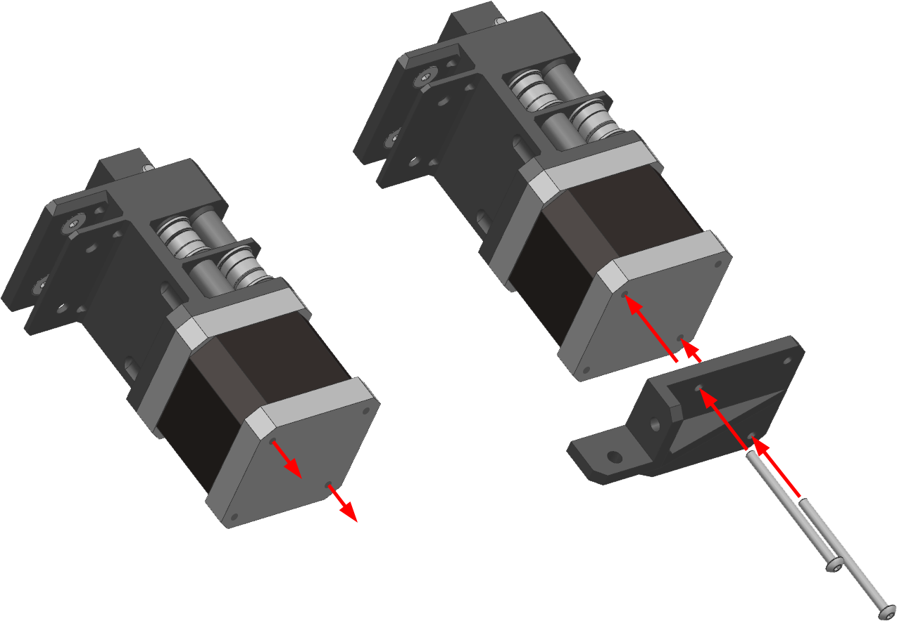
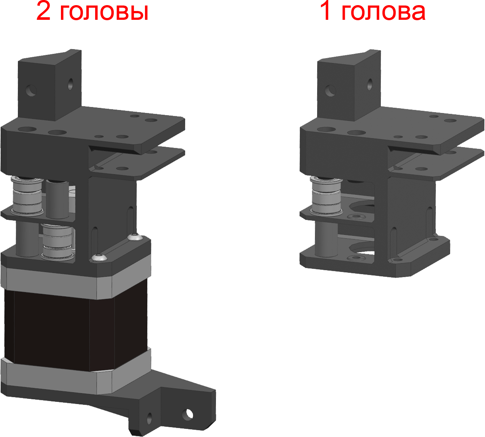
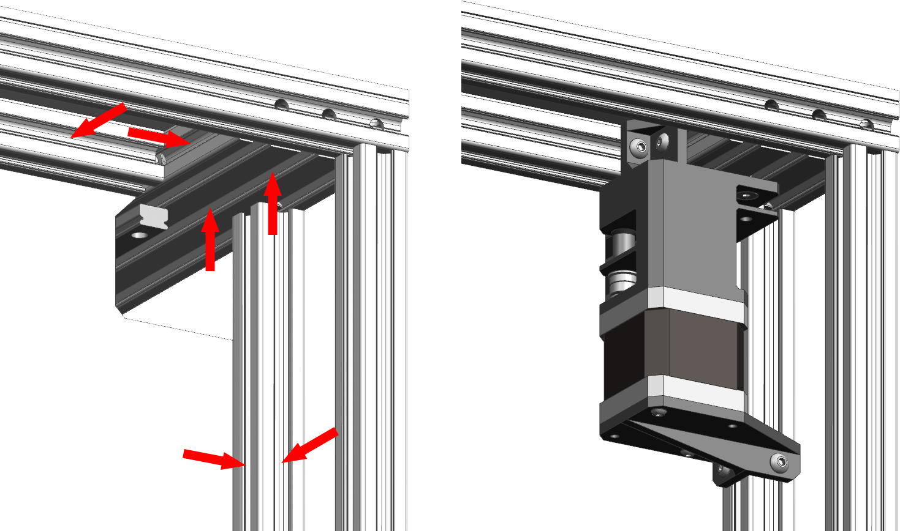

# Сборка приводов осей XU

## Подготовка печатных деталей

### Необходимые детали и материалы для них

| Наименование        | Кол-во |       Предпочтительный материал       |              Возможный материал              | Примечание                                                   |
| :------------------ | :----: | :-----------------------------------: | :------------------------------------------: | :----------------------------------------------------------- |
| X motor mount       |   2    |         `PA6 GF30`, `PP GF30`         | `PA12 GF30`, `ABS GF/CF`, `ABS`, `PC`, `ASA` | Одна зеркально. Печатать обе даже если собираете вариант с одной печатающей головой |
| X motor strenghener |  0-2   |         `PA6 GF30`, `PP GF30`         | `PA12 GF30`, `ABS GF/CF`, `ABS`, `PC`, `ASA` | Одна зеркально                                               |
| Roller spacer       |  2-4   | Любой жесткий с термостойкостью >75°C |                      -                       | Количество зависит от комплектации. Если собираете с 1 печатающей головой, то 1шт. Если собираете с 2 печатающими головами, то 2шт. |

### Ориентация деталей и особенности печати

<figure markdown>
  { width="600" }
</figure>

При печати деталей в указанной ориентации, поддержки не нужны. Все детали должны быть максимально прочными и жесткими. Поэтому рекомендуется печатать со следующими параметрами:

- Толщина стенок 2-3мм;
- 100% заполнения;
- Невысокая скорость;
- Ширина линий >120% от диаметра сопла;
- Толщина слоя <30% от ширины линий.

### Подготовка кронштейнов моторов

<figure markdown>
  { width="300" }
</figure>

После печати кронштейнов моторов будет необходимо удалить мембрану из отверстия, отмеченного на изображении выше.

## Привод оси X

### Подготовка моторов

<figure markdown>
  { width="600" }
</figure>

На моторы осей X и U установите шкивы так, как показано на изображении выше. 

### Сборка роликов

<figure markdown>
  { width="500" }
</figure>

Все ролики в принтере состоят из двух подшипников f623, одного подшипника 623 и шайбы М3, соединенных таким образом, как показано на изображении выше. При этом не важно между какой парой подшипников располагается шайба.

Для удобства сборки рекомендуется все ролики предварительно собрать и обклеить полоской скотча, чтобы те не рассыпались, и их можно было бы устанавливать как единую деталь. После сборки скотч с роликов необходимо будет снять.

На эту сборку требуется 2 ролика, если собирается вариант с 1 печатающей головой, и 4 ролика, если собирается вариант с 2 печатающими головами.

### Сборка привода оси X

<figure markdown>
  { width="900" }
</figure>

1. Установите мотор в кронштейн и закрепите на 3 винта М3x8. Обратите внимание на ориентацию мотора, он должен стоять разъёмом к центру принтера (синяя стрелка);
2. Установите ролик, расположенный ближе к стенке, и закрепите винтом М3x35 с потайной головкой;
3. Если собираете версию под 2 печатающие головы, то установите второй ролик и закрепите его винтом М3x35 с потайной головкой.

### Установка усилителя оси X

<figure markdown>
  { width="600" }
</figure>

Выкрутите любые два винта мотора по диагонали. Это никак не повлияет на его работу, если оставить два оставшихся на месте.

Усилитель прикручивается к нижней части мотора на два винта М3 с полукруглой или цилиндрической головкой. Длина винта должна быть равна длине мотора. Обычно это нестандартный размер, так что придётся покупать винты длиннее и обрезать. Если винт будет длиннее, то он будет мешать винтам, которые крепят мотор к кронштейну. Если будет сильно короче, то не достанет до резьбы.

## Сборка привода оси U

<figure markdown>
  { width="500" }
</figure>

Привод оси U собирается аналогичным образом, за исключением пары вещей:

- Если собирается вариант под 1 печатающую голову, то кронштейн оси U выполняет роль держателя одного ролика. В таком случае устанавливать мотор, усилитель и т.д. не надо;
- Положение роликов на кронштейне оси U не зеркально таковому на оси X.

## Установка привода оси X

<figure markdown>
  { width="600" }
</figure>

1. Заложите пазовые гайки М4 согласно изображению выше. 1 стрелка = 1 гайка;
2. Установите привод оси X в заднюю левую часть принтера так, как показано на изображении выше (вид сзади). Привод крепится на 2 винта М4x8 с потайной головкой с внешней стороны принтера, 2 винта М4x8 с полукруглой головкой в портале. Еще 2 винта М4x8 с полукруглой головкой крепят усилитель к вспомогательной стойке.

## Установка привода оси U

Привод оси U устанавливается зеркально приводу оси X.

---

<table class="navitable">
    <tbody>
        <tr>
            <td><a class="md-button" href="../tensioners" style="width: 100%; padding-left: 0em; padding-right: 0em;"><svg xmlns="http://www.w3.org/2000/svg" viewBox="0 0 24 24"><path d="M20 11v2H8l5.5 5.5-1.42 1.42L4.16 12l7.92-7.92L13.5 5.5 8 11h12Z"></path></svg> Натяжители</a></td>
            <td><a class="md-button" href="../y_drive" style="width: 100%; padding-left: 0em; padding-right: 0em;">Приводы оси Y <svg xmlns="http://www.w3.org/2000/svg" viewBox="0 0 24 24"><path d="M4 11v2h12l-5.5 5.5 1.42 1.42L19.84 12l-7.92-7.92L10.5 5.5 16 11H4Z"></path></svg></a></td>
        </tr>
    </tbody>
</table>

---

<meta name='discourse-username' content='DISCOURSE_USERNAME'>

---

<a property="dct:title" rel="cc:attributionURL" href="https://k3d.tech/vostok/">K3D VOSTOK</a> by Dmitry Sorkin is licensed under <a href="http://creativecommons.org/licenses/by/4.0/?ref=chooser-v1" target="_blank" rel="license noopener noreferrer" style="display:inline-block;">CC BY 4.0</a>
