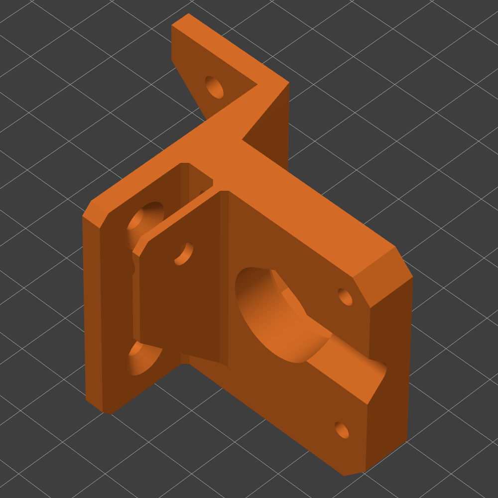
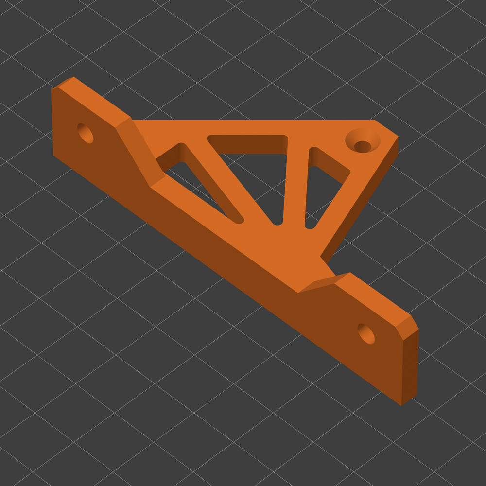
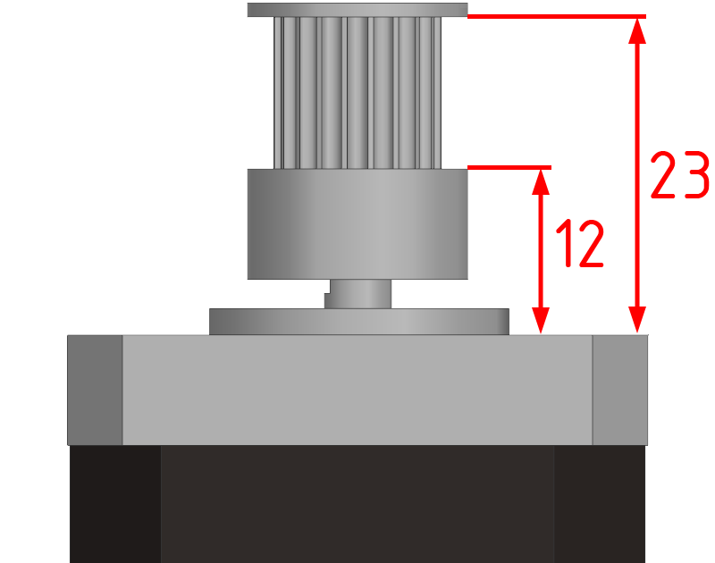
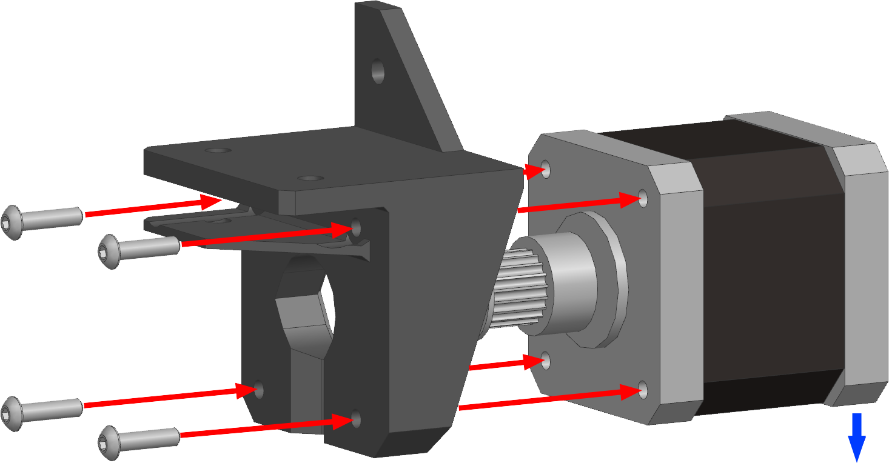
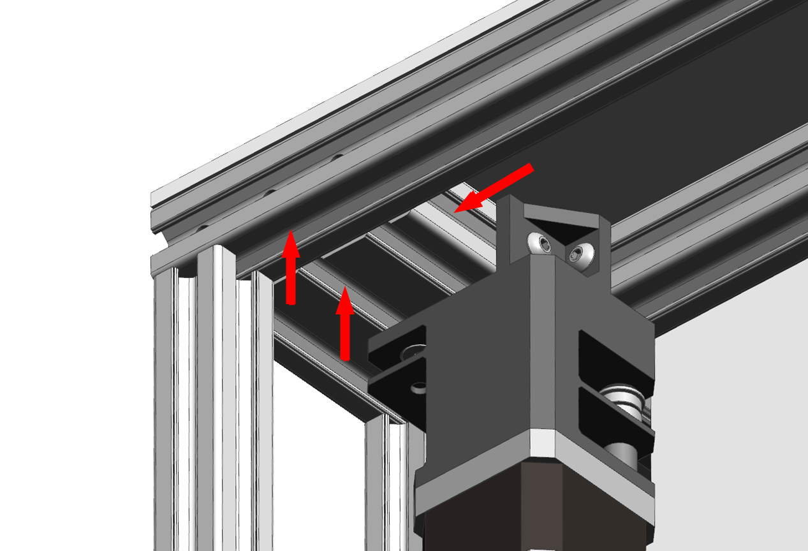
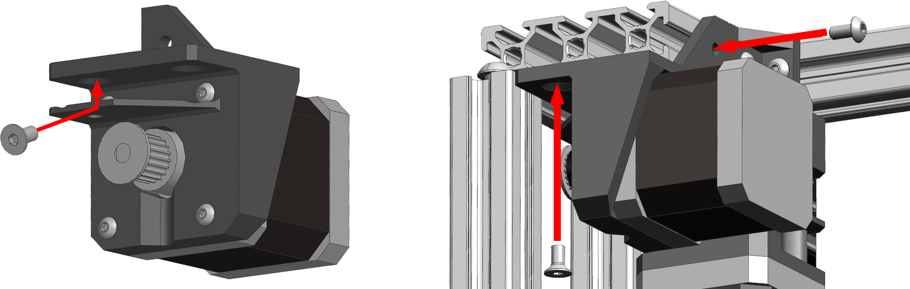
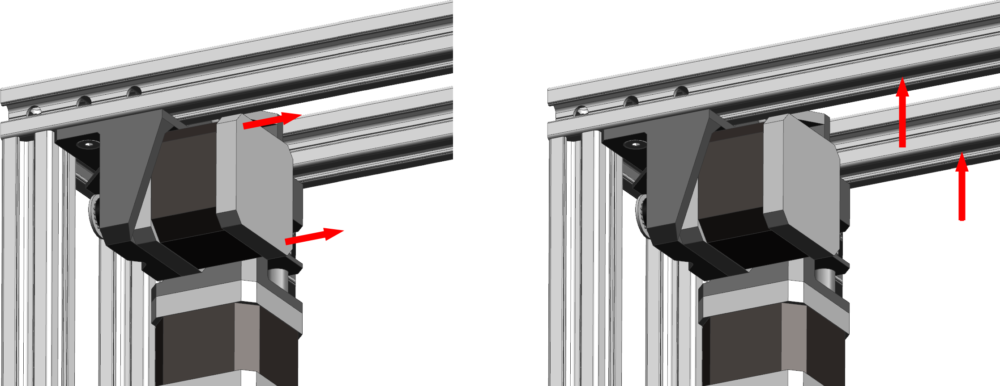
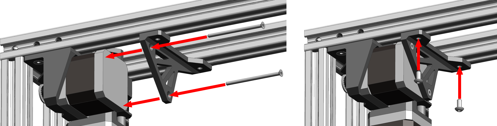

# Сборка приводов оси Y

## Подготовка печатных деталей

| Наименование | Ориентация | Количество | Предпочтительный материал | Комментарий |
|:------------ |:------:|:------:|:-----:|:---- |
| Y motor mount | { width="600" } | 2 | `PA6 GF30`, `PP GF30` | Возможно напечатать из других материалов, например, на основе `ABS`, `ASA`, `PC` и подобных. Одну деталь нужно отзеркалить |
| Y motor strengthener |  | 0-2 | Любой жесткий с термостойкостью ≥90°С | Опционально |

При печати деталей в указанной ориентации, поддержки не нужны. Все детали должны быть максимально прочными и жесткими. Поэтому рекомендуется печатать со следующими параметрами:

- Толщина стенок 2-3мм;
- 100% заполнения;
- Не высокая скорость;
- Ширина линий >120% от диаметра сопла;
- Толщина слоя <50% от ширины линий;
- Кайма 3+ мм.

## Сборка привода оси Y

### Подготовка мотора

<figure markdown>
  { width="300" }
</figure>

Установите шкив на мотор как показано на изображении выше. Если используются шкив и мотор из спецификации, то можно просто совместить торец шкива и торец вала мотора.

### Сборка привода оси Y

<figure markdown>
  { width="400" }
</figure>

Установите мотор в привод так, чтобы провод выходил вниз (на изображении показано синей стрелкой) и закрепите на 4 винта М3x12.

### Установка привода оси Y

<figure markdown>
  { width="400" }
</figure>

Заложите по 1 пазовой гайке М4 в указанные на изображении пазы профиля.

<figure markdown>
  { width="900" }
</figure>

1. Установите винт М4x8 с потайной головкой как показано на изображении;
2. Установите привод на место и закрутите заранее заложенный винт М4x8 с потайной головкой, а так же еще один такой же винт и винт М4x8 с полукруглой головкой.

### Установка усилителя (опционально)

<figure markdown>
  { width="700" }
</figure>

1. Из мотора выкрутите 2 указанных винта;
2. В указанные на изображении пазы заложите по 1 гайке М4.

<figure markdown>
  { width="900" }
</figure>

1. Прикрутите усилитель к мотору на 2 винта М3х[длина мотора + 2] с потайной головкой;
2. Закрепите усилитель к раме на 2 винта М4x8.

## Сборка зеркального привода

Второй привод оси Y собирается и крепится зеркально описанному без каких-либо отличий.

---

<table class="navitable">
    <tbody>
        <tr>
            <td><a class="md-button" href="../xu_drives" style="width: 100%; padding-left: 0em; padding-right: 0em;"><svg xmlns="http://www.w3.org/2000/svg" viewBox="0 0 24 24"><path d="M20 11v2H8l5.5 5.5-1.42 1.42L4.16 12l7.92-7.92L13.5 5.5 8 11h12Z"></path></svg> Приводы осей XU</a></td>
            <td><a class="md-button" href="../belts" style="width: 100%; padding-left: 0em; padding-right: 0em;">Установка ремней <svg xmlns="http://www.w3.org/2000/svg" viewBox="0 0 24 24"><path d="M4 11v2h12l-5.5 5.5 1.42 1.42L19.84 12l-7.92-7.92L10.5 5.5 16 11H4Z"></path></svg></a></td>
        </tr>
    </tbody>
</table>

---

<meta name='discourse-username' content='DISCOURSE_USERNAME'>

---

<a property="dct:title" rel="cc:attributionURL" href="https://k3d.tech/vostok/">K3D VOSTOK</a> by Dmitry Sorkin is licensed under <a href="http://creativecommons.org/licenses/by/4.0/?ref=chooser-v1" target="_blank" rel="license noopener noreferrer" style="display:inline-block;">CC BY 4.0</a>
