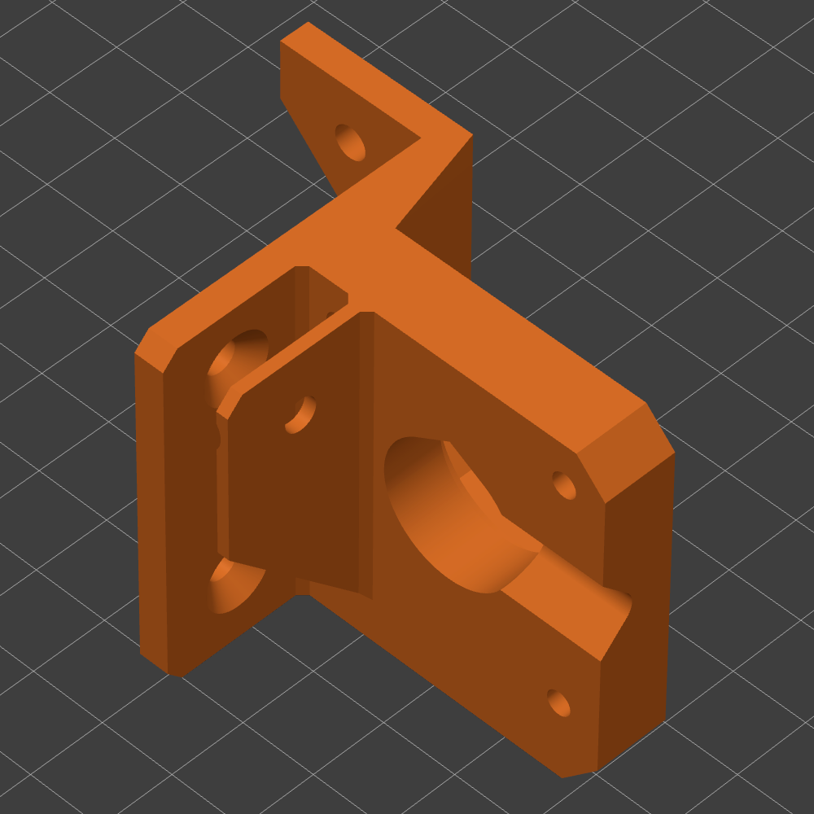
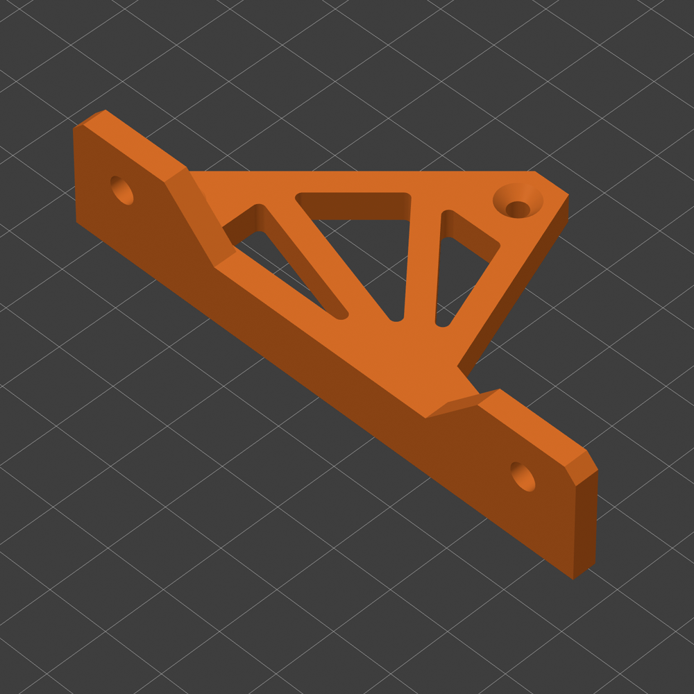
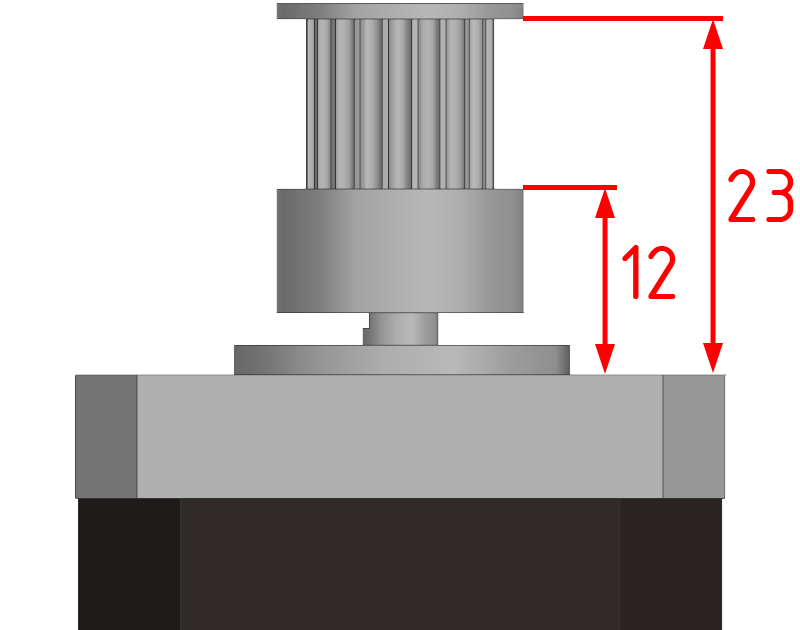
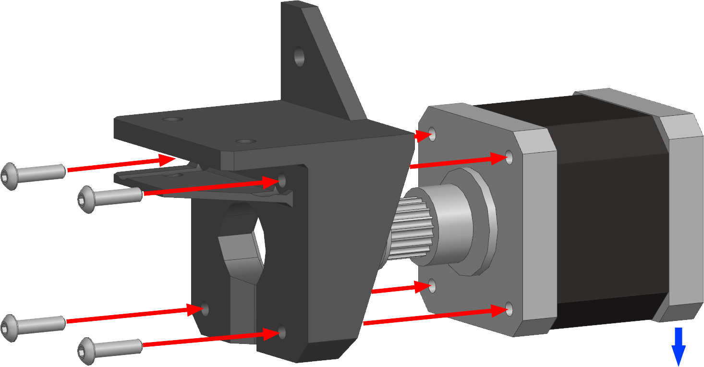
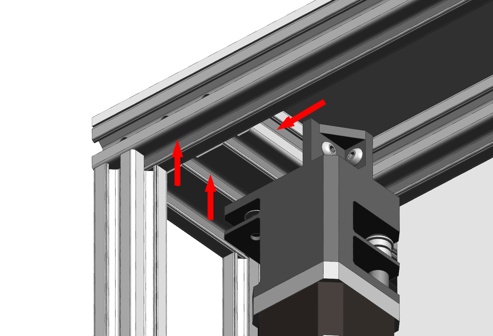
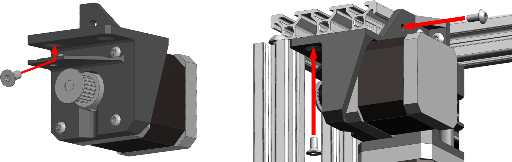
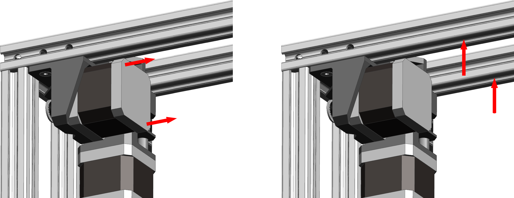
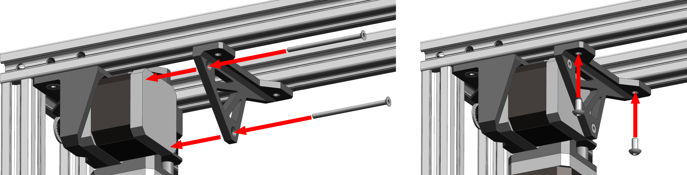

---

authors:
  - sorkin
icon: material/source-commit-local
title: K3D VOSTOK - Сборка приводов оси Y
description: Инструкция по сборке VOSTOK
---

# Сборка приводов оси Y

## Подготовка печатных деталей

| Наименование | Ориентация | Количество | Предпочтительный материал | Комментарий |
|:------------ |:------:|:------:|:-----:|:---- |
| Y motor mount | { width="600" } | 2 | `PA6 GF30`, `PP GF30` | Возможно напечатать из других материалов, например, на основе `ABS`, `ASA`, `PC` и подобных. Одну деталь нужно отзеркалить |
| Y motor strengthener |  | 0-2 | Любой жесткий с термостойкостью ≥90°С | Опционально |

При печати деталей в указанной ориентации, поддержки не нужны. Все детали должны быть максимально прочными и жесткими. Поэтому рекомендуется печатать со следующими параметрами:

- Толщина стенок 2-3мм;
- 100% заполнения;
- Не высокая скорость;
- Ширина линий >120% от диаметра сопла;
- Толщина слоя <50% от ширины линий;
- Кайма 3+ мм.

## Сборка привода оси Y

### Подготовка мотора

<figure markdown>
  { width="300" }
</figure>

Установите шкив на мотор как показано на изображении выше. Если используются шкив и мотор из спецификации, то можно просто совместить торец шкива и торец вала мотора.

### Сборка привода оси Y

<figure markdown>
  { width="400" }
</figure>

Установите мотор в привод так, чтобы провод выходил вниз (на изображении показано синей стрелкой) и закрепите на 4 винта М3x12.

### Установка привода оси Y

<figure markdown>
  { width="400" }
</figure>

Заложите по 1 пазовой гайке М4 в указанные на изображении пазы профиля.

<figure markdown>
  { width="900" }
</figure>

1. Установите винт М4x8 с потайной головкой как показано на изображении;
2. Установите привод на место и закрутите заранее заложенный винт М4x8 с потайной головкой, а так же еще один такой же винт и винт М4x8 с полукруглой головкой.

### Установка усилителя (опционально)

<figure markdown>
  { width="700" }
</figure>

1. Из мотора выкрутите 2 указанных винта;
2. В указанные на изображении пазы заложите по 1 гайке М4.

<figure markdown>
  { width="900" }
</figure>

1. Прикрутите усилитель к мотору на 2 винта М3х[длина мотора + 2] с потайной головкой;
2. Закрепите усилитель к раме на 2 винта М4x8.

## Сборка зеркального привода

Второй привод оси Y собирается и крепится зеркально описанному без каких-либо отличий.
