# Сборка приводов осей XU

## Подготовка печатных деталей

### Необходимые детали и материалы для них

| Наименование        | Кол-во |       Предпочтительный материал       |              Возможный материал              | Примечание                                                   |
| :------------------ | :----: | :-----------------------------------: | :------------------------------------------: | :----------------------------------------------------------- |
| X motor mount       |   2    |         `PA6 GF30`, `PP GF30`         | `PA12 GF30`, `ABS GF/CF`, `ABS`, `PC`, `ASA` | Одна зеркально. Печатать обе даже если собираете вариант с одной печатающей головой |
| X motor strenghener |  0-2   |         `PA6 GF30`, `PP GF30`         | `PA12 GF30`, `ABS GF/CF`, `ABS`, `PC`, `ASA` | Одна зеркально                                               |
| Roller spacer       |  2-4   | Любой жесткий с термостойкостью >75°C |                      -                       | Количество зависит от комплектации. Если собираете с 1 печатающей головой, то 1шт. Если собираете с 2 печатающими головами, то 2шт. |

### Ориентация деталей и особенности печати

При печати деталей в указанной ориентации, поддержки не нужны. Все детали должны быть максимально прочными и жесткими. Поэтому рекомендуется печатать со следующими параметрами:

- Толщина стенок 2-3мм;
- 100% заполнения;
- Не высокая скорость;
- Ширина линий >120% от диаметра сопла;
- Толщина слоя <30% от ширины линий.

### Подготовка кронштейнов моторов

После печати кронштейнов моторов будет необходимо удалить мембрану из отверстия, отмеченного на изображении выше.

## Сборка привода оси X

### Подготовка моторов

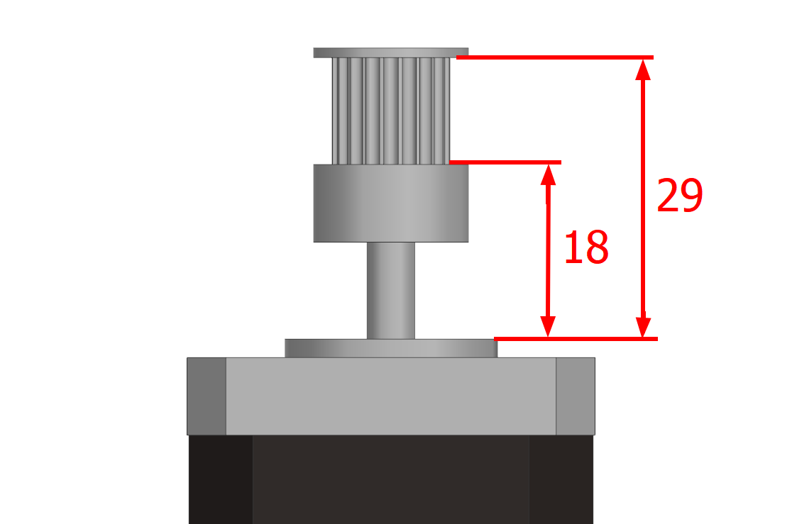

Для левого привода установите и закрепите шкив так, как показано на изображении выше. 

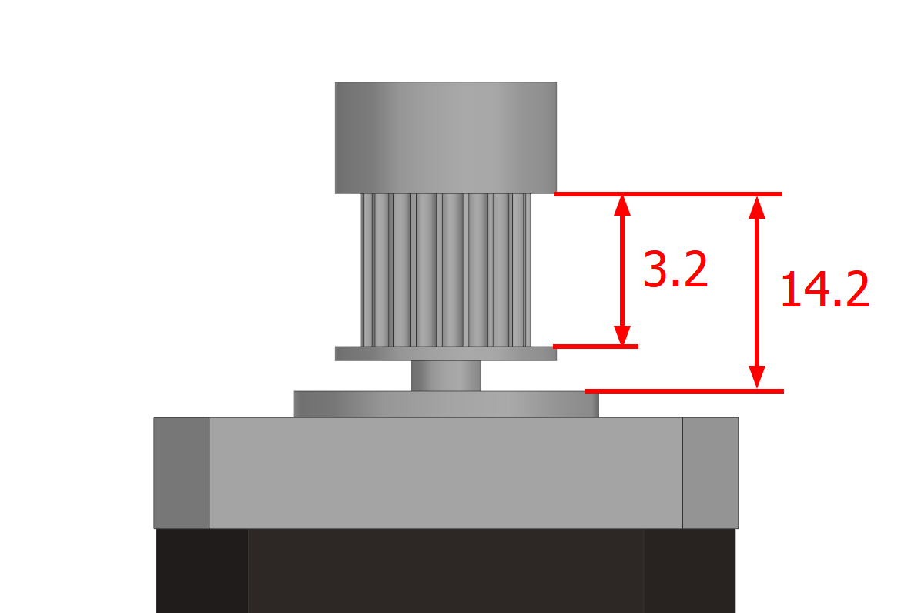

Сборка роликов 

Все ролики в принтере состоят из двух подшипников f623, одного подшипника 623 и шайбы М3, соединенных таким образом, как показано на изображении выше. При этом не важно между какой парой подшипников располагается шайба. 

Для удобства сборки рекомендуется все ролики предварительно собрать и обклеить полоской скотча, чтобы те не рассыпались, и их можно было бы устанавливать как единую деталь. После сборки скотч с роликов необходимо будет снять.

На эту сборку требуется 2 ролика, если собирается вариант с 1 печатающей головой, и 4 ролика, если собирается вариант с 2 печатающими головами.

### Сборка привода оси X

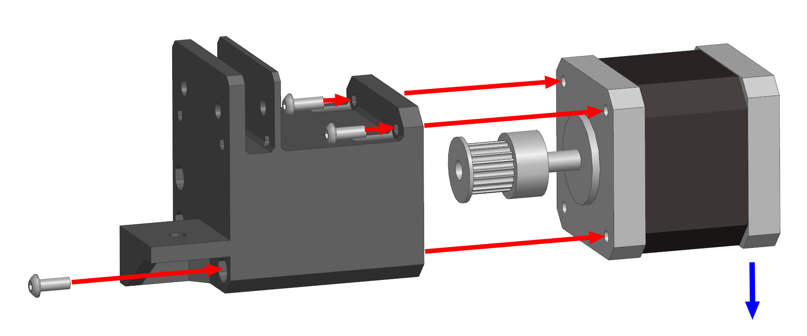

Вставьте мотор в кронштейн так, чтобы разъём мотора смотрел вдоль оси Х в системе координат принтера (синяя стрелка на изображении выше). Закрепите на 3 винта М3х8 с полукруглой или цилиндрической головкой.

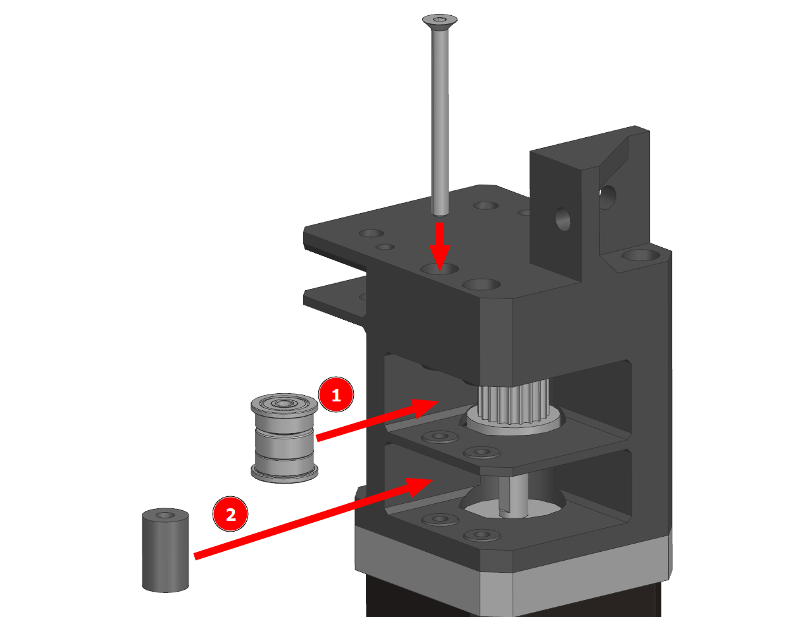

Установите ролик наверх, ближе к стенке. Проставка устанавливается под ролик. Далее всё это крепится винтом М3х35 с потайной головкой.

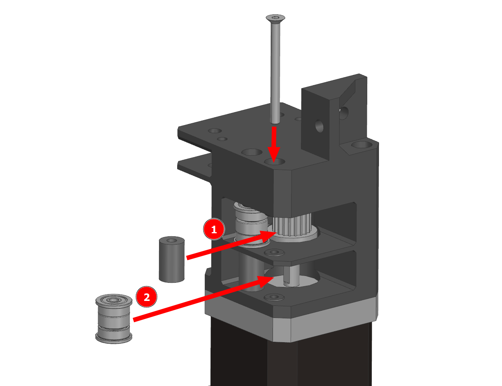

Если собираете вариант с 2 печатающими головами, то аналогичным образом надо будет установить второй ролик. Единственное отличие - ролик ставится вниз, а проставка наверх.

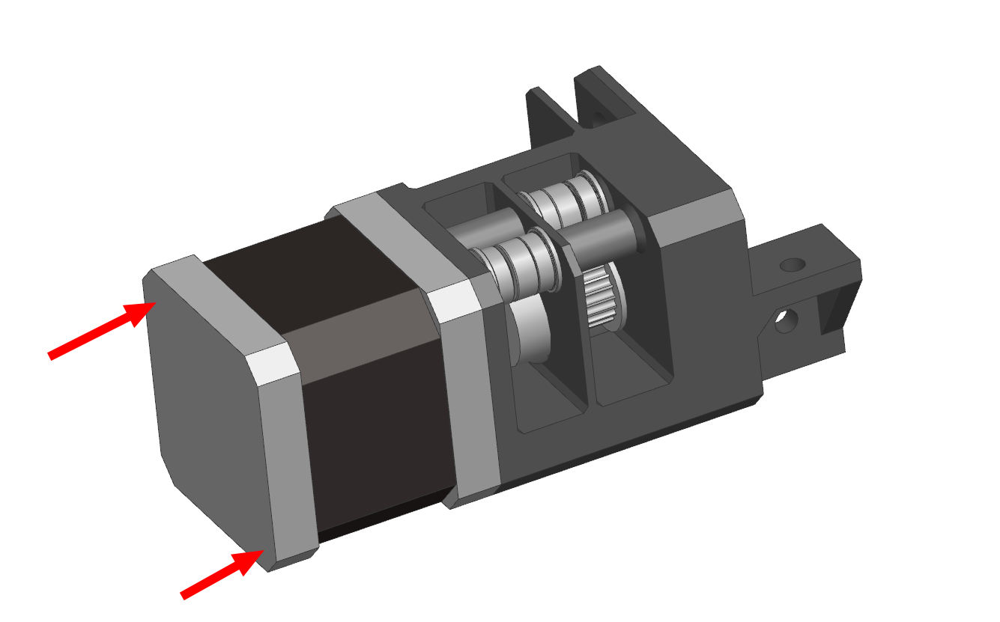

Выкрутите любые два винта мотора по диагонали. Это никак не повлияет на его работу, если оставить два оставшихся на месте.

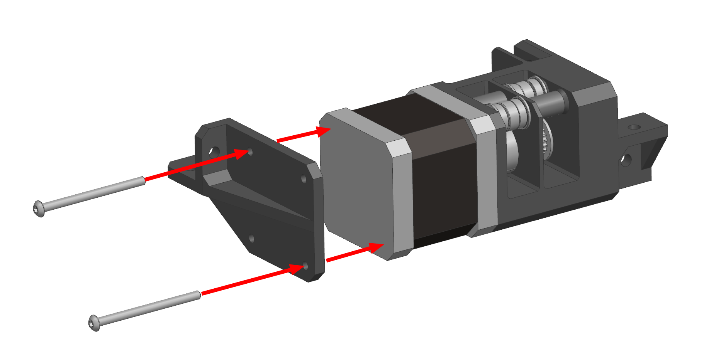

Усилитель прикручивается к нижней части мотора на два винта М3 с полукруглой или цилиндрической головкой. Длина винта должна быть равна длине мотора. Обычно это нестандартный размер, так что придётся покупать винты длиннее и обрезать. Если винт будет длиннее, то он будет мешать винтам, которые крепят мотор к кронштейну. Если будет сильно короче, то не достанет до резьбы.

## Сборка привода оси U

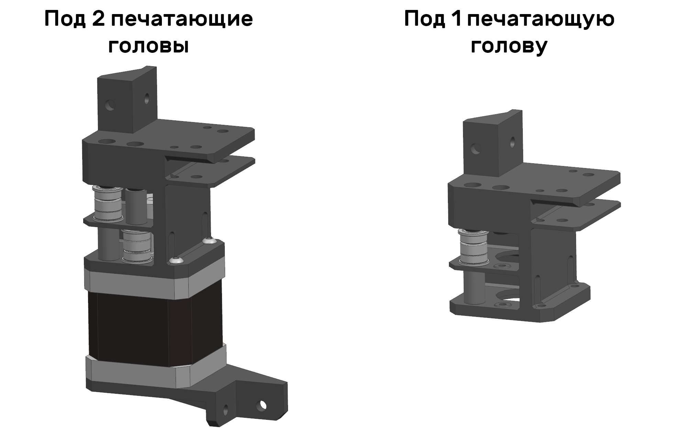

Привод оси U собирается аналогичным образом, за исключением пары вещей:

Во-первых, если вторая печатающая голова ставиться не будет, то кронштейн оси U выполняет роль держателя одного ролика. В таком случае устанавливать мотор, усилитель и т.д. не надо;

Во-вторых, обратите внимание на положение роликов. Оно не зеркальное.

## Установка привода оси X

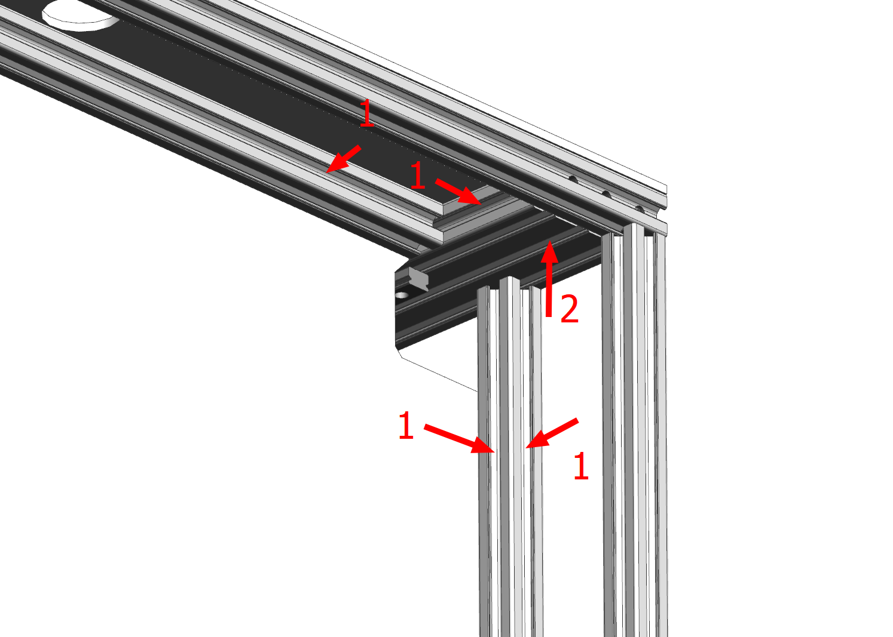

Заложите пазовые гайки М4 согласно изображению выше.

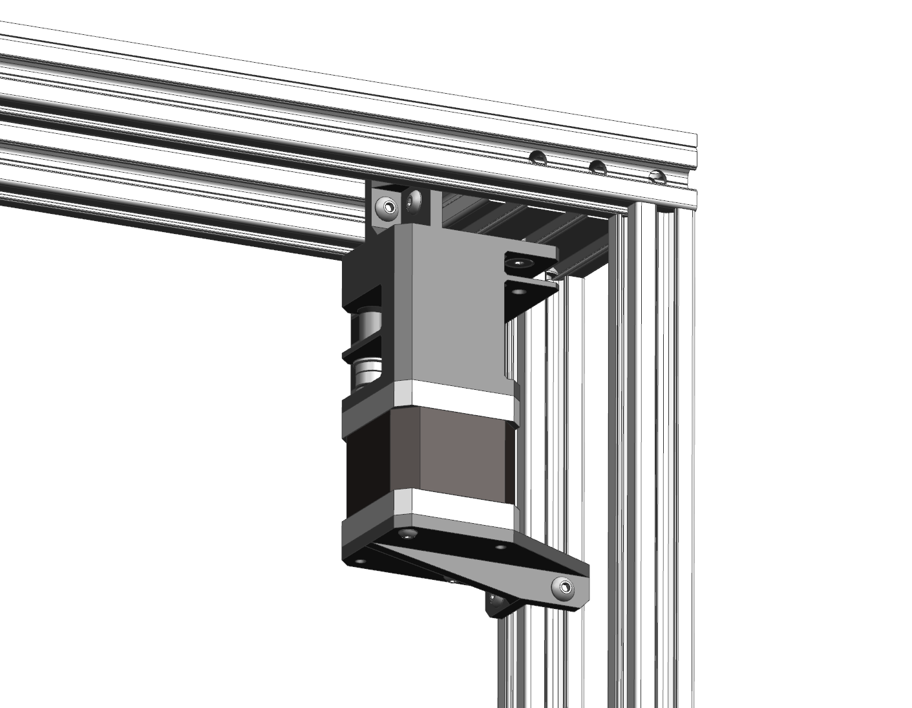

Установите привод оси X в заднюю левую часть принтера так, как показано на изображении выше (вид сзади). Привод крепится на 2 винта М4х8 с потайной головкой с внешней стороны принтера, 2 винта М4х8 с полукруглой головкой в портале. Еще 2 винта М4х8 с полукруглой головкой крепят усилитель к вспомогательной стойке.

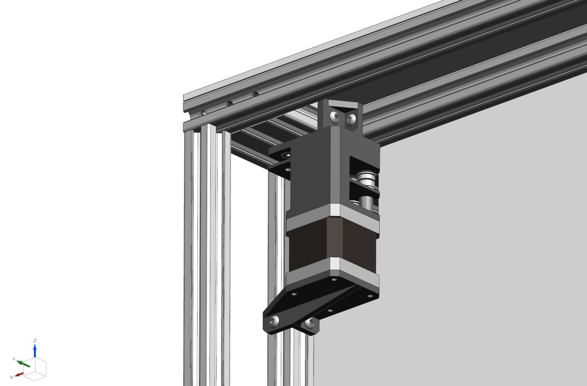

Аналогичным образом устанавливается привод оси U.
