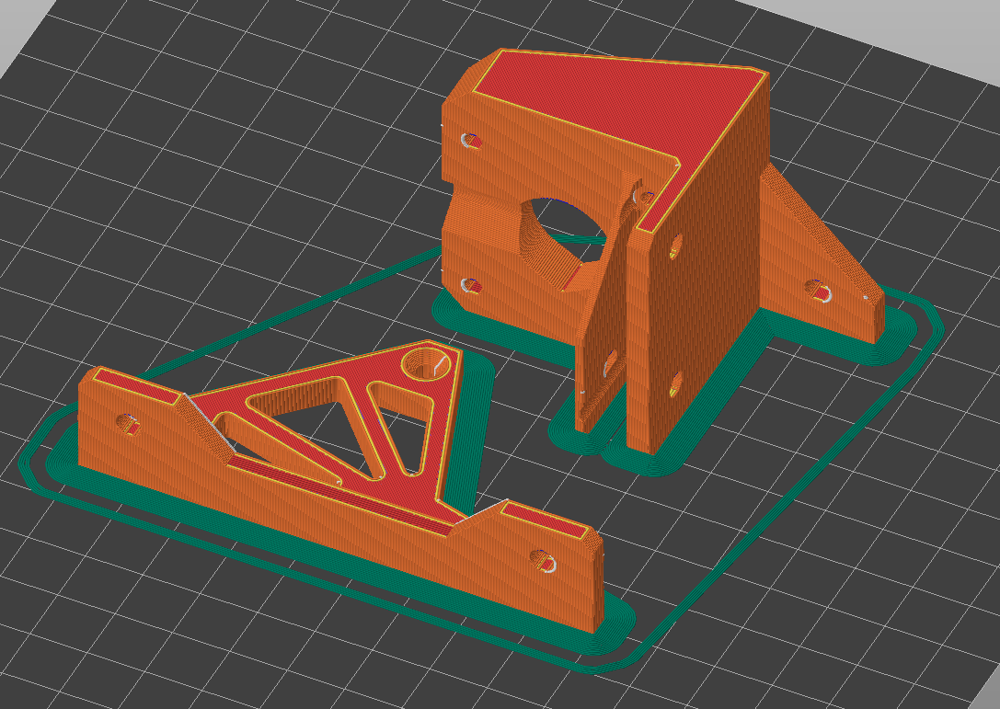
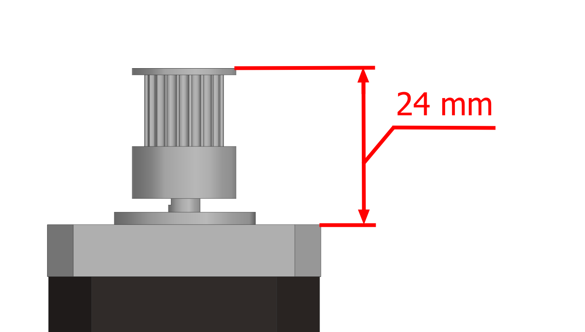
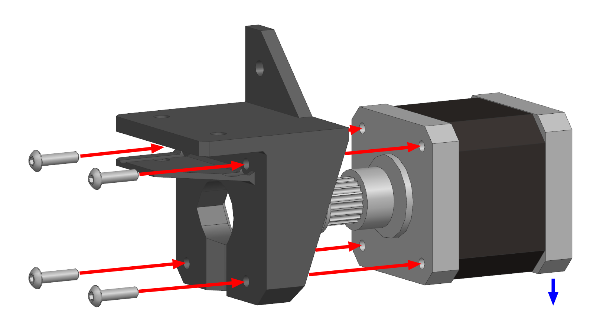
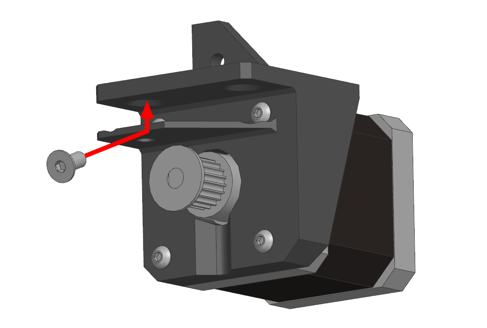
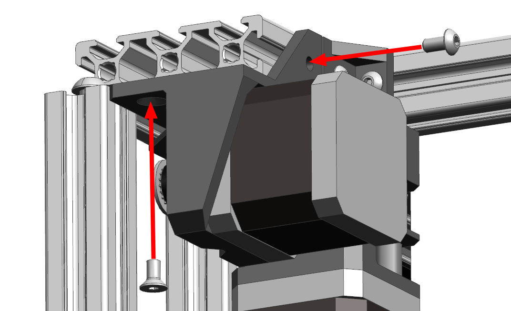
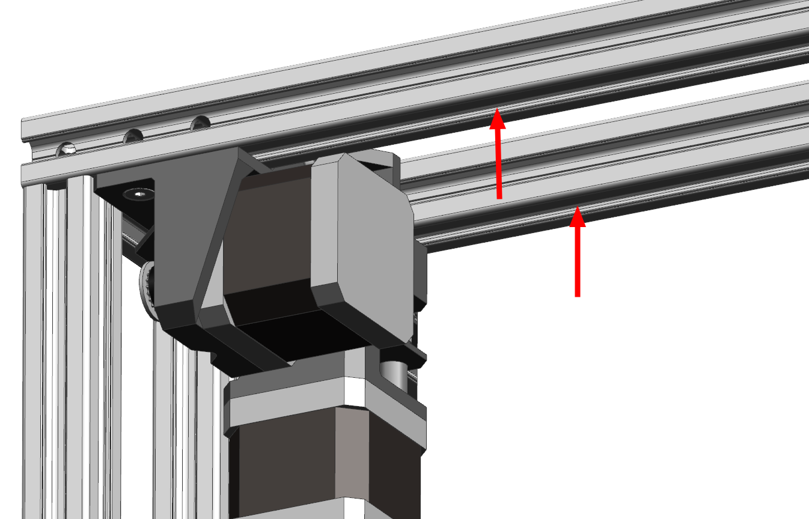
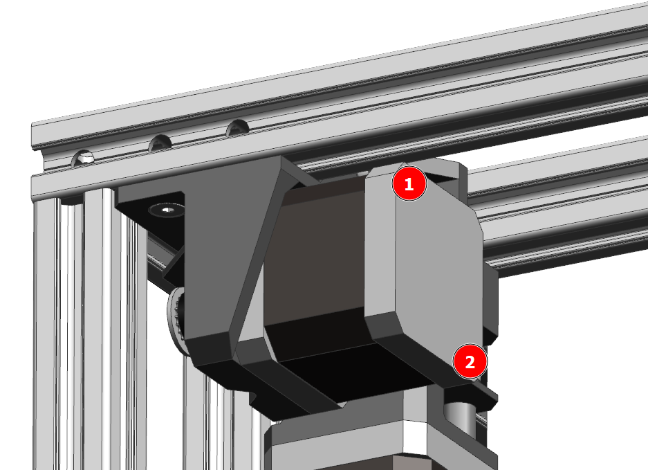
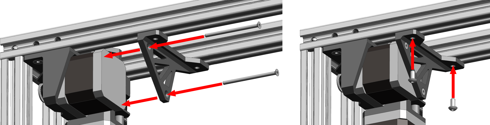

# Шаг 9 - Сборка приводов оси Y

## Подготовка печатных деталей

### Необходимые детали и материалы для них

| Наименование        | Кол-во |       Предпочтительный материал       |              Возможный материал              | Примечание                                                   |
| :------------------ | :----: | :-----------------------------------: | :------------------------------------------: | :----------------------------------------------------------- |
| Y motor mount       |   2    |         `PA6 GF30`, `PP GF30`         | `PA12 GF30`, `ABS GF/CF`, `ABS`, `PC`, `ASA` | Одна зеркально |
| Y motor strengthener | 0-2 | Любой с термостойкостью >90°С | - | Опционально |

### Ориентация деталей и особенности печати

При печати деталей в указанной ориентации, поддержки не нужны. Все детали должны быть максимально прочными и жесткими. Поэтому рекомендуется печатать со следующими параметрами:

- Толщина стенок 2-3мм;
- 100% заполнения;
- Не высокая скорость;
- Ширина линий >120% от диаметра сопла;
- Толщина слоя <50% от ширины линий;
- Кайма 3+ мм.

## Сборка привода оси Y

!!! note "Так как правый и левый привод собираются зеркально, то будет показана сборка только одного из них"

### Подготовка мотора

Установите шкив на мотор так, как показано на изображении. Если используете шкив и мотор из спецификации, то можно просто совместить их торцы.

### Сборка привода оси Y

Установите мотор в привод так, чтобы провод выходил вниз (на изображении показано синей стрелкой) и закрепите на 4 винта М3х12.

### Установка привода оси Y

Заложите по 1 пазовой гайке М4 в указанные на изображении пазы профиля.

Установите винт М4х8 с потайной головкой как показано на изображении.

Установите привод на место и закрутите заранее заложенный винт М4х8 с потайной головкой, а так же еще один такой же винт и винт М4х8 с полукруглой головкой.

### Установка усилителя (опционально)

В указанные пазы заложите по 1 пазовой гайке М4.

Выкрутите 2 указанных винта из мотора.

Прикрутите усилитель к мотору на 2 винта. Для установки используются винты М3 с потайной головкой. Длина винтов должна быть на 2мм больше, чем длина корпуса мотора. Например, для Nema 17 48mm используются винты М3х50. В случае, если винты есть только с полукруглой или цилиндрической головкой, то они устанавливаются через шайбы.

Закрепите усилитель к раме на 2 винта М3х8.