# Сборка оси Z

## Варианты сборки оси Z

| Вариант 1. 2 стойки 2 привода | Вариант 2. 4 стойки 2 привода | Вариант 3. 4 стойки 4 привода |
| :----------------: | :----------------: | :----------------: |
|  |  |  |

Благодаря модульной конструкции, можно не внося заметных изменений в конструкцию деталей собрать множество конфигураций оси Z. Основными являются 3 варианта:

1. Вариант под 2 стойки и 2 привода подходит для столов с областью печати по оси Y до 300мм. У каждой стойки свой привод и концевик. В такой конфигурации ось Z потребует 2 драйвера. В этом варианте можно использовать раму стола и с 1, и с 2 поперечными балками;
2. Вариант под 4 стойки и 2 привода подходит для столов с областью печати по Y от 300мм. Требует 2 драйвера. Можно использовать раму стола только с 2 поперечными балками;
3. Вариант под 4 стойки и 4 привода рекомендуется для принтеров с очень большой областью печати. Требует 4 драйвера, но можно обойтись двумя, если использовать ходовые винты с однозаходной резьбой. Можно использовать раму стола только с 2 поперечными балками.

Также можно комбинировать эти варианты между собой. Например, с одной стороны поставить 2 стойки и 2 привода как в варианте 3, а с другой 1 стойку и 1 привод как в варианте 1. Но подобные варианты не учитываются спецификацией и генератором зашивки, их придётся рассчитывать самому.

!!! note "В любом варианте используются одинаковые модули стоек или приводов, так что инструкция будет описывать сборку именно модулей. Необходимое количество этих модулей легко будет посчитать самостоятельно, например, по изображениям в начале статьи"

## Сборка стойки

### Необходимые детали и материалы для них

| Наименование | Ориентация | Количество | Предпочтительный материал | Комментарий |
|:------------ |:------:|:------:|:-----:|:---- |
| Z axis beam mount | 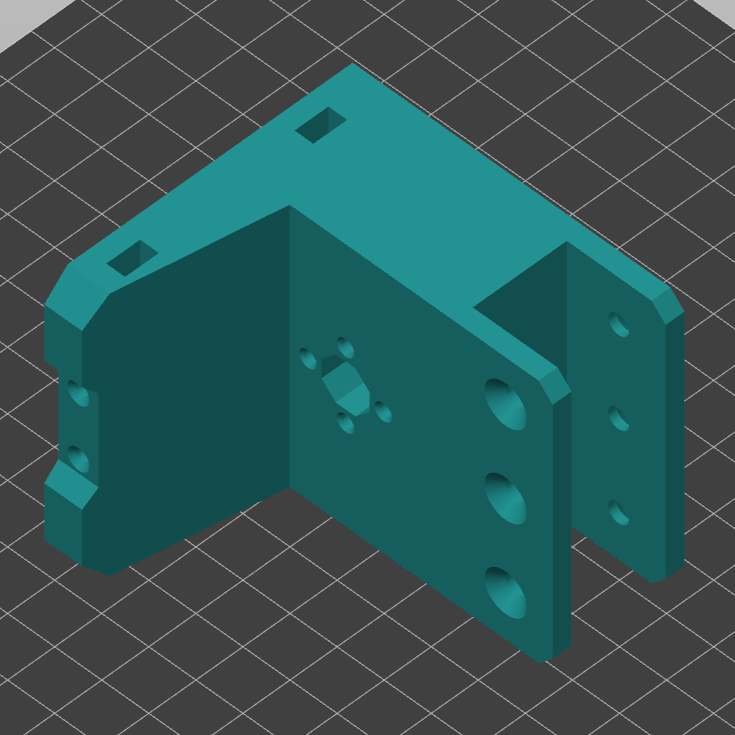{ width="600" } | 1 | `PA6 GF/CF`, `PP GF`, `PETG` | Лучше всего печатать эту деталь из хорошо спекающихся материалов, так как иначе она может лопнуть при неисправности приводов оси Z (например, если один концевик не сработает или 1 мотор откажет) |
| Optical endstop mount | 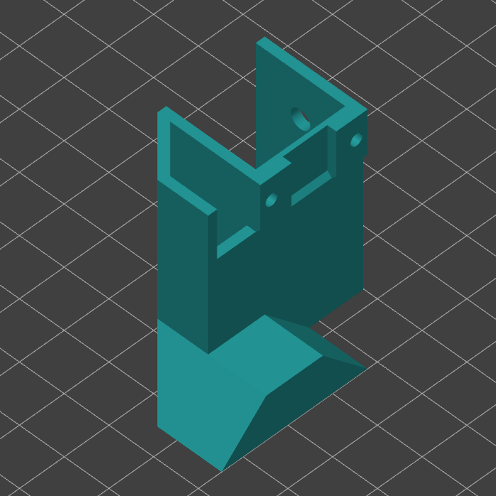{ width="600" } | 0-1 | Любой жесткий с термостойкостью >70°C | Нужна для установки концевика на стойку. Общее количество концевиков на все стойки равно количеству драйверов на ось Z |
| Optical endstop trigger | 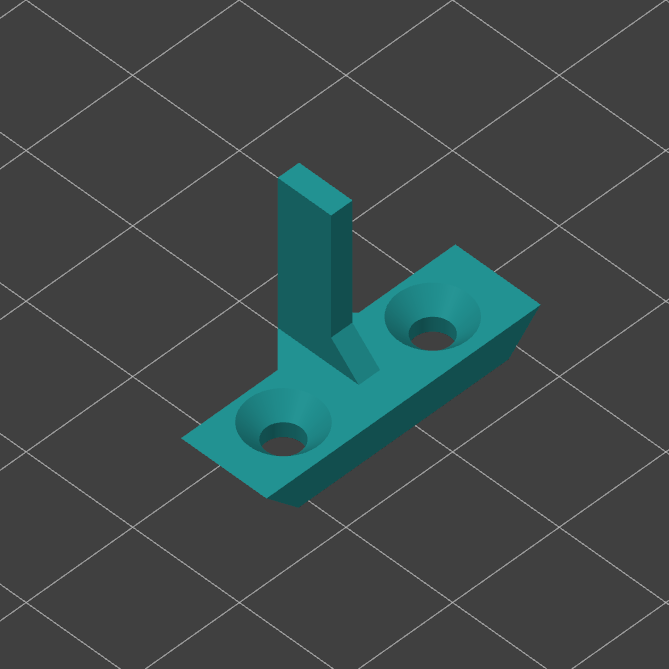{ width="600" } | 0-1 | Любой жесткий с термостойкостью >70°C | Флажок для концевика. Если концевик на стойку ставится, то и флажок нужен. Если что, легко допечатать потом или даже сколхозить из подручных материалов |
| Z axis stop | { width="600" } | 0-1 | Любой жесткий с термостойкостью >70°C | Если на стойку не ставится концевик, кронштейн которого является аварийным упором для оси, то упор надо будет напечатать отдельно |

### Сборка каретки Openbuilds

<figure markdown>
  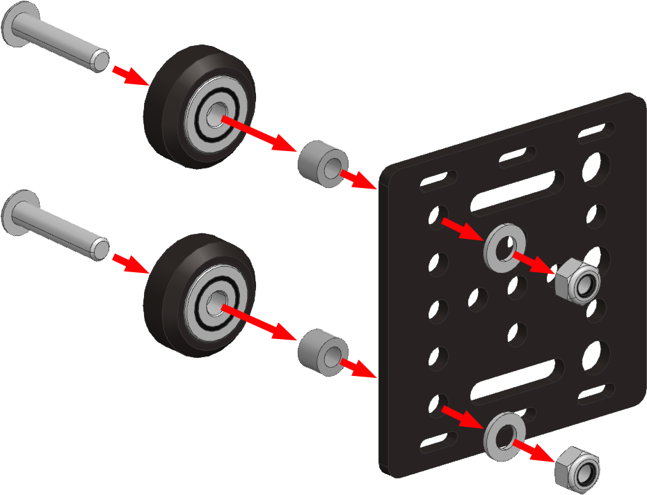{ width="400" }
</figure>

Обратите внимание, что на каретке Openbuilds с одной стороны расположены отверстия ~5мм, а с другой увеличенные до ~7мм. На стороне, где отверстия ~5мм, соберите 2 ролика. Последовательность деталей:

1. Винт М5х25 с полукруглой или низкой цилиндрической головкой;
2. Ролик Openbuilds;
3. Проставка длиной 6мм;
4. Каретка;
5. Шайба М5;
6. Гайка М5.

!!! warning "Со стороны ролика обязательно должна быть именно головка винта, а не гайки, так как иначе не получится установить зашивку"

<figure markdown>
  { width="400" }
</figure>

Противолежащий ролк собирается аналогичным образом, кроме 2 отличий: вместо проставки используется эксцентриковая гайка, а сборка происходит прямо на стойке.

После сборки каретки надо будет отрегулировать прижим колёс. Делается это подкручиванием эксцентриковой гайки. Затягивать надо до того момента, как пропадут люфты. Перетягивание регулировки приведёт к быстрому износу колёс, поэтому лучше этого не делать.

!!! warning "Перед установкой каретки на стойку, обратите внимание на положение углублений под гайки в детали `Z axis beam mount`. Оно должно совпадать с положением гаек на каретке"

!!! note "Если вы перебираете ось Z при уже установленной зашивке, то в боковых панелях есть специальные отверстия, через которые можно получить доступ ключом до шлицев всех винтов на каретке"

### Установка кронштейна балки

<figure markdown>
  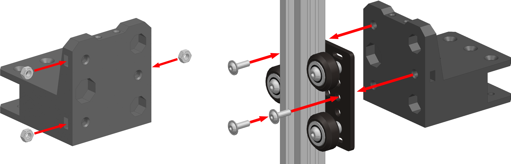
</figure>

1. Вставьте в углубления в детали `Z axis beam mount` 3 гайки М4. Если они плохо держатся, то можно посадить их на клей;
2. Прикрутите кронштейн к каретке на 3 винта М4х12 с прессшайбой. Винты можно заменить на обычные М4х12 + шайбы М4.

### Установка оптического концевика

!!! note "Этот шаг является опциональным. Если не будете ставить концевик на эту ось, то обязательно поставьте ограничитель хода каретки (`Z axis stop`)"

<figure markdown>
  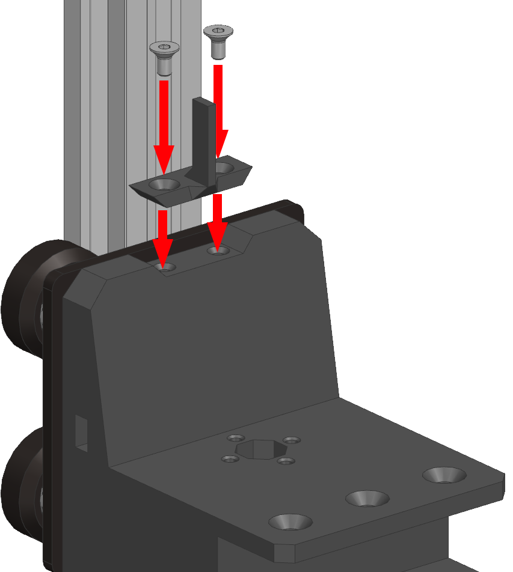{ width="300" }
</figure>

Установите флажок для концевика на кронштейн балки оси Z и закрепите на 2 винта М3х6 с потайной головкой.

<figure markdown>
  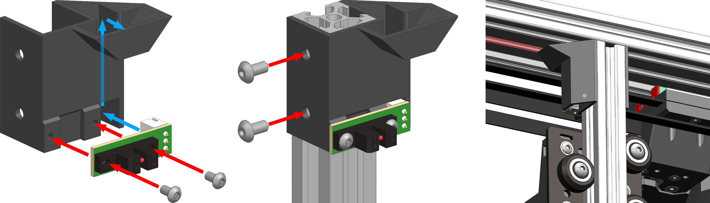
</figure>

1. Подсоедините провод к концевику;
2. Просуньте провод концевика через кронштейн концевика (синяя стрелка на изображении);
3. Прикрепите концевик к кронштейну на 2 винта М3х6;
4. Установите кронштейн концевика на стойку и задвиньте вверх до упора в портал. Провод концевика при этом должен попасть в средний паз профиля 2060 по направлению к отсеку электроники (подсвечен красным);
5. Закрепите кронштейн концевика на 2 винта М4х8 и 2 пазовые гайки М4.

### Установка ограничителя хода

<figure markdown>
  { width="400" }
</figure>

Ограничитель хода каретки ставится на те стойки, куда не ставится оптический концевик. Ограничитель устанавливается в верхней части стойки так, чтобы упирался в профили портала, после чего крепится на 2 винта М4х8 и 2 пазовые гайки М4.

## Установка стола

<figure markdown>
  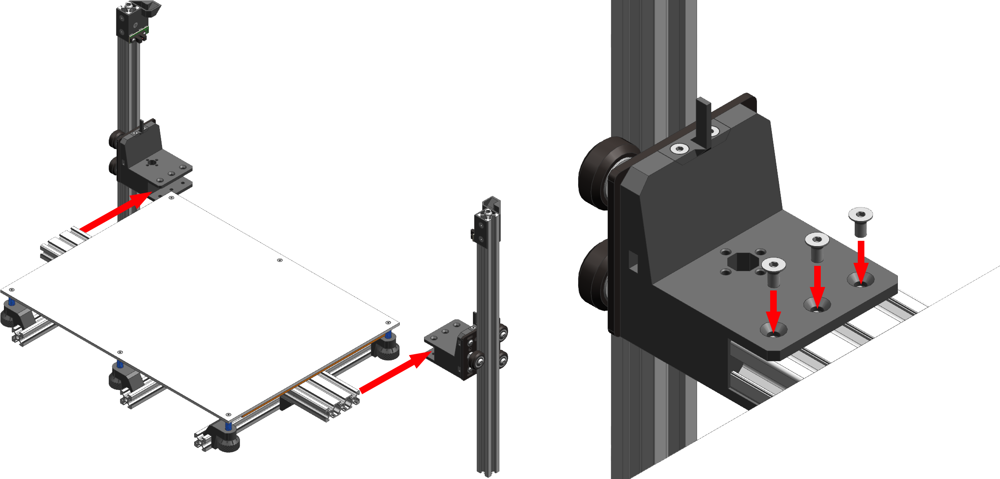{ width="800" }
</figure>

Вне зависимости от типа рамы и количества стоек оси Z, стол устанавливается одинаково - просто вставляется спереди и крепится по 6 винтов М4х8 с потайной головкой к каждому кронштейну балки оси Z (3 винта сверху, 3 снизу).

!!! note "Для вариантов, у которых стойка совмещена с приводом, можно установить стол после сборки привода"

## Сборка привода на стойке

### Печатные детали

| Наименование | Ориентация | Количество | Предпочтительный материал | Комментарий |
|:------------ |:------:|:------:|:-----:|:---- |
| Z motor mount | 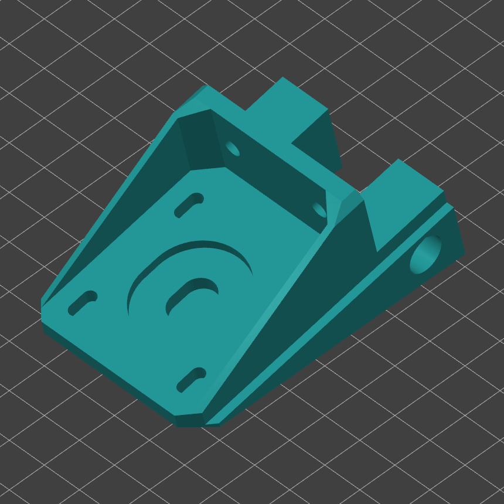{ width="600" } | 1 | Любой жесткий с термостойкостью >90°C | Есть версии под толщину листов зашивки 3 и 4мм, не перепутайте их |

### Установка кронштейна мотора

<figure markdown>
  
</figure>

1. Удалите мембраны в отверстиях, указанных зелеными стрелками;
2. Установите кронштейн мотора оси Z на пересечение стойки оси Z и продольной балки нижней части рамы сверху
3. Закрепите на 2 винта М4х8 с полукруглой головкой и 2 пазовые гайки М4 над панелью;
4. Поверните принтер на бок и закрепите еще на 2 винта М4х8 и 2 пазовые гайки.

!!! note "Нижнюю панель зашивки нельзя снять или установить без разборки привода оси Z"

### Установка мотора

<figure markdown>
  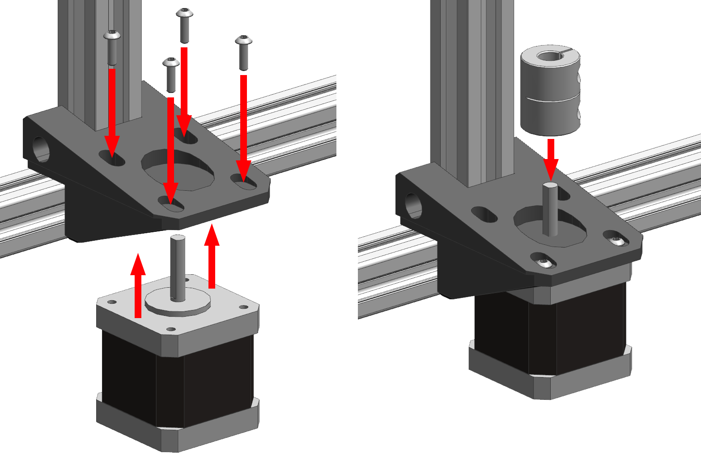{ width="600" }
</figure>

1. Установите мотор в кронштейн снизу и закрепите на 4 винта М3х8;
2. Наденьте на вал мотора муфту. Закреплять её на данном этапе не надо.

### Установка ходового винта

<figure markdown>
  { width="600" }
</figure>

1. Закрепите гайку ходового винта к кронштейну балки оси Z на 4 винта М3х12. Винты просто наживите, затягивать их не надо;
2. Опустите каретку оси Z вниз;
3. Закрутите ходовой винт в гайку до момента, когда нижний конец винта окажется в муфте;
4. Закрепите муфту:
      1. Муфта двигается вверх до момента, когда ходовой винт упрётся в уступ внутри муфты;
      2. Затягиваются верхние винты муфты;
      3. Муфта опускается вниз, пока торец ходового винта не упрётся в торец вала мотора;
      4. Затягиваются нижние крепления;
5. Пока каретка находится в нижнем положении, выставьте ходовой винт вертикально (точности "на глаз" будет достаточно) и затяните винты крепления гайки.

## Сборка отдельно стоящего привода

### Печатные детали

| Наименование | Ориентация | Количество | Предпочтительный материал | Комментарий |
|:------------ |:------:|:------:|:-----:|:---- |
| Z motor mount for separate drive | { width="600" } | 1 | Любой жесткий с термостойкостью >90°C | Есть версии под толщину листов зашивки 3 и 4мм, не перепутайте их |
| Quad guide nut mount | 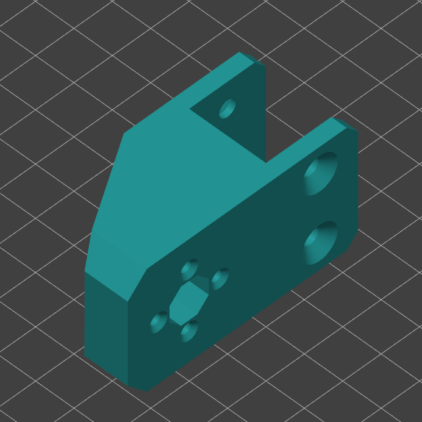{ width="600" } | 1 | Любой жесткий с термостойкостью >90°C |  |

### Установка кронштейна мотора

<figure markdown>
  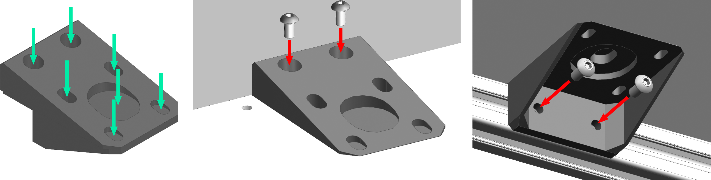
</figure>

1. Удалите мембраны в отверстиях, указанных зелеными стрелками;
2. Установите кронштейн мотора оси Z на пересечение стойки оси Z и продольной балки нижней части рамы сверху
3. Закрепите на 2 винта М4х8 с полукруглой головкой и 2 пазовые гайки М4 над панелью;
4. Поверните принтер на бок и закрепите еще на 2 винта М4х8 и 2 пазовые гайки.

!!! note "Нижнюю панель зашивки нельзя снять или установить без разборки привода оси Z"

### Установка мотора

<figure markdown>
  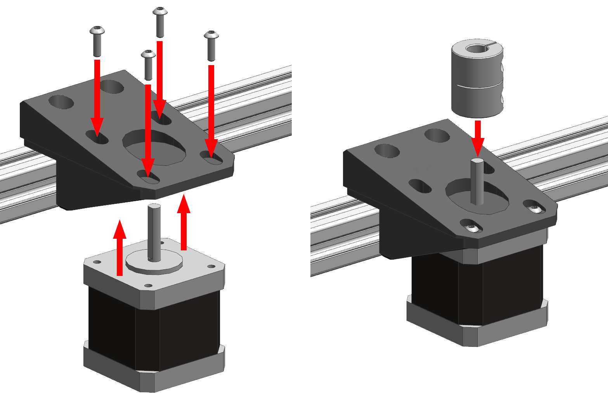{ width="600" }
</figure>

1. Установите мотор в кронштейн снизу и закрепите на 4 винта М3х8;
2. Наденьте на вал мотора муфту. Закреплять её на данном этапе не надо.

### Установка кронштейна гайки

<figure markdown>
  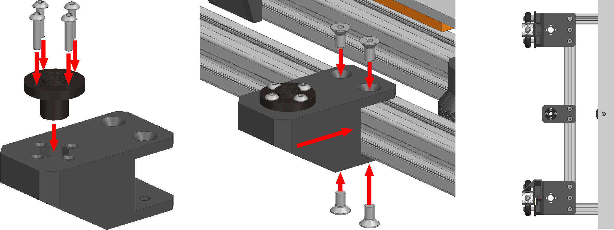{ width="700" }
</figure>

1. Прикрутите гайку ходового винта к кронштейну гайки на 4 винта М3х12;
2. Установите кронштейн на продольную балку рамы стола посередине;
3. Зафиксируйте кронштейн на 4 винта М4х8 с потайной головкой и 4 пазовые гайки М4.

### Установка ходового винта

<figure markdown>
  { width="600" }
</figure>

1. Закрутите ходовой винт в гайку до момента, когда нижний конец винта окажется в муфте;
2. Сдвиньте муфту вверх до момент, когда ходовой винт упрётся в уступ внутри муфты;
3. Затяните верхние винты муфты;
4. Опустите винт с муфтой пока торец винта не упрётся в торец вала мотора;
5. Затяните нижние винты муфты;
6. При необходимости отрегулируйте положение мотора или кронштейна гайки так, чтобы винт был вертикален (точности "на глаз хватит").